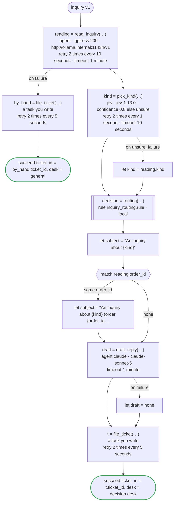

# inquiry v1

Jev picks the kind of a customer's inquiry and says how sure it is; an agent reads the inquiry for an order number and its point, and for its kind too, which the flow takes when Jev is not sure enough of its own. A rule decides the desk that takes it and how soon it is answered; another agent drafts the first reply; and a ticket goes into the desk's system. Jev picks, agents read and write (a model the company runs itself reads, Claude writes), and the rule decides. Written for Temporal: Jev and the agents are activities dandori writes, Jev called with TypeSafe's key (TYPESAFE_API_KEY), the reading sent to the company's Ollama, which serves Open Responses (`url`), and the draft to Claude with the key the worker has; the rule runs in the worker of the workflow as a local activity, its answer kept in the history as a marker; and filing the ticket is an activity you write

`examples/inquiry/temporal/inquiry.flow`, drawn by `dandori doc`. Inputs: `inquiry: Inquiry`. Outputs: `ticket_id: string`, `desk: routing.desk`.

## flow

A rectangle is a task, one with a line down each side a rule, a slanted one a task whose value comes from outside (an event, or the answer to a callback), a hexagon a `match`, a rounded box a wait, and a box around steps a loop. A dashed arrow is an error the call handles.

## Calls

| Line | Call | Calls | Retries | Timeout | When it fails |
|---:|---|---|---|---|---|
| 61 | `reading = read_inquiry(…)` | `agent · gpt-oss:20b · http://ollama.internal:11434/v1` | 2 times every 10 seconds (failure, timeout) | 1 minute | `timeout`, `failure` → line 62 |
| 63 | `by_hand = file_ticket(…)` | a task you write, `key` | 2 times every 5 seconds (failure, timeout) | — | `timeout`, `failure` → the workflow fails |
| 66 | `kind = pick_kind(…)` | `jev · jev-1.13.0 · confidence 0.8 else unsure` | 2 times every 1 second (failure, timeout) | 10 seconds | `unsure`, `timeout`, `failure` → line 67 |
| 68 | `decision = routing(…)` | rule `inquiry_routing.rule`, a local activity on Temporal | 2 times, after 1 second and 2 (failure) | — | `timeout`, `failure` → the workflow fails |
| 73 | `draft = draft_reply(…)` | `agent claude · claude-sonnet-5` | — | 1 minute | `timeout`, `failure` → line 74 |
| 75 | `t = file_ticket(…)` | a task you write, `key` | 2 times every 5 seconds (failure, timeout) | — | `timeout`, `failure` → the workflow fails |

## Ends

Every way the workflow can end.

| Line | End |
|---:|---|
| 64 | `succeed ticket_id = by_hand.ticket_id, desk = general` |
| 76 | `succeed ticket_id = t.ticket_id, desk = decision.desk` |

## Rules

The rules this workflow calls, as `rulec doc` renders them for whoever approves them.

<code>routing</code> · inquiry_routing v1 · <code>../rules/inquiry_routing.rule</code>

<!-- Generated by rulec 0.21.2 from inquiry_routing.rule (sha256:77cf5ddb6256). This is a read-only rendering; the source of truth is the .rule file. Edits cannot be carried back (§1.6). -->
# Rule inquiry_routing v1

Which desk takes an inquiry, and how soon it is first answered, from its kind and whether the customer is a member. Written for the example

## Inputs

| Name | Type | Range | Notes |
|---|---|---|---|
| kind | kind (4 values) |  |  |
| member | bool |  |  |

## Outputs

| Name | Type | Rounding | Notes |
|---|---|---|---|
| desk | desk (3 values) |  |  |
| within | duration[h] | down(1h) |  |

## Types

An enum is a **closed** finite set. Add a value, and every table that does not look at it fails the completeness check.

- **kind** (4 values) — returns, delivery, billing, other
- **desk** (3 values) — logistics, accounting, general

## Table route (policy unique)

| Column | Source |
|---|---|
| kind | Input |
| member | Input |
| → desk | Output of this rule |
| → within | Output of this rule |

| # | kind | member | → desk (desk) | → within (duration[h] / down(1h)) |
|---|---|---|---|---|
| 1 | returns | true | logistics | 24h |
| 2 | returns | false | logistics | 48h |
| 3 | delivery | - | logistics | 24h |
| 4 | billing | - | accounting | 48h |
| 5 | other | true | general | 48h |
| 6 | other | false | general | 72h |

**What `rulec check` verified**

- Every combination of inputs matches some row (E101 completeness)
- There is no row that can never match (E102 unreachable row)
- No input matches two or more rows at once (E105 overlap). Reordering the rows does not change the meaning

## Examples (verified)

| kind | member | → desk | within |
|---|---|---|---|
| returns | true | logistics | 24h |
| billing | false | accounting | 48h |
| other | false | general | 72h |

`rulec check` ran these 3 examples through the reference evaluator, and every one produced the declared values (E107). The examples are an **executable specification**.

