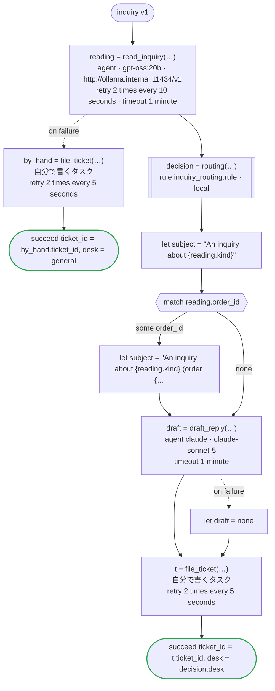

# inquiry v1

An agent reads a customer's inquiry for its kind, an order number and its point; a rule decides the desk that takes it and how soon it is answered; another agent drafts the first reply; and a ticket goes into the desk's system. Agents read and write (a model the company runs itself reads, Claude writes); the rule decides. Written for Temporal: the agents are activities dandori writes, the reading sent to the company's Ollama, which serves Open Responses (`url`), and the draft to Claude with the key the worker has; the rule runs in the worker of the workflow as a local activity, its answer kept in the history as a marker; and filing the ticket is an activity you write

`examples/inquiry/temporal/inquiry.flow` を `dandori doc` で描いたものです。入力は `inquiry: Inquiry`、出力は `ticket_id: string`, `desk: routing.desk` です。

## flow

四角はタスク、両脇に線のある四角は規則、斜めの四角は外から値が届くタスク（イベントやコールバックの応答）、六角形は `match`、角の丸い四角は待ち、ステップを囲む枠はループです。破線の矢印は、呼び出しがその場で処理するエラーです。

## 呼び出し

| 行 | 呼び出し | 呼ぶもの | リトライ | タイムアウト | 失敗したとき |
|---:|---|---|---|---|---|
| 49 | `reading = read_inquiry(…)` | `agent · gpt-oss:20b · http://ollama.internal:11434/v1` | 10 秒おきに 2 回（failure, timeout） | 1 分 | `timeout`, `failure` → 50 行目 |
| 51 | `by_hand = file_ticket(…)` | 自分で書くタスク, `key` | 5 秒おきに 2 回（failure, timeout） | — | `timeout`, `failure` → ワークフローが失敗する |
| 53 | `decision = routing(…)` | 規則 `inquiry_routing.rule`（Temporal ではローカルアクティビティ） | 2 回（1 秒後と 2 秒後、failure） | — | `timeout`, `failure` → ワークフローが失敗する |
| 58 | `draft = draft_reply(…)` | `agent claude · claude-sonnet-5` | — | 1 分 | `timeout`, `failure` → 59 行目 |
| 60 | `t = file_ticket(…)` | 自分で書くタスク, `key` | 5 秒おきに 2 回（failure, timeout） | — | `timeout`, `failure` → ワークフローが失敗する |

## 終わり方

ワークフローの終わり方のすべてです。

| 行 | 終わり方 |
|---:|---|
| 52 | `succeed ticket_id = by_hand.ticket_id, desk = general` |
| 61 | `succeed ticket_id = t.ticket_id, desk = decision.desk` |

