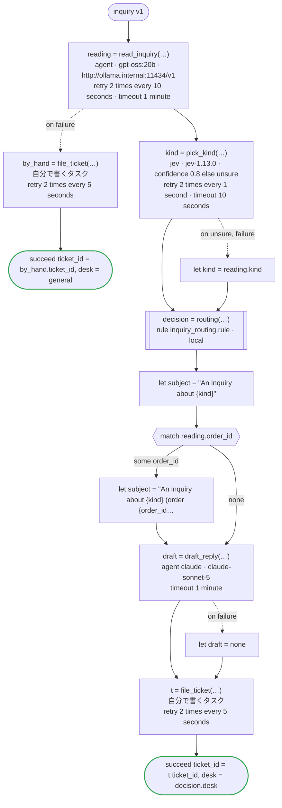

# inquiry v1

Jev picks the kind of a customer's inquiry and says how sure it is; an agent reads the inquiry for an order number and its point, and for its kind too, which the flow takes when Jev is not sure enough of its own. A rule decides the desk that takes it and how soon it is answered; another agent drafts the first reply; and a ticket goes into the desk's system. Jev picks, agents read and write (a model the company runs itself reads, Claude writes), and the rule decides. Written for Temporal: Jev and the agents are activities dandori writes, Jev called with TypeSafe's key (TYPESAFE_API_KEY), the reading sent to the company's Ollama, which serves Open Responses (`url`), and the draft to Claude with the key the worker has; the rule runs in the worker of the workflow as a local activity, its answer kept in the history as a marker; and filing the ticket is an activity you write

`examples/inquiry/temporal/inquiry.flow` を `dandori doc` で描いたものです。入力は `inquiry: Inquiry`、出力は `ticket_id: string`, `desk: routing.desk` です。

## flow

四角はタスク、両脇に線のある四角は規則、斜めの四角は外から値が届くタスク（イベントやコールバックの応答）、六角形は `match`、角の丸い四角は待ち、ステップを囲む枠はループです。破線の矢印は、呼び出しがその場で処理するエラーです。

## 呼び出し

| 行 | 呼び出し | 呼ぶもの | リトライ | タイムアウト | 失敗したとき |
|---:|---|---|---|---|---|
| 61 | `reading = read_inquiry(…)` | `agent · gpt-oss:20b · http://ollama.internal:11434/v1` | 10 秒おきに 2 回（failure, timeout） | 1 分 | `timeout`, `failure` → 62 行目 |
| 63 | `by_hand = file_ticket(…)` | 自分で書くタスク, `key` | 5 秒おきに 2 回（failure, timeout） | — | `timeout`, `failure` → ワークフローが失敗する |
| 66 | `kind = pick_kind(…)` | `jev · jev-1.13.0 · confidence 0.8 else unsure` | 1 秒おきに 2 回（failure, timeout） | 10 秒 | `unsure`, `timeout`, `failure` → 67 行目 |
| 68 | `decision = routing(…)` | 規則 `inquiry_routing.rule`（Temporal ではローカルアクティビティ） | 2 回（1 秒後と 2 秒後、failure） | — | `timeout`, `failure` → ワークフローが失敗する |
| 73 | `draft = draft_reply(…)` | `agent claude · claude-sonnet-5` | — | 1 分 | `timeout`, `failure` → 74 行目 |
| 75 | `t = file_ticket(…)` | 自分で書くタスク, `key` | 5 秒おきに 2 回（failure, timeout） | — | `timeout`, `failure` → ワークフローが失敗する |

## 終わり方

ワークフローの終わり方のすべてです。

| 行 | 終わり方 |
|---:|---|
| 64 | `succeed ticket_id = by_hand.ticket_id, desk = general` |
| 76 | `succeed ticket_id = t.ticket_id, desk = decision.desk` |

## 規則

このワークフローが呼ぶ規則を、`rulec doc` が承認する人向けに描いたものです。

<code>routing</code> · inquiry_routing v1 · <code>../rules/inquiry_routing.rule</code>

<!-- rulec 0.22.0 が inquiry_routing.rule (sha256:77cf5ddb6256) から生成。これは読み取り専用の資料で、本物は .rule のほうです。編集しても戻せません（§1.6）。 -->
# 規則 inquiry_routing v1

Which desk takes an inquiry, and how soon it is first answered, from its kind and whether the customer is a member. Written for the example

## 入力

| 名前 | 型 | 範囲 | 注記 |
|---|---|---|---|
| kind | kind（4 値） |  |  |
| member | bool |  |  |

## 出力

| 名前 | 型 | 丸め | 注記 |
|---|---|---|---|
| desk | desk（3 値） |  |  |
| within | duration[h] | down(1h) |  |

## 型

列挙は**閉じた**有限集合です。値を足すと、それを見ていない表が完全性検査で割れます。

- **kind**（4 値）— returns、delivery、billing、other
- **desk**（3 値）— logistics、accounting、general

## 表 route（policy unique）

| 列 | 出どころ |
|---|---|
| kind | 入力 |
| member | 入力 |
| → desk | この規則の出力 |
| → within | この規則の出力 |

| # | kind | member | → desk（desk） | → within（duration[h] / down(1h)） |
|---|---|---|---|---|
| 1 | returns | true | logistics | 24h |
| 2 | returns | false | logistics | 48h |
| 3 | delivery | - | logistics | 24h |
| 4 | billing | - | accounting | 48h |
| 5 | other | true | general | 48h |
| 6 | other | false | general | 72h |

**`rulec check` が確かめたこと**

- どの入力の組合せも、いずれかの行に当てはまります（E101 完全性）
- どの入力にも当てはまらない行はありません（E102）
- 二つ以上の行に同時に当てはまる入力はありません（E105 重なり）。行の並べ替えは意味を変えません

## 例（検証済み）

| kind | member | → desk | within |
|---|---|---|---|
| returns | true | logistics | 24h |
| billing | false | accounting | 48h |
| other | false | general | 72h |

この 3 件は `rulec check` が参照評価器で実行し、すべて宣言どおりの値になりました（E107）。例は**実行される仕様**です。

