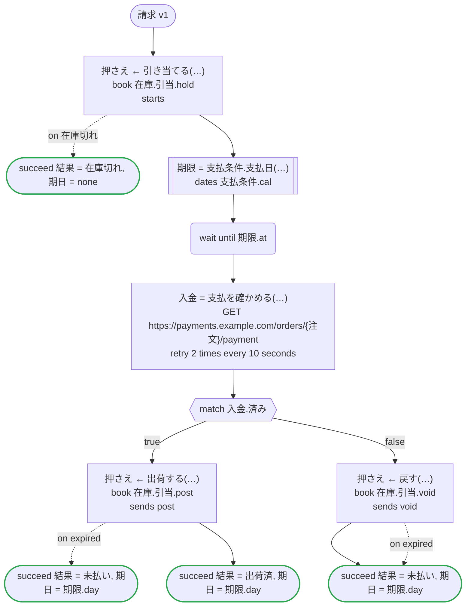
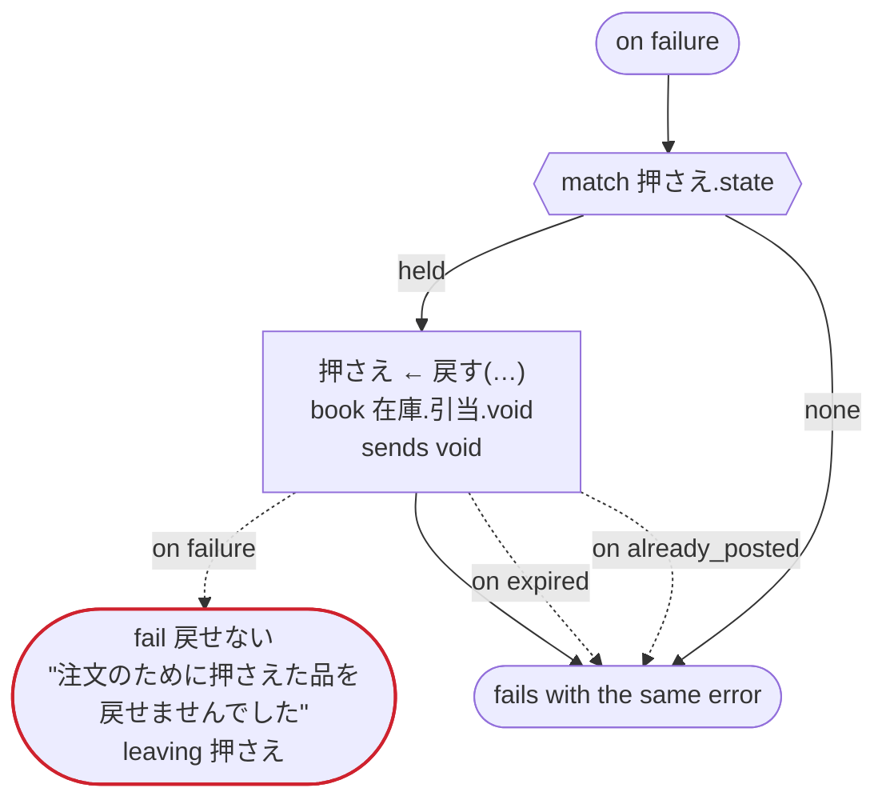

# 請求 v1

注文の品を支払期日まで押さえ、支払われたら出荷し、支払われなければ戻す

`examples/invoice/invoice.ja.flow`, drawn by `dandori doc`. Inputs: `受注: 注文`. Outputs: `結果: 終わり方`, `期日: date?`.

## flow

A rectangle is a task, one with a line down each side a rule or a date of a dates file, a slanted one a task whose value comes from outside (an event, or the answer to a callback), a hexagon a `match`, a rounded box a wait, and a box around steps a loop. A dashed arrow is an error the call handles.

## on failure

Runs when a call fails and nothing at the call handles the error: from the calls on lines 56, 58, 60, 63 and 67. When it runs to its end, the workflow fails with that error.

## Calls

| Line | Call | Calls | Retries | Timeout | When it fails | Case after |
|---:|---|---|---|---|---|---|
| 56 | `押さえ ← 引き当てる(…)` | `book 在庫.引当.hold`, `starts 在庫.引当` | — | — | `在庫切れ` → line 57 `timeout`, `failure` → `on failure` | `押さえ`: `held` |
| 58 | `期限 = 支払条件.支払日(…)` | the date `支払日` of `支払条件.cal` | 2 times, after 1 second and 2 (failure) | — | `timeout`, `failure` → `on failure` | — |
| 60 | `入金 = 支払を確かめる(…)` | `GET https://payments.example.com/orders/{注文}/payment`, `idempotent` | 2 times every 10 seconds (failure, timeout) | — | `timeout`, `failure` → `on failure` | — |
| 63 | `押さえ ← 出荷する(…)` | `book 在庫.引当.post`, `sends post` | — | — | `expired` → line 64 `timeout`, `failure` → `on failure` | `押さえ`: `posted` |
| 67 | `押さえ ← 戻す(…)` | `book 在庫.引当.void`, `sends void` | — | — | `expired` → line 68 `already_posted`, `timeout`, `failure` → `on failure` | `押さえ`: `voided` |
| 75 | `押さえ ← 戻す(…)` | `book 在庫.引当.void`, `sends void` | — | — | `expired` → line 76 `already_posted` → line 77 `timeout`, `failure` → line 78 | `押さえ`: `voided` |

## Ends

Every way the workflow can end, and what each case can be then, the events on the other side included.

| Line | End | `押さえ` |
|---:|---|---|
| 57 | `succeed 結果 = 在庫切れ, 期日 = none` | not started |
| 64 | `succeed 結果 = 未払い, 期日 = 期限.day` | `expired` |
| 65 | `succeed 結果 = 出荷済, 期日 = 期限.day` | `posted` |
| 69 | `succeed 結果 = 未払い, 期日 = 期限.day` | `voided`, `expired` |
| 78 | `fail 戻せない` "注文のために押さえた品を戻せませんでした" `leaving 押さえ` | handed over as it is: `held`, `posted`, `voided`, `expired` |
| 78 | `on failure` runs to its end, and the workflow fails with the error that started it | not started, or `posted`, `voided`, `expired` |

