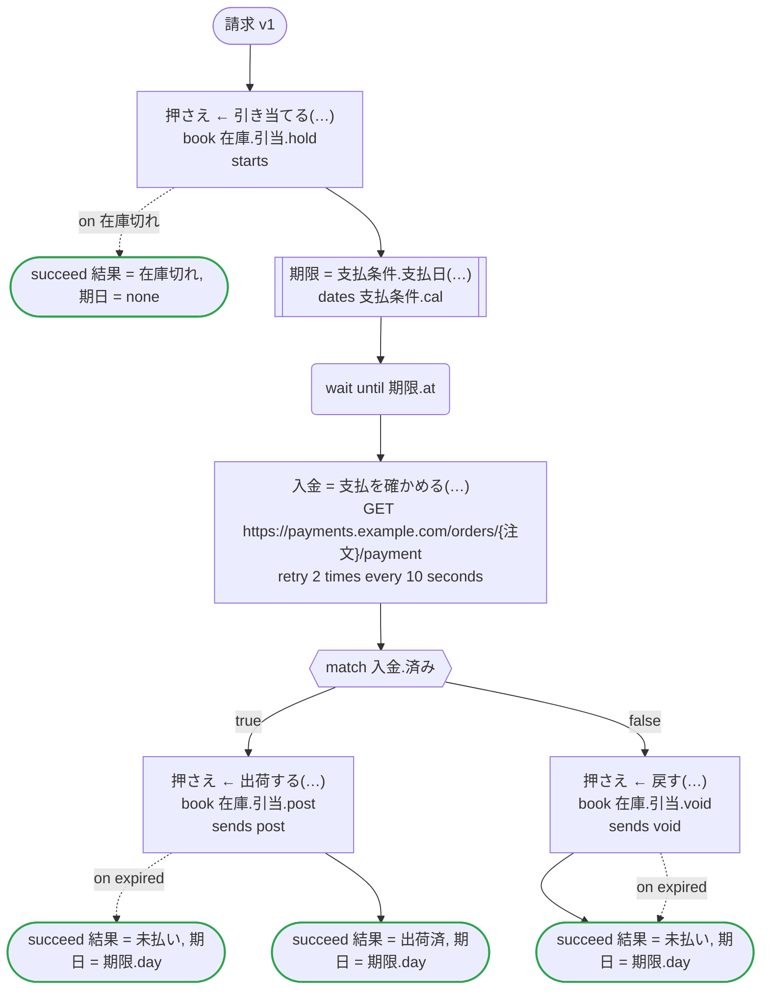
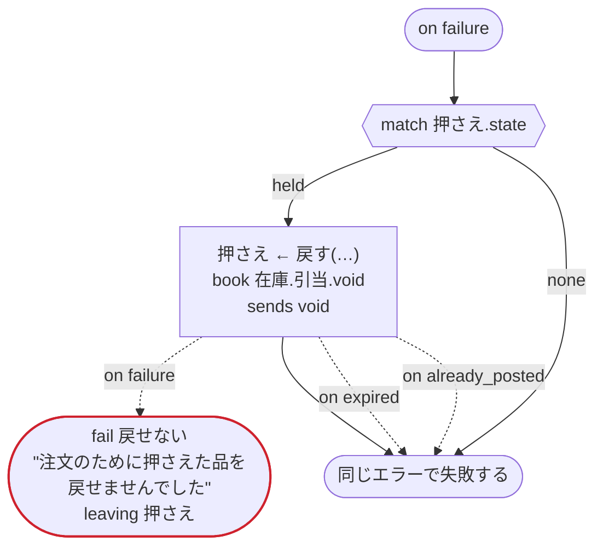

# 請求 v1

注文の品を支払期日まで押さえ、支払われたら出荷し、支払われなければ戻す

`examples/invoice/invoice.ja.flow` を `dandori doc` で描いたものです。入力は `受注: 注文`、出力は `結果: 終わり方`, `期日: date?` です。

## flow

四角はタスク、両脇に線のある四角は規則か日付のファイルの日付、斜めの四角は外から値が届くタスク（イベントやコールバックの応答）、六角形は `match`、角の丸い四角は待ち、ステップを囲む枠はループです。破線の矢印は、呼び出しがその場で処理するエラーです。

## on failure

呼び出しが失敗し、そのエラーをその場で処理しないときに走ります（56・58・60・63・67 行目の呼び出しから）。最後まで走ると、ワークフローはそのエラーで失敗します。

## 呼び出し

| 行 | 呼び出し | 呼ぶもの | リトライ | タイムアウト | 失敗したとき | 呼び出しのあとの案件 |
|---:|---|---|---|---|---|---|
| 56 | `押さえ ← 引き当てる(…)` | `book 在庫.引当.hold`, `starts 在庫.引当` | — | — | `在庫切れ` → 57 行目 `timeout`, `failure` → `on failure` | `押さえ`: `held` |
| 58 | `期限 = 支払条件.支払日(…)` | `支払条件.cal` の日付 `支払日` | 2 回（1 秒後と 2 秒後、failure） | — | `timeout`, `failure` → `on failure` | — |
| 60 | `入金 = 支払を確かめる(…)` | `GET https://payments.example.com/orders/{注文}/payment`, `idempotent` | 10 秒おきに 2 回（failure, timeout） | — | `timeout`, `failure` → `on failure` | — |
| 63 | `押さえ ← 出荷する(…)` | `book 在庫.引当.post`, `sends post` | — | — | `expired` → 64 行目 `timeout`, `failure` → `on failure` | `押さえ`: `posted` |
| 67 | `押さえ ← 戻す(…)` | `book 在庫.引当.void`, `sends void` | — | — | `expired` → 68 行目 `already_posted`, `timeout`, `failure` → `on failure` | `押さえ`: `voided` |
| 75 | `押さえ ← 戻す(…)` | `book 在庫.引当.void`, `sends void` | — | — | `expired` → 76 行目 `already_posted` → 77 行目 `timeout`, `failure` → 78 行目 | `押さえ`: `voided` |

## 終わり方

ワークフローの終わり方のすべてと、そのとき各案件がとりうる状態です。外部のサービスで起きるイベントも含めています。

| 行 | 終わり方 | `押さえ` |
|---:|---|---|
| 57 | `succeed 結果 = 在庫切れ, 期日 = none` | 始まっていない |
| 64 | `succeed 結果 = 未払い, 期日 = 期限.day` | `expired` |
| 65 | `succeed 結果 = 出荷済, 期日 = 期限.day` | `posted` |
| 69 | `succeed 結果 = 未払い, 期日 = 期限.day` | `voided`, `expired` |
| 78 | `fail 戻せない` "注文のために押さえた品を戻せませんでした" `leaving 押さえ` | そのまま引き渡す: `held`, `posted`, `voided`, `expired` |
| 78 | `on failure` が最後まで走り、ワークフローは始まりのエラーで失敗する | 始まっていないか、`posted`, `voided`, `expired` |

