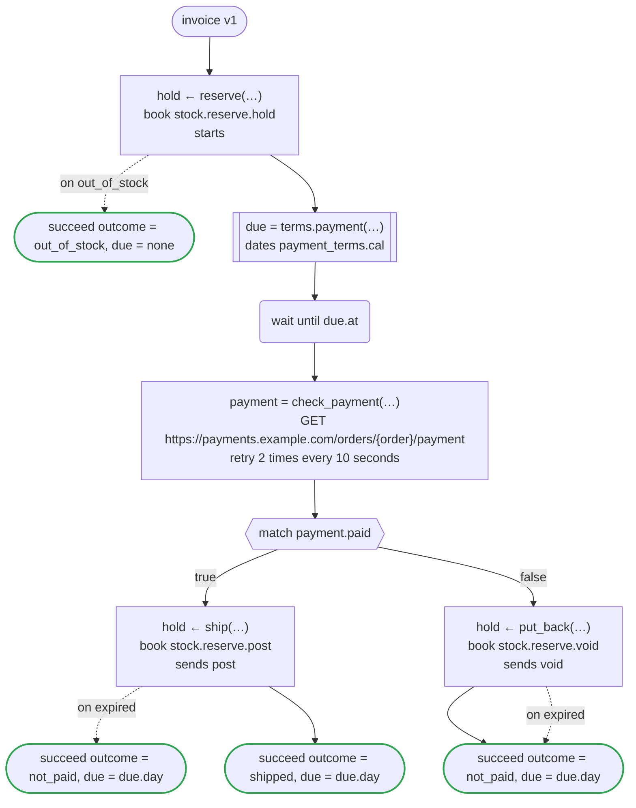
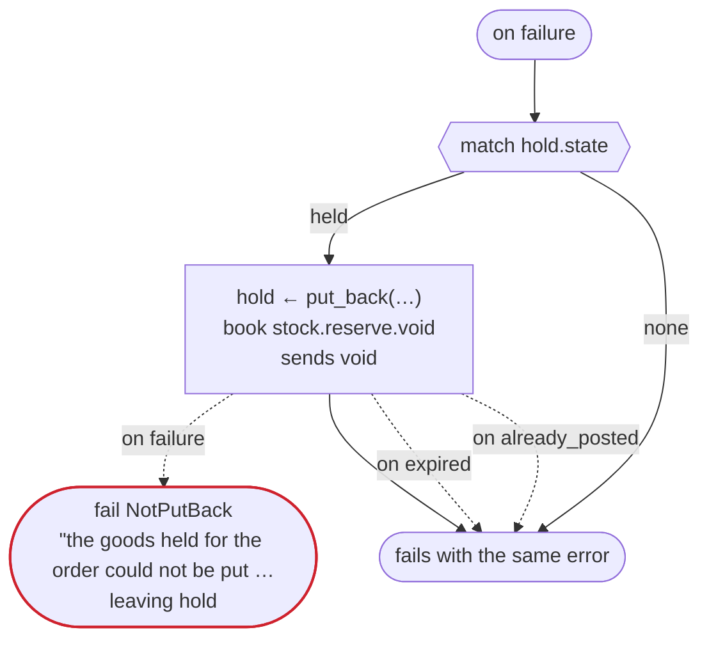

# invoice v1

An order holds its goods until its payment is due, then ships them once paid, or puts them back

`examples/invoice/invoice.flow`, drawn by `dandori doc`. Inputs: `order: Order`. Outputs: `outcome: Outcome`, `due: date?`.

## flow

A rectangle is a task, one with a line down each side a rule or a date of a dates file, a slanted one a task whose value comes from outside (an event, or the answer to a callback), a hexagon a `match`, a rounded box a wait, and a box around steps a loop. A dashed arrow is an error the call handles.

## on failure

Runs when a call fails and nothing at the call handles the error: from the calls on lines 56, 58, 60, 63 and 67. When it runs to its end, the workflow fails with that error.

## Calls

| Line | Call | Calls | Retries | Timeout | When it fails | Case after |
|---:|---|---|---|---|---|---|
| 56 | `hold ← reserve(…)` | `book stock.reserve.hold`, `starts stock.reserve` | — | — | `out_of_stock` → line 57 `timeout`, `failure` → `on failure` | `hold`: `held` |
| 58 | `due = terms.payment(…)` | the date `payment` of `payment_terms.cal` | 2 times, after 1 second and 2 (failure) | — | `timeout`, `failure` → `on failure` | — |
| 60 | `payment = check_payment(…)` | `GET https://payments.example.com/orders/{order}/payment`, `idempotent` | 2 times every 10 seconds (failure, timeout) | — | `timeout`, `failure` → `on failure` | — |
| 63 | `hold ← ship(…)` | `book stock.reserve.post`, `sends post` | — | — | `expired` → line 64 `timeout`, `failure` → `on failure` | `hold`: `posted` |
| 67 | `hold ← put_back(…)` | `book stock.reserve.void`, `sends void` | — | — | `expired` → line 68 `already_posted`, `timeout`, `failure` → `on failure` | `hold`: `voided` |
| 75 | `hold ← put_back(…)` | `book stock.reserve.void`, `sends void` | — | — | `expired` → line 76 `already_posted` → line 77 `timeout`, `failure` → line 78 | `hold`: `voided` |

## Ends

Every way the workflow can end, and what each case can be then, the events on the other side included.

| Line | End | `hold` |
|---:|---|---|
| 57 | `succeed outcome = out_of_stock, due = none` | not started |
| 64 | `succeed outcome = not_paid, due = due.day` | `expired` |
| 65 | `succeed outcome = shipped, due = due.day` | `posted` |
| 69 | `succeed outcome = not_paid, due = due.day` | `voided`, `expired` |
| 78 | `fail NotPutBack` "the goods held for the order could not be put back" `leaving hold` | handed over as it is: `held`, `posted`, `voided`, `expired` |
| 78 | `on failure` runs to its end, and the workflow fails with the error that started it | not started, or `posted`, `voided`, `expired` |

