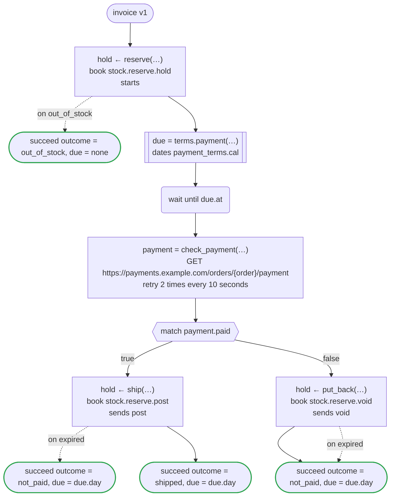
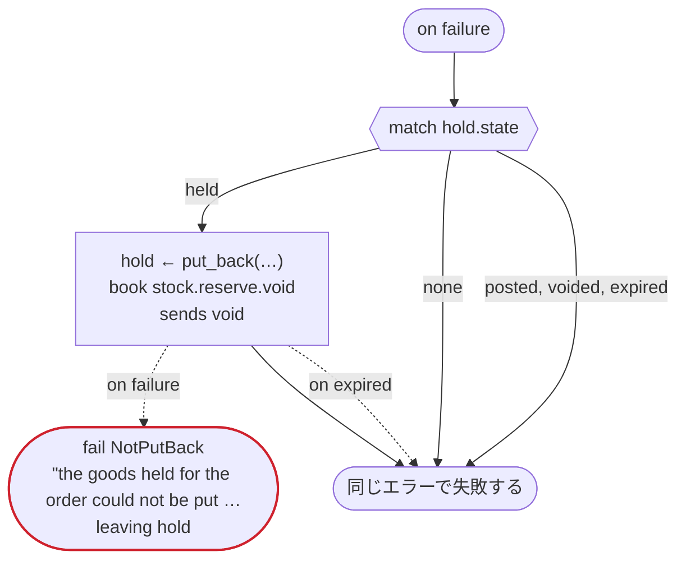

# invoice v1

An order holds its goods until its payment is due, then ships them once paid, or puts them back

`examples/invoice/invoice.flow` を `dandori doc` で描いたものです。入力は `order: Order`、出力は `outcome: Outcome`, `due: date?` です。

## flow

四角はタスク、両脇に線のある四角は規則か日付のファイルの日付、斜めの四角は外から値が届くタスク（イベントやコールバックの応答）、六角形は `match`、角の丸い四角は待ち、ステップを囲む枠はループです。破線の矢印は、呼び出しがその場で処理するエラーです。

## on failure

呼び出しが失敗し、そのエラーをその場で処理しないときに走ります（56・58・60・63・67 行目の呼び出しから）。最後まで走ると、ワークフローはそのエラーで失敗します。

## 呼び出し

| 行 | 呼び出し | 呼ぶもの | リトライ | タイムアウト | 失敗したとき | 呼び出しのあとの案件 |
|---:|---|---|---|---|---|---|
| 56 | `hold ← reserve(…)` | `book stock.reserve.hold`, `starts stock.reserve` | — | — | `out_of_stock` → 57 行目 `timeout`, `failure` → `on failure` | `hold`: `held` |
| 58 | `due = terms.payment(…)` | `payment_terms.cal` の日付 `payment` | 2 回（1 秒後と 2 秒後、failure） | — | `timeout`, `failure` → `on failure` | — |
| 60 | `payment = check_payment(…)` | `GET https://payments.example.com/orders/{order}/payment`, `idempotent` | 10 秒おきに 2 回（failure, timeout） | — | `timeout`, `failure` → `on failure` | — |
| 63 | `hold ← ship(…)` | `book stock.reserve.post`, `sends post` | — | — | `expired` → 64 行目 `timeout`, `failure` → `on failure` | `hold`: `posted` |
| 67 | `hold ← put_back(…)` | `book stock.reserve.void`, `sends void` | — | — | `expired` → 68 行目 `timeout`, `failure` → `on failure` | `hold`: `voided` |
| 75 | `hold ← put_back(…)` | `book stock.reserve.void`, `sends void` | — | — | `expired` → 76 行目 `timeout`, `failure` → 77 行目 | `hold`: `voided` |

## 終わり方

ワークフローの終わり方のすべてと、そのとき各案件がとりうる状態です。外部のサービスで起きるイベントも含めています。

| 行 | 終わり方 | `hold` |
|---:|---|---|
| 57 | `succeed outcome = out_of_stock, due = none` | 始まっていない |
| 64 | `succeed outcome = not_paid, due = due.day` | `expired` |
| 65 | `succeed outcome = shipped, due = due.day` | `posted` |
| 69 | `succeed outcome = not_paid, due = due.day` | `voided`, `expired` |
| 77 | `fail NotPutBack` "the goods held for the order could not be put back" `leaving hold` | そのまま引き渡す: `held`, `voided`, `expired` |
| 78 | `on failure` が最後まで走り、ワークフローは始まりのエラーで失敗する | 始まっていないか、`posted`, `voided`, `expired` |

