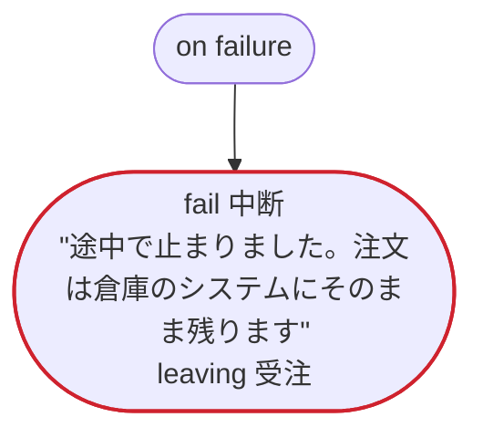

# 出荷 v1

倉庫のシステムにある注文について、入金を催促し、出荷させ、配達の知らせを待つ。注文の状態は倉庫のシステムが持ち、その移り方は rulec の規則「注文の状態」に従う。Temporal 向けの版：倉庫の呼び出しは dandori が生成するアクティビティで、お知らせは自分で書くアクティビティ。配達のことは、運送会社のシステムが注文の ID を宛先にして知らせる（event）。お店が途中で注文を取り消すと、倉庫でも取り消す（on cancel）。催促のループは、履歴が長くなると新しい実行に引き継ぐ

`examples/order/temporal/order.ja.flow`, drawn by `dandori doc`. Inputs: `注文ID: string`. Outputs: `便: 急ぎ.便`.

## flow

A rectangle is a task, one with a line down each side a rule, a slanted one a task whose value comes from outside (an event, or the answer to a callback), a hexagon a `match`, a rounded box a wait, and a box around steps a loop. A dashed arrow is an error the call handles.

## on failure

Runs when a call fails and nothing at the call handles the error: from the calls on lines 60, 64, 67, 71, 77, 78, 81 and 83. When it runs to its end, the workflow fails with that error.

## on cancel

Runs when the workflow is cancelled, from the call or the wait the run is at. When it runs to its end, the workflow ends cancelled.

## Calls

| Line | Call | Calls | Retries | Timeout | When it fails | Case after |
|---:|---|---|---|---|---|---|
| 60 | `受注 ← 注文を見る(…)` | `GET https://warehouse.example.com/v1/orders/{id}`, `observes`, `idempotent` | 3 times every 1 second (混雑) | — | `混雑`, `timeout`, `failure` → `on failure` | `受注`: `受付`, `入金済`, `出荷済`, `配達済`, `取消` |
| 64 | `催促の控え = 知らせる(…)` | a task you write, `key` | 2 times every 5 seconds (failure, timeout) | — | `宛先なし` → line 65 `timeout`, `failure` → `on failure` | — |
| 67 | `受注 ← 注文を見る(…)` | `GET https://warehouse.example.com/v1/orders/{id}`, `observes`, `idempotent` | 3 times every 1 second (混雑) | — | `混雑`, `timeout`, `failure` → `on failure` | `受注`: `受付`, `入金済`, `取消` |
| 71 | `受注 ← 取消を頼む(…)` | `POST https://warehouse.example.com/v1/orders/{id}/cancellations`, `sends 取消依頼`, `key` | — | — | `断られた` → line 72 `timeout`, `failure` → `on failure` | `受注`: `取消` |
| 77 | `判定 = 急ぎ(…)` | rule `出荷の急ぎ.rule` | 2 times, after 1 second and 2 (failure) | — | `timeout`, `failure` → `on failure` | — |
| 78 | `受注 ← 出荷を頼む(…)` | `POST https://warehouse.example.com/v1/orders/{id}/shipments`, `sends 出荷`, `key` | — | — | `断られた` → line 79 `timeout`, `failure` → `on failure` | `受注`: `出荷済` |
| 81 | `出荷の控え = 知らせる(…)` | a task you write, `key` | 2 times every 5 seconds (failure, timeout) | — | `宛先なし`, `timeout`, `failure` → `on failure` | — |
| 83 | `受注 ← 配達の知らせ()` | `event`, `observes` | — | 7 days | `timeout` → line 84 `failure` → `on failure` | `受注`: `出荷済`, `配達済` |
| 97 | `受注 ← 取消を頼む(…)` | `POST https://warehouse.example.com/v1/orders/{id}/cancellations`, `sends 取消依頼`, `key` | — | — | `断られた` → line 98 `timeout`, `failure` → line 99 | `受注`: `取消` |

## Ends

Every way the workflow can end, and what each case can be then, the events on the other side included.

| Line | End | `受注` |
|---:|---|---|
| 65 | `fail 連絡先なし` `leaving 受注` | handed over as it is: `受付`, `入金済`, `取消` |
| 73 | `fail 未入金` "三日たっても入金がありませんでした" | `取消` |
| 74 | `fail 取消済み` "取り消された注文です" | `取消` |
| 75 | `fail 既に出荷` "もう出荷されています" `leaving 受注` | handed over as it is: `出荷済`, `配達済` |
| 79 | `fail 取消済み` "出荷の前に取り消されました" | `取消` |
| 84 | `fail 配達の遅れ` "七日たっても配達の知らせがありません" `leaving 受注` | handed over as it is: `出荷済`, `配達済` |
| 86 | `succeed 便 = 判定.便` | `配達済` |
| 87 | `fail 配達の遅れ` "配達の知らせのあとも出荷済のままです" `leaving 受注` | handed over as it is: `出荷済`, `配達済` |
| 90 | `fail 中断` "途中で止まりました。注文は倉庫のシステムにそのまま残ります" `leaving 受注` | handed over as it is: not started, or `受付`, `入金済`, `出荷済`, `配達済`, `取消` |
| 99 | `fail 取消の失敗` "倉庫で注文 {受注.id} を取り消せませんでした" `leaving 受注` | handed over as it is: `受付`, `入金済`, `取消` |
| 100 | `fail 出荷後の取消` "注文 {受注.id} はもう出荷されています" `leaving 受注` | handed over as it is: `出荷済`, `配達済` |
| 100 | `on cancel` runs to its end, and the workflow ends cancelled | not started, or `取消` |

