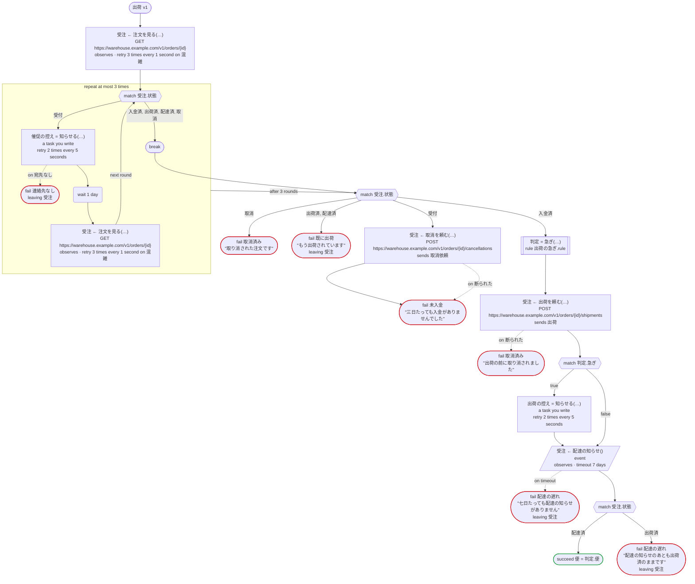
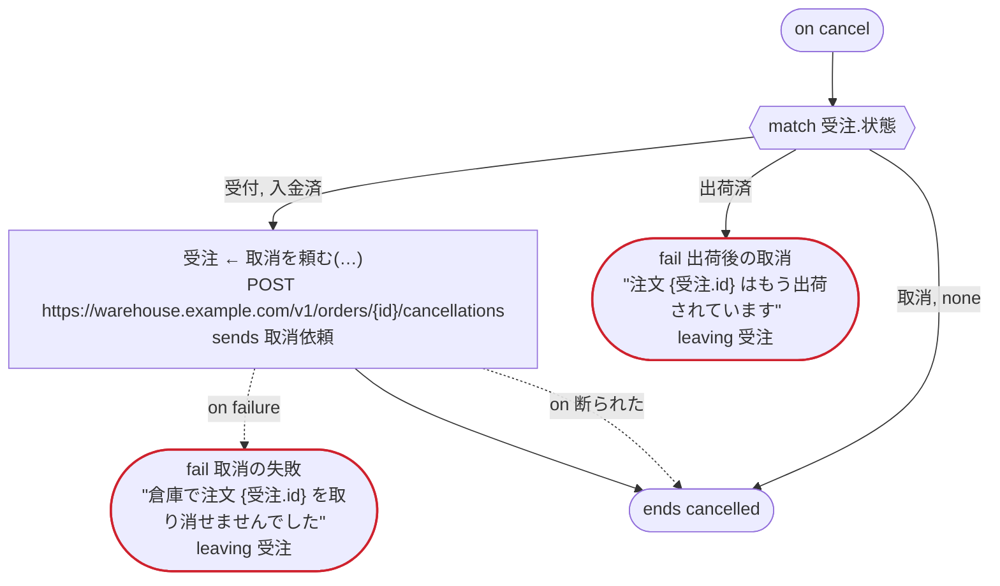
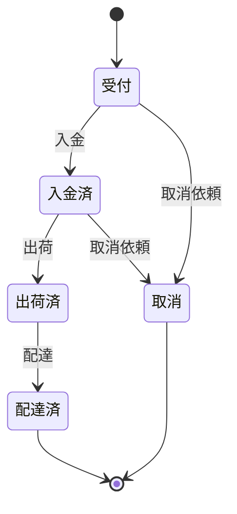

# 出荷 v1

倉庫のシステムにある注文について、入金を催促し、出荷させ、配達の知らせを待つ。注文の状態は倉庫のシステムが持ち、その移り方は rulec の規則「注文の状態」に従う。Temporal 向けの版：倉庫の呼び出しは dandori が生成するアクティビティで、お知らせは自分で書くアクティビティ。配達のことは、運送会社のシステムが注文の ID を宛先にして知らせる（event）。お店が途中で注文を取り消すと、倉庫でも取り消す（on cancel）。催促のループは、履歴が長くなると新しい実行に引き継ぐ

`examples/order/temporal/order.ja.flow`, drawn by `dandori doc`. Inputs: `注文ID: string`. Outputs: `便: 急ぎ.便`.

## flow

A rectangle is a task, one with a line down each side a rule, a slanted one a task whose value comes from outside (an event, or the answer to a callback), a hexagon a `match`, a rounded box a wait, and a box around steps a loop. A dashed arrow is an error the call handles.

## on failure

Runs when a call fails and nothing at the call handles the error: from the calls on lines 60, 64, 67, 71, 77, 78, 81 and 83. When it runs to its end, the workflow fails with that error.

## on cancel

Runs when the workflow is cancelled, from the call or the wait the run is at. When it runs to its end, the workflow ends cancelled.

## Calls

| Line | Call | Calls | Retries | Timeout | When it fails | Case after |
|---:|---|---|---|---|---|---|
| 60 | `受注 ← 注文を見る(…)` | `GET https://warehouse.example.com/v1/orders/{id}`, `observes`, `idempotent` | 3 times every 1 second (混雑) | — | `混雑`, `timeout`, `failure` → `on failure` | `受注`: `受付`, `入金済`, `出荷済`, `配達済`, `取消` |
| 64 | `催促の控え = 知らせる(…)` | a task you write, `key` | 2 times every 5 seconds (failure, timeout) | — | `宛先なし` → line 65 `timeout`, `failure` → `on failure` | — |
| 67 | `受注 ← 注文を見る(…)` | `GET https://warehouse.example.com/v1/orders/{id}`, `observes`, `idempotent` | 3 times every 1 second (混雑) | — | `混雑`, `timeout`, `failure` → `on failure` | `受注`: `受付`, `入金済`, `取消` |
| 71 | `受注 ← 取消を頼む(…)` | `POST https://warehouse.example.com/v1/orders/{id}/cancellations`, `sends 取消依頼`, `key` | — | — | `断られた` → line 72 `timeout`, `failure` → `on failure` | `受注`: `取消` |
| 77 | `判定 = 急ぎ(…)` | rule `出荷の急ぎ.rule` | 2 times, after 1 second and 2 (failure) | — | `timeout`, `failure` → `on failure` | — |
| 78 | `受注 ← 出荷を頼む(…)` | `POST https://warehouse.example.com/v1/orders/{id}/shipments`, `sends 出荷`, `key` | — | — | `断られた` → line 79 `timeout`, `failure` → `on failure` | `受注`: `出荷済` |
| 81 | `出荷の控え = 知らせる(…)` | a task you write, `key` | 2 times every 5 seconds (failure, timeout) | — | `宛先なし`, `timeout`, `failure` → `on failure` | — |
| 83 | `受注 ← 配達の知らせ()` | `event`, `observes` | — | 7 days | `timeout` → line 84 `failure` → `on failure` | `受注`: `出荷済`, `配達済` |
| 97 | `受注 ← 取消を頼む(…)` | `POST https://warehouse.example.com/v1/orders/{id}/cancellations`, `sends 取消依頼`, `key` | — | — | `断られた` → line 98 `timeout`, `failure` → line 99 | `受注`: `取消` |

## Ends

Every way the workflow can end, and what each case can be then, the events on the other side included.

| Line | End | `受注` |
|---:|---|---|
| 65 | `fail 連絡先なし` `leaving 受注` | handed over as it is: `受付`, `入金済`, `取消` |
| 73 | `fail 未入金` "三日たっても入金がありませんでした" | `取消` |
| 74 | `fail 取消済み` "取り消された注文です" | `取消` |
| 75 | `fail 既に出荷` "もう出荷されています" `leaving 受注` | handed over as it is: `出荷済`, `配達済` |
| 79 | `fail 取消済み` "出荷の前に取り消されました" | `取消` |
| 84 | `fail 配達の遅れ` "七日たっても配達の知らせがありません" `leaving 受注` | handed over as it is: `出荷済`, `配達済` |
| 86 | `succeed 便 = 判定.便` | `配達済` |
| 87 | `fail 配達の遅れ` "配達の知らせのあとも出荷済のままです" `leaving 受注` | handed over as it is: `出荷済`, `配達済` |
| 90 | `fail 中断` "途中で止まりました。注文は倉庫のシステムにそのまま残ります" `leaving 受注` | handed over as it is: not started, or `受付`, `入金済`, `出荷済`, `配達済`, `取消` |
| 99 | `fail 取消の失敗` "倉庫で注文 {受注.id} を取り消せませんでした" `leaving 受注` | handed over as it is: `受付`, `入金済`, `取消` |
| 100 | `fail 出荷後の取消` "注文 {受注.id} はもう出荷されています" `leaving 受注` | handed over as it is: `出荷済`, `配達済` |
| 100 | `on cancel` runs to its end, and the workflow ends cancelled | not started, or `取消` |

## Rules

The rules this workflow calls, as `rulec doc` renders them for whoever approves them.

<code>注文の状態</code> · 注文の状態 v1 · <code>../rules/注文の状態.rule</code>

<!-- Generated by rulec 0.21.2 from 注文の状態.rule (sha256:a78989a24f22). This is a read-only rendering; the source of truth is the .rule file. Edits cannot be carried back (§1.6). -->
# Rule 注文の状態 v1

通販の注文が、入金・出荷・配達・取消依頼のイベントでどの状態に移り、いくら返金するか。状態は呼び出す側が持ち、規則は一回のイベントだけを判定する。書き下ろしの例

## Inputs

| Name | Type | Range | Notes |
|---|---|---|---|
| 状態 | 状態 (5 values) |  |  |
| イベント | イベント (4 values) |  |  |
| 支払額 | money[円, incl_tax] | 0円 〜 100万円 |  |

## Outputs

| Name | Type | Rounding | Notes |
|---|---|---|---|
| 次の状態 | 状態 (5 values) |  |  |
| 返金額 | money[円, incl_tax] | down(1円) |  |
| 受理 | bool |  |  |

## Types

An enum is a **closed** finite set. Add a value, and every table that does not look at it fails the completeness check.

- **状態** (5 values) — 受付, 入金済, 出荷済, 配達済, 取消
- **イベント** (4 values) — 入金, 出荷, 配達, 取消依頼

## Table 遷移 (policy unique)

| Column | Source |
|---|---|
| 状態 | Input |
| イベント | Input |
| → 次の状態 | Output of this rule |
| → 返金額 | Output of this rule |
| → 受理 | Output of this rule |

| # | 状態 | イベント | → 次の状態 (状態) | → 返金額 (money[円, incl_tax] / down(1円)) | → 受理 (bool) | Notes |
|---|---|---|---|---|---|---|
| 1 | 受付 | 入金 | 入金済 | 0円 | true |  |
| 2 | 受付 | 取消依頼 | 取消 | 0円 | true |  |
| 3 | 受付 | 出荷, 配達 | 状態 | 0円 | false |  |
| 4 | 入金済 | 出荷 | 出荷済 | 0円 | true |  |
| 5 | 入金済 | 取消依頼 | 取消 | 支払額 | true |  |
| 6 | 入金済 | 入金, 配達 | 状態 | 0円 | false |  |
| 7 | 出荷済 | 配達 | 配達済 | 0円 | true |  |
| 8 | 出荷済 | 入金, 出荷, 取消依頼 | 状態 | 0円 | false | 出荷のあとの取消は、返品の手続きで受ける |
| 9 | 配達済 | - | 状態 | 0円 | false |  |
| 10 | 取消 | - | 状態 | 0円 | false | 取消のあとに届いた入金の通知では、注文を戻さない |

**What `rulec check` verified**

- Every combination of inputs matches some row (E101 completeness)
- There is no row that can never match (E102 unreachable row)
- No input matches two or more rows at once (E105 overlap). Reordering the rows does not change the meaning

## State machine: 注文

This rule is one step of a state machine. Every call is passed the state (input 状態) and answers the next one (output 次の状態). **The caller keeps the state; the generated code keeps nothing.** Where a case goes is decided by table 遷移.

| Initial state | Final states |
|---|---|
| 受付 | 配達済, 取消 |

One case passes 支払額 with the same value from its first call to its last (`held`). The claims below are about the sequences of calls that keep it.

### Where each state goes

| State | Goes to (row of table 遷移) |
|---|---|
| 受付 | 入金（row 1） → 入金済 / 取消依頼（row 2） → 取消 / 出荷, 配達（row 3） → stays |
| 入金済 | 出荷（row 4） → 出荷済 / 取消依頼（row 5） → 取消 / 入金, 配達（row 6） → stays |
| 出荷済 | 配達（row 7） → 配達済 / 入金, 出荷, 取消依頼（row 8） → stays |
| 配達済 | any call（row 9） → stays |
| 取消 | any call（row 10） → stays |

### What `rulec check` proved about every sequence of calls

- From 受付 a case can reach 受付, 入金済, 出荷済, 配達済, 取消. Every state is reached.
- No call moves a case out of the final states 配達済, 取消.
- Whatever state a case reaches, a way to a final state remains.
- `never 出荷済 after 取消`: no sequence of calls reaches 出荷済 after 取消.
- `once 返金額 >0円`: 返金額 is answered >0円 at most once in a case.

### Scenarios (verified)

**配達まで**

| # | 状態 | イベント | 支払額 | → 次の状態 | 返金額 | 受理 |
|---|---|---|---|---|---|---|
| 1 | 受付 | 入金 | 3000円 | 入金済 | 0円 | true |
| 2 | 入金済 | 出荷 | 3000円 | 出荷済 | 0円 | true |
| 3 | 出荷済 | 配達 | 3000円 | 配達済 | 0円 | true |

**取消のあとの入金**

| # | 状態 | イベント | 支払額 | → 次の状態 | 返金額 | 受理 |
|---|---|---|---|---|---|---|
| 1 | 受付 | 入金 | 3000円 | 入金済 | 0円 | true |
| 2 | 入金済 | 取消依頼 | 3000円 | 取消 | 3000円 | true |
| 3 | 取消 | 入金 | 3000円 | 取消 | 0円 | false |

The first call starts in 受付, and every later one in the state the call before it answered (the left column). `rulec check` ran them in order through the reference evaluator, and every one produced the declared values (E107).

## Examples (verified)

| 状態 | イベント | 支払額 | → 次の状態 | 返金額 | 受理 |
|---|---|---|---|---|---|
| 受付 | 取消依頼 | 0円 | 取消 | 0円 | true |
| 出荷済 | 取消依頼 | 3000円 | 出荷済 | 0円 | false |

`rulec check` ran these 2 examples through the reference evaluator, and every one produced the declared values (E107). The examples are an **executable specification**.

<code>急ぎ</code> · 出荷の急ぎ v1 · <code>../rules/出荷の急ぎ.rule</code>

<!-- Generated by rulec 0.21.2 from 出荷の急ぎ.rule (sha256:3f566b643eb8). This is a read-only rendering; the source of truth is the .rule file. Edits cannot be carried back (§1.6). -->
# Rule 出荷の急ぎ v1

注文を急ぎで出すかどうかと、使う便。会員はいつも急ぎ、それ以外は三万円以上なら急ぎ。書き下ろしの例

## Inputs

| Name | Type | Range | Notes |
|---|---|---|---|
| 会員 | bool |  |  |
| 金額 | money[円, incl_tax] | 0円 〜 100万円 |  |

## Outputs

| Name | Type | Rounding | Notes |
|---|---|---|---|
| 急ぎ | bool |  |  |
| 便 | 便 (2 values) |  |  |

## Types

An enum is a **closed** finite set. Add a value, and every table that does not look at it fails the completeness check.

- **便** (2 values) — 通常便, 翌日便

## Table 急ぎの判定 (policy unique)

| Column | Source |
|---|---|
| 会員 | Input |
| 金額 | Input |
| → 急ぎ | Output of this rule |
| → 便 | Output of this rule |

| # | 会員 | 金額 | → 急ぎ (bool) | → 便 (便) |
|---|---|---|---|---|
| 1 | true | - | true | 翌日便 |
| 2 | false | >=30000円 | true | 翌日便 |
| 3 | false | <30000円 | false | 通常便 |

**What `rulec check` verified**

- Every combination of inputs matches some row (E101 completeness)
- There is no row that can never match (E102 unreachable row)
- No input matches two or more rows at once (E105 overlap). Reordering the rows does not change the meaning

## Examples (verified)

| 会員 | 金額 | → 急ぎ | 便 |
|---|---|---|---|
| true | 1000円 | true | 翌日便 |
| false | 5000円 | false | 通常便 |
| false | 30000円 | true | 翌日便 |

`rulec check` ran these 3 examples through the reference evaluator, and every one produced the declared values (E107). The examples are an **executable specification**.

