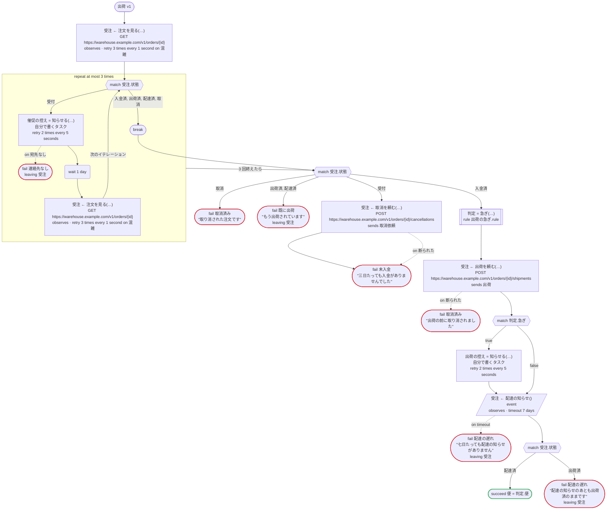
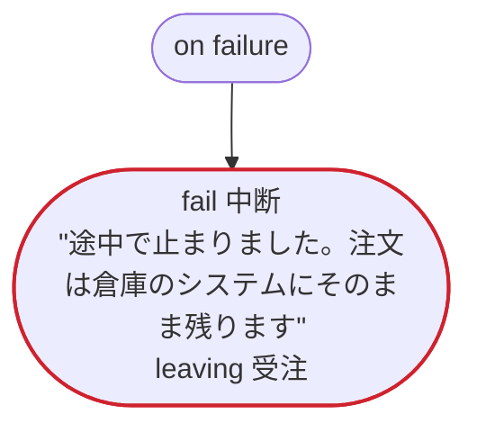
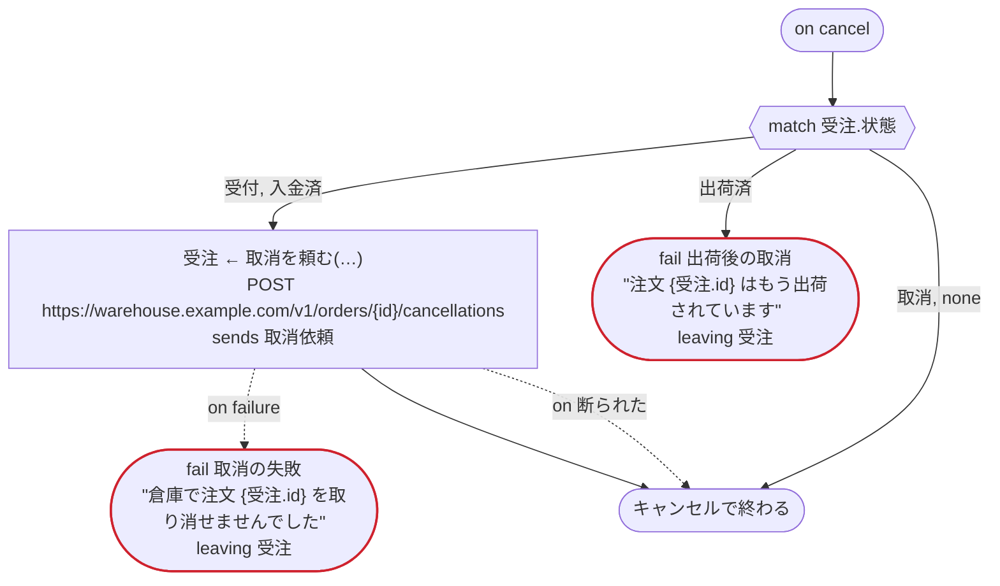
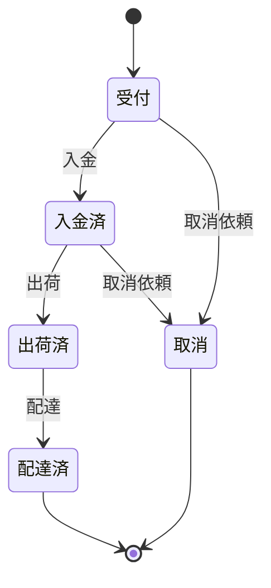

# 出荷 v1

倉庫のシステムにある注文について、入金を催促し、出荷させ、配達の知らせを待つ。注文の状態は倉庫のシステムが持ち、その移り方は rulec の規則「注文の状態」に従う。Temporal 向けの版：倉庫の呼び出しは dandori が生成するアクティビティで、お知らせは自分で書くアクティビティ。配達のことは、運送会社のシステムが注文の ID を宛先にして知らせる（event）。お店が途中で注文を取り消すと、倉庫でも取り消す（on cancel）。催促のループは、履歴が長くなると新しい実行に引き継ぐ

`examples/order/temporal/order.ja.flow` を `dandori doc` で描いたものです。入力は `注文ID: string`、出力は `便: 急ぎ.便` です。

## flow

四角はタスク、両脇に線のある四角は規則、斜めの四角は外から値が届くタスク（イベントやコールバックの応答）、六角形は `match`、角の丸い四角は待ち、ステップを囲む枠はループです。破線の矢印は、呼び出しがその場で処理するエラーです。

## on failure

呼び出しが失敗し、そのエラーをその場で処理しないときに走ります（60・64・67・71・77・78・81・83 行目の呼び出しから）。最後まで走ると、ワークフローはそのエラーで失敗します。

## on cancel

ワークフローがキャンセルされると、そのとき待っている呼び出しや wait から、ここに来ます。最後まで走ると、ワークフローはキャンセルで終わります。

## 呼び出し

| 行 | 呼び出し | 呼ぶもの | リトライ | タイムアウト | 失敗したとき | 呼び出しのあとの案件 |
|---:|---|---|---|---|---|---|
| 60 | `受注 ← 注文を見る(…)` | `GET https://warehouse.example.com/v1/orders/{id}`, `observes`, `idempotent` | 1 秒おきに 3 回（混雑） | — | `混雑`, `timeout`, `failure` → `on failure` | `受注`: `受付`, `入金済`, `出荷済`, `配達済`, `取消` |
| 64 | `催促の控え = 知らせる(…)` | 自分で書くタスク, `key` | 5 秒おきに 2 回（failure, timeout） | — | `宛先なし` → 65 行目 `timeout`, `failure` → `on failure` | — |
| 67 | `受注 ← 注文を見る(…)` | `GET https://warehouse.example.com/v1/orders/{id}`, `observes`, `idempotent` | 1 秒おきに 3 回（混雑） | — | `混雑`, `timeout`, `failure` → `on failure` | `受注`: `受付`, `入金済`, `取消` |
| 71 | `受注 ← 取消を頼む(…)` | `POST https://warehouse.example.com/v1/orders/{id}/cancellations`, `sends 取消依頼`, `key` | — | — | `断られた` → 72 行目 `timeout`, `failure` → `on failure` | `受注`: `取消` |
| 77 | `判定 = 急ぎ(…)` | 規則 `出荷の急ぎ.rule` | 2 回（1 秒後と 2 秒後、failure） | — | `timeout`, `failure` → `on failure` | — |
| 78 | `受注 ← 出荷を頼む(…)` | `POST https://warehouse.example.com/v1/orders/{id}/shipments`, `sends 出荷`, `key` | — | — | `断られた` → 79 行目 `timeout`, `failure` → `on failure` | `受注`: `出荷済` |
| 81 | `出荷の控え = 知らせる(…)` | 自分で書くタスク, `key` | 5 秒おきに 2 回（failure, timeout） | — | `宛先なし`, `timeout`, `failure` → `on failure` | — |
| 83 | `受注 ← 配達の知らせ()` | `event`, `observes` | — | 7 日 | `timeout` → 84 行目 `failure` → `on failure` | `受注`: `出荷済`, `配達済` |
| 97 | `受注 ← 取消を頼む(…)` | `POST https://warehouse.example.com/v1/orders/{id}/cancellations`, `sends 取消依頼`, `key` | — | — | `断られた` → 98 行目 `timeout`, `failure` → 99 行目 | `受注`: `取消` |

## 終わり方

ワークフローの終わり方のすべてと、そのとき各案件がとりうる状態です。外部のサービスで起きるイベントも含めています。

| 行 | 終わり方 | `受注` |
|---:|---|---|
| 65 | `fail 連絡先なし` `leaving 受注` | そのまま引き渡す: `受付`, `入金済`, `取消` |
| 73 | `fail 未入金` "三日たっても入金がありませんでした" | `取消` |
| 74 | `fail 取消済み` "取り消された注文です" | `取消` |
| 75 | `fail 既に出荷` "もう出荷されています" `leaving 受注` | そのまま引き渡す: `出荷済`, `配達済` |
| 79 | `fail 取消済み` "出荷の前に取り消されました" | `取消` |
| 84 | `fail 配達の遅れ` "七日たっても配達の知らせがありません" `leaving 受注` | そのまま引き渡す: `出荷済`, `配達済` |
| 86 | `succeed 便 = 判定.便` | `配達済` |
| 87 | `fail 配達の遅れ` "配達の知らせのあとも出荷済のままです" `leaving 受注` | そのまま引き渡す: `出荷済`, `配達済` |
| 90 | `fail 中断` "途中で止まりました。注文は倉庫のシステムにそのまま残ります" `leaving 受注` | そのまま引き渡す: 始まっていないか、`受付`, `入金済`, `出荷済`, `配達済`, `取消` |
| 99 | `fail 取消の失敗` "倉庫で注文 {受注.id} を取り消せませんでした" `leaving 受注` | そのまま引き渡す: `受付`, `入金済`, `取消` |
| 100 | `fail 出荷後の取消` "注文 {受注.id} はもう出荷されています" `leaving 受注` | そのまま引き渡す: `出荷済`, `配達済` |
| 100 | `on cancel` が最後まで走り、ワークフローはキャンセルで終わる | 始まっていないか、`取消` |

## 規則

このワークフローが呼ぶ規則を、`rulec doc` が承認する人向けに描いたものです。

<code>注文の状態</code> · 注文の状態 v1 · <code>../rules/注文の状態.rule</code>

<!-- rulec 0.22.0 が 注文の状態.rule (sha256:a78989a24f22) から生成。これは読み取り専用の資料で、本物は .rule のほうです。編集しても戻せません（§1.6）。 -->
# 規則 注文の状態 v1

通販の注文が、入金・出荷・配達・取消依頼のイベントでどの状態に移り、いくら返金するか。状態は呼び出す側が持ち、規則は一回のイベントだけを判定する。書き下ろしの例

## 入力

| 名前 | 型 | 範囲 | 注記 |
|---|---|---|---|
| 状態 | 状態（5 値） |  |  |
| イベント | イベント（4 値） |  |  |
| 支払額 | money[円, incl_tax] | 0円 〜 100万円 |  |

## 出力

| 名前 | 型 | 丸め | 注記 |
|---|---|---|---|
| 次の状態 | 状態（5 値） |  |  |
| 返金額 | money[円, incl_tax] | down(1円) |  |
| 受理 | bool |  |  |

## 型

列挙は**閉じた**有限集合です。値を足すと、それを見ていない表が完全性検査で割れます。

- **状態**（5 値）— 受付、入金済、出荷済、配達済、取消
- **イベント**（4 値）— 入金、出荷、配達、取消依頼

## 表 遷移（policy unique）

| 列 | 出どころ |
|---|---|
| 状態 | 入力 |
| イベント | 入力 |
| → 次の状態 | この規則の出力 |
| → 返金額 | この規則の出力 |
| → 受理 | この規則の出力 |

| # | 状態 | イベント | → 次の状態（状態） | → 返金額（money[円, incl_tax] / down(1円)） | → 受理（bool） | 注記 |
|---|---|---|---|---|---|---|
| 1 | 受付 | 入金 | 入金済 | 0円 | true |  |
| 2 | 受付 | 取消依頼 | 取消 | 0円 | true |  |
| 3 | 受付 | 出荷, 配達 | 状態 | 0円 | false |  |
| 4 | 入金済 | 出荷 | 出荷済 | 0円 | true |  |
| 5 | 入金済 | 取消依頼 | 取消 | 支払額 | true |  |
| 6 | 入金済 | 入金, 配達 | 状態 | 0円 | false |  |
| 7 | 出荷済 | 配達 | 配達済 | 0円 | true |  |
| 8 | 出荷済 | 入金, 出荷, 取消依頼 | 状態 | 0円 | false | 出荷のあとの取消は、返品の手続きで受ける |
| 9 | 配達済 | - | 状態 | 0円 | false |  |
| 10 | 取消 | - | 状態 | 0円 | false | 取消のあとに届いた入金の通知では、注文を戻さない |

**`rulec check` が確かめたこと**

- どの入力の組合せも、いずれかの行に当てはまります（E101 完全性）
- どの入力にも当てはまらない行はありません（E102）
- 二つ以上の行に同時に当てはまる入力はありません（E105 重なり）。行の並べ替えは意味を変えません

## ステートマシン: 注文

この規則はステートマシンの一歩です。呼び出しのたびに状態（入力 状態）を受け取り、次の状態（出力 次の状態）を返します。**状態を覚えておくのは呼び出す側で、生成コードは何も覚えません。**行き先を決めるのは表 遷移 です。

| 始まりの状態 | 終わりの状態 |
|---|---|
| 受付 | 配達済、取消 |

一つの案件は、支払額 を最初の呼び出しから最後の呼び出しまで同じ値で渡します（`held`）。下の主張は、それを変えない呼び出しの並びについてのものです。

### 状態ごとの行き先

| 状態 | 行き先（表 遷移 の行） |
|---|---|
| 受付 | 入金（行1） → 入金済 / 取消依頼（行2） → 取消 / 出荷, 配達（行3） → 留まる |
| 入金済 | 出荷（行4） → 出荷済 / 取消依頼（行5） → 取消 / 入金, 配達（行6） → 留まる |
| 出荷済 | 配達（行7） → 配達済 / 入金, 出荷, 取消依頼（行8） → 留まる |
| 配達済 | どの呼び出しでも（行9） → 留まる |
| 取消 | どの呼び出しでも（行10） → 留まる |

### `rulec check` が呼び出しの並び全体について確かめたこと

- 受付 から着ける状態は 受付・入金済・出荷済・配達済・取消 です。すべての状態に着けます。
- 終わりの状態 配達済・取消 からは、ほかの状態へ移る呼び出しがありません。
- どの状態に着いても、終わりの状態へ行く手順が残っています。
- `never 出荷済 after 取消`: 取消 のあとに 出荷済 に着く手順はありません。
- `once 返金額 >0円`: 返金額 が >0円 になる呼び出しは、一件の案件で一回までです。

### 手順の例（検証済み）

**配達まで**

| # | 状態 | イベント | 支払額 | → 次の状態 | 返金額 | 受理 |
|---|---|---|---|---|---|---|
| 1 | 受付 | 入金 | 3000円 | 入金済 | 0円 | true |
| 2 | 入金済 | 出荷 | 3000円 | 出荷済 | 0円 | true |
| 3 | 出荷済 | 配達 | 3000円 | 配達済 | 0円 | true |

**取消のあとの入金**

| # | 状態 | イベント | 支払額 | → 次の状態 | 返金額 | 受理 |
|---|---|---|---|---|---|---|
| 1 | 受付 | 入金 | 3000円 | 入金済 | 0円 | true |
| 2 | 入金済 | 取消依頼 | 3000円 | 取消 | 3000円 | true |
| 3 | 取消 | 入金 | 3000円 | 取消 | 0円 | false |

一行目は 受付 から始まり、二行目からは一つ前の呼び出しが返した状態から始まります（左の列）。`rulec check` が参照評価器で順に実行し、すべて宣言どおりの値になりました（E107）。

## 例（検証済み）

| 状態 | イベント | 支払額 | → 次の状態 | 返金額 | 受理 |
|---|---|---|---|---|---|
| 受付 | 取消依頼 | 0円 | 取消 | 0円 | true |
| 出荷済 | 取消依頼 | 3000円 | 出荷済 | 0円 | false |

この 2 件は `rulec check` が参照評価器で実行し、すべて宣言どおりの値になりました（E107）。例は**実行される仕様**です。

<code>急ぎ</code> · 出荷の急ぎ v1 · <code>../rules/出荷の急ぎ.rule</code>

<!-- rulec 0.22.0 が 出荷の急ぎ.rule (sha256:3f566b643eb8) から生成。これは読み取り専用の資料で、本物は .rule のほうです。編集しても戻せません（§1.6）。 -->
# 規則 出荷の急ぎ v1

注文を急ぎで出すかどうかと、使う便。会員はいつも急ぎ、それ以外は三万円以上なら急ぎ。書き下ろしの例

## 入力

| 名前 | 型 | 範囲 | 注記 |
|---|---|---|---|
| 会員 | bool |  |  |
| 金額 | money[円, incl_tax] | 0円 〜 100万円 |  |

## 出力

| 名前 | 型 | 丸め | 注記 |
|---|---|---|---|
| 急ぎ | bool |  |  |
| 便 | 便（2 値） |  |  |

## 型

列挙は**閉じた**有限集合です。値を足すと、それを見ていない表が完全性検査で割れます。

- **便**（2 値）— 通常便、翌日便

## 表 急ぎの判定（policy unique）

| 列 | 出どころ |
|---|---|
| 会員 | 入力 |
| 金額 | 入力 |
| → 急ぎ | この規則の出力 |
| → 便 | この規則の出力 |

| # | 会員 | 金額 | → 急ぎ（bool） | → 便（便） |
|---|---|---|---|---|
| 1 | true | - | true | 翌日便 |
| 2 | false | >=30000円 | true | 翌日便 |
| 3 | false | <30000円 | false | 通常便 |

**`rulec check` が確かめたこと**

- どの入力の組合せも、いずれかの行に当てはまります（E101 完全性）
- どの入力にも当てはまらない行はありません（E102）
- 二つ以上の行に同時に当てはまる入力はありません（E105 重なり）。行の並べ替えは意味を変えません

## 例（検証済み）

| 会員 | 金額 | → 急ぎ | 便 |
|---|---|---|---|
| true | 1000円 | true | 翌日便 |
| false | 5000円 | false | 通常便 |
| false | 30000円 | true | 翌日便 |

この 3 件は `rulec check` が参照評価器で実行し、すべて宣言どおりの値になりました（E107）。例は**実行される仕様**です。

