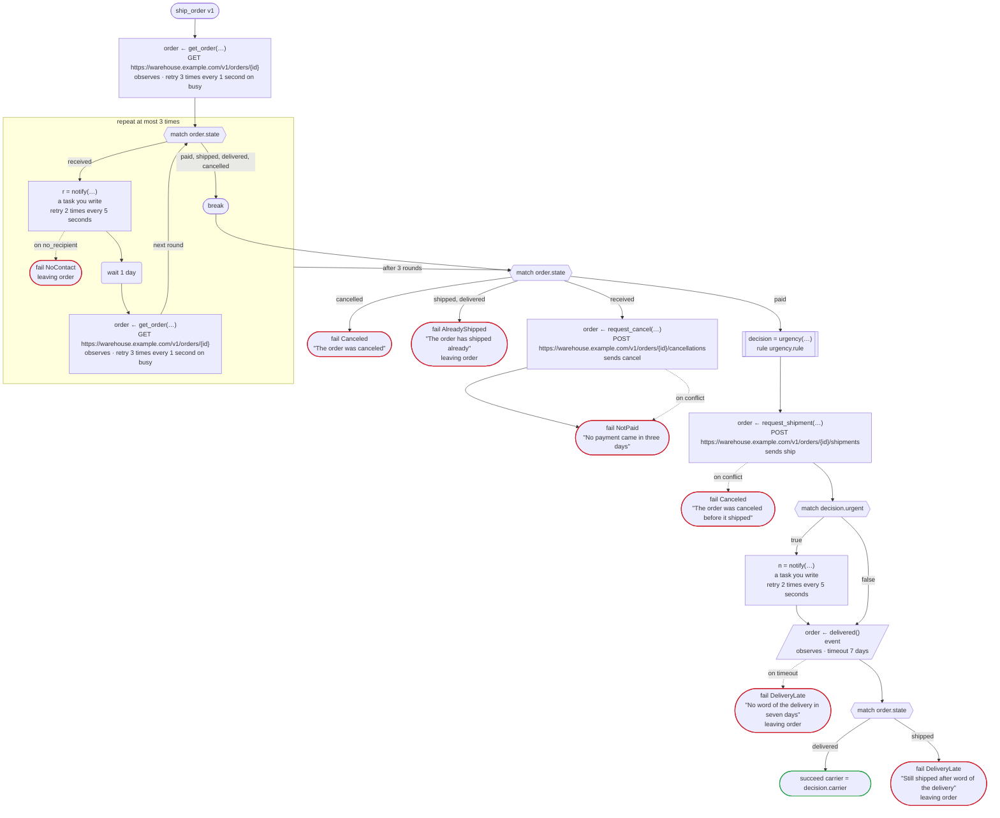
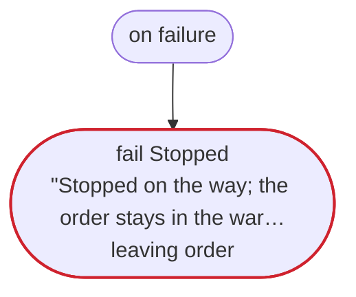
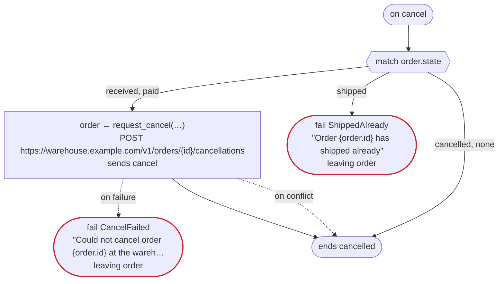
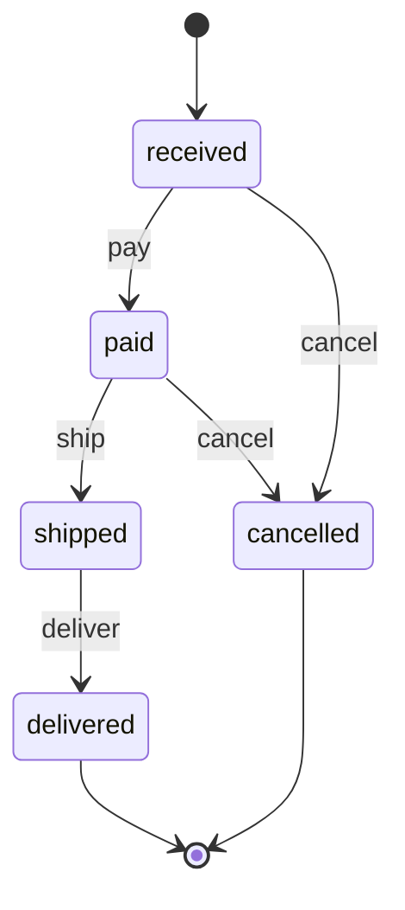

# ship_order v1

For an order in the warehouse's system, ask for the payment, have it shipped, and wait for word of the delivery. The warehouse's system keeps the order's state, which moves as rulec's rule order_state says. Written for Temporal: the warehouse's calls are activities dandori writes, and the notice is an activity you write; the carrier's system tells the workflow of the order about the delivery, by the order's id (an event); and an order the shop cancels on the way is cancelled at the warehouse too (on cancel). The loop over the reminders goes on in a new run when its history grows long

`examples/order/temporal/order.flow`, drawn by `dandori doc`. Inputs: `order_id: string`. Outputs: `carrier: urgency.carrier`.

## flow

A rectangle is a task, one with a line down each side a rule, a slanted one a task whose value comes from outside (an event, or the answer to a callback), a hexagon a `match`, a rounded box a wait, and a box around steps a loop. A dashed arrow is an error the call handles.

## on failure

Runs when a call fails and nothing at the call handles the error: from the calls on lines 61, 65, 68, 72, 78, 79, 82 and 84. When it runs to its end, the workflow fails with that error.

## on cancel

Runs when the workflow is cancelled, from the call or the wait the run is at. When it runs to its end, the workflow ends cancelled.

## Calls

| Line | Call | Calls | Retries | Timeout | When it fails | Case after |
|---:|---|---|---|---|---|---|
| 61 | `order ← get_order(…)` | `GET https://warehouse.example.com/v1/orders/{id}`, `observes`, `idempotent` | 3 times every 1 second (busy) | — | `busy`, `timeout`, `failure` → `on failure` | `order`: `received`, `paid`, `shipped`, `delivered`, `cancelled` |
| 65 | `r = notify(…)` | a task you write, `key` | 2 times every 5 seconds (failure, timeout) | — | `no_recipient` → line 66 `timeout`, `failure` → `on failure` | — |
| 68 | `order ← get_order(…)` | `GET https://warehouse.example.com/v1/orders/{id}`, `observes`, `idempotent` | 3 times every 1 second (busy) | — | `busy`, `timeout`, `failure` → `on failure` | `order`: `received`, `paid`, `cancelled` |
| 72 | `order ← request_cancel(…)` | `POST https://warehouse.example.com/v1/orders/{id}/cancellations`, `sends cancel`, `key` | — | — | `conflict` → line 73 `timeout`, `failure` → `on failure` | `order`: `cancelled` |
| 78 | `decision = urgency(…)` | rule `urgency.rule` | 2 times, after 1 second and 2 (failure) | — | `timeout`, `failure` → `on failure` | — |
| 79 | `order ← request_shipment(…)` | `POST https://warehouse.example.com/v1/orders/{id}/shipments`, `sends ship`, `key` | — | — | `conflict` → line 80 `timeout`, `failure` → `on failure` | `order`: `shipped` |
| 82 | `n = notify(…)` | a task you write, `key` | 2 times every 5 seconds (failure, timeout) | — | `no_recipient`, `timeout`, `failure` → `on failure` | — |
| 84 | `order ← delivered()` | `event`, `observes` | — | 7 days | `timeout` → line 85 `failure` → `on failure` | `order`: `shipped`, `delivered` |
| 99 | `order ← request_cancel(…)` | `POST https://warehouse.example.com/v1/orders/{id}/cancellations`, `sends cancel`, `key` | — | — | `conflict` → line 100 `timeout`, `failure` → line 101 | `order`: `cancelled` |

## Ends

Every way the workflow can end, and what each case can be then, the events on the other side included.

| Line | End | `order` |
|---:|---|---|
| 66 | `fail NoContact` `leaving order` | handed over as it is: `received`, `paid`, `cancelled` |
| 74 | `fail NotPaid` "No payment came in three days" | `cancelled` |
| 75 | `fail Canceled` "The order was canceled" | `cancelled` |
| 76 | `fail AlreadyShipped` "The order has shipped already" `leaving order` | handed over as it is: `shipped`, `delivered` |
| 80 | `fail Canceled` "The order was canceled before it shipped" | `cancelled` |
| 85 | `fail DeliveryLate` "No word of the delivery in seven days" `leaving order` | handed over as it is: `shipped`, `delivered` |
| 87 | `succeed carrier = decision.carrier` | `delivered` |
| 88 | `fail DeliveryLate` "Still shipped after word of the delivery" `leaving order` | handed over as it is: `shipped`, `delivered` |
| 91 | `fail Stopped` "Stopped on the way; the order stays in the warehouse's system as it is" `leaving order` | handed over as it is: not started, or `received`, `paid`, `shipped`, `delivered`, `cancelled` |
| 101 | `fail CancelFailed` "Could not cancel order {order.id} at the warehouse" `leaving order` | handed over as it is: `received`, `paid`, `cancelled` |
| 102 | `fail ShippedAlready` "Order {order.id} has shipped already" `leaving order` | handed over as it is: `shipped`, `delivered` |
| 102 | `on cancel` runs to its end, and the workflow ends cancelled | not started, or `cancelled` |

## Rules

The rules this workflow calls, as `rulec doc` renders them for whoever approves them.

<code>order_state</code> · order_state v1 · <code>../rules/order_state.rule</code>

<!-- Generated by rulec 0.21.2 from order_state.rule (sha256:5b6ae1fbd5cf). This is a read-only rendering; the source of truth is the .rule file. Edits cannot be carried back (§1.6). -->
# Rule order_state v1

Where an online order goes on a payment, a shipment, a delivery or a request to cancel it, and how much is refunded. The caller keeps the state; the rule decides one event at a time. Written for the example

## Inputs

| Name | Type | Range | Notes |
|---|---|---|---|
| state | state (5 values) |  |  |
| event | event (4 values) |  |  |
| amount_paid | money[JPY, incl_tax] | 0JPY 〜 100万JPY |  |

## Outputs

| Name | Type | Rounding | Notes |
|---|---|---|---|
| next_state | state (5 values) |  |  |
| refund | money[JPY, incl_tax] | down(1JPY) |  |
| accepted | bool |  |  |

## Types

An enum is a **closed** finite set. Add a value, and every table that does not look at it fails the completeness check.

- **state** (5 values) — received, paid, shipped, delivered, cancelled
- **event** (4 values) — pay, ship, deliver, cancel

## Table step (policy unique)

| Column | Source |
|---|---|
| state | Input |
| event | Input |
| → next_state | Output of this rule |
| → refund | Output of this rule |
| → accepted | Output of this rule |

| # | state | event | → next_state (state) | → refund (money[JPY, incl_tax] / down(1JPY)) | → accepted (bool) | Notes |
|---|---|---|---|---|---|---|
| 1 | received | pay | paid | 0JPY | true |  |
| 2 | received | cancel | cancelled | 0JPY | true |  |
| 3 | received | ship, deliver | state | 0JPY | false |  |
| 4 | paid | ship | shipped | 0JPY | true |  |
| 5 | paid | cancel | cancelled | amount_paid | true |  |
| 6 | paid | pay, deliver | state | 0JPY | false |  |
| 7 | shipped | deliver | delivered | 0JPY | true |  |
| 8 | shipped | pay, ship, cancel | state | 0JPY | false | a cancel after the shipment goes through a return |
| 9 | delivered | - | state | 0JPY | false |  |
| 10 | cancelled | - | state | 0JPY | false | a payment that comes after a cancel does not bring the order back |

**What `rulec check` verified**

- Every combination of inputs matches some row (E101 completeness)
- There is no row that can never match (E102 unreachable row)
- No input matches two or more rows at once (E105 overlap). Reordering the rows does not change the meaning

## State machine: order

This rule is one step of a state machine. Every call is passed the state (input state) and answers the next one (output next_state). **The caller keeps the state; the generated code keeps nothing.** Where a case goes is decided by table step.

| Initial state | Final states |
|---|---|
| received | delivered, cancelled |

One case passes amount_paid with the same value from its first call to its last (`held`). The claims below are about the sequences of calls that keep it.

### Where each state goes

| State | Goes to (row of table step) |
|---|---|
| received | pay（row 1） → paid / cancel（row 2） → cancelled / ship, deliver（row 3） → stays |
| paid | ship（row 4） → shipped / cancel（row 5） → cancelled / pay, deliver（row 6） → stays |
| shipped | deliver（row 7） → delivered / pay, ship, cancel（row 8） → stays |
| delivered | any call（row 9） → stays |
| cancelled | any call（row 10） → stays |

### What `rulec check` proved about every sequence of calls

- From received a case can reach received, paid, shipped, delivered, cancelled. Every state is reached.
- No call moves a case out of the final states delivered, cancelled.
- Whatever state a case reaches, a way to a final state remains.
- `never shipped after cancelled`: no sequence of calls reaches shipped after cancelled.
- `once refund >0JPY`: refund is answered >0JPY at most once in a case.

### Scenarios (verified)

**delivered**

| # | state | event | amount_paid | → next_state | refund | accepted |
|---|---|---|---|---|---|---|
| 1 | received | pay | 3000JPY | paid | 0JPY | true |
| 2 | paid | ship | 3000JPY | shipped | 0JPY | true |
| 3 | shipped | deliver | 3000JPY | delivered | 0JPY | true |

**late_pay**

| # | state | event | amount_paid | → next_state | refund | accepted |
|---|---|---|---|---|---|---|
| 1 | received | pay | 3000JPY | paid | 0JPY | true |
| 2 | paid | cancel | 3000JPY | cancelled | 3000JPY | true |
| 3 | cancelled | pay | 3000JPY | cancelled | 0JPY | false |

The first call starts in received, and every later one in the state the call before it answered (the left column). `rulec check` ran them in order through the reference evaluator, and every one produced the declared values (E107).

## Examples (verified)

| state | event | amount_paid | → next_state | refund | accepted |
|---|---|---|---|---|---|
| received | cancel | 0JPY | cancelled | 0JPY | true |
| shipped | cancel | 3000JPY | shipped | 0JPY | false |

`rulec check` ran these 2 examples through the reference evaluator, and every one produced the declared values (E107). The examples are an **executable specification**.

<code>urgency</code> · urgency v1 · <code>../rules/urgency.rule</code>

<!-- Generated by rulec 0.21.2 from urgency.rule (sha256:5ff6efc93a9b). This is a read-only rendering; the source of truth is the .rule file. Edits cannot be carried back (§1.6). -->
# Rule urgency v1

Whether an order goes out in a hurry, and by which carrier: a member's always does, and anyone else's from 30,000 yen. Written for the example

## Inputs

| Name | Type | Range | Notes |
|---|---|---|---|
| member | bool |  |  |
| amount | money[JPY, incl_tax] | 0JPY 〜 100万JPY |  |

## Outputs

| Name | Type | Rounding | Notes |
|---|---|---|---|
| urgent | bool |  |  |
| carrier | carrier (2 values) |  |  |

## Types

An enum is a **closed** finite set. Add a value, and every table that does not look at it fails the completeness check.

- **carrier** (2 values) — standard, next_day

## Table decide (policy unique)

| Column | Source |
|---|---|
| member | Input |
| amount | Input |
| → urgent | Output of this rule |
| → carrier | Output of this rule |

| # | member | amount | → urgent (bool) | → carrier (carrier) |
|---|---|---|---|---|
| 1 | true | - | true | next_day |
| 2 | false | >=30000JPY | true | next_day |
| 3 | false | <30000JPY | false | standard |

**What `rulec check` verified**

- Every combination of inputs matches some row (E101 completeness)
- There is no row that can never match (E102 unreachable row)
- No input matches two or more rows at once (E105 overlap). Reordering the rows does not change the meaning

## Examples (verified)

| member | amount | → urgent | carrier |
|---|---|---|---|
| true | 1000JPY | true | next_day |
| false | 5000JPY | false | standard |
| false | 30000JPY | true | next_day |

`rulec check` ran these 3 examples through the reference evaluator, and every one produced the declared values (E107). The examples are an **executable specification**.

