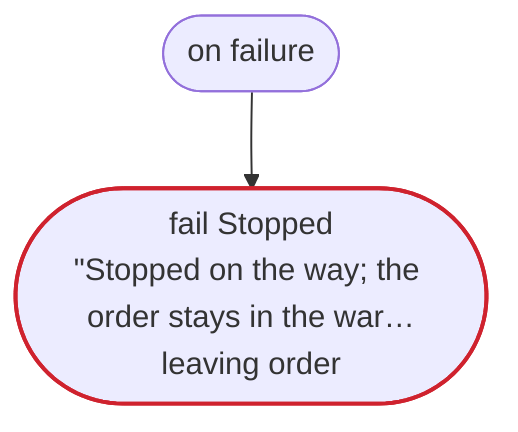
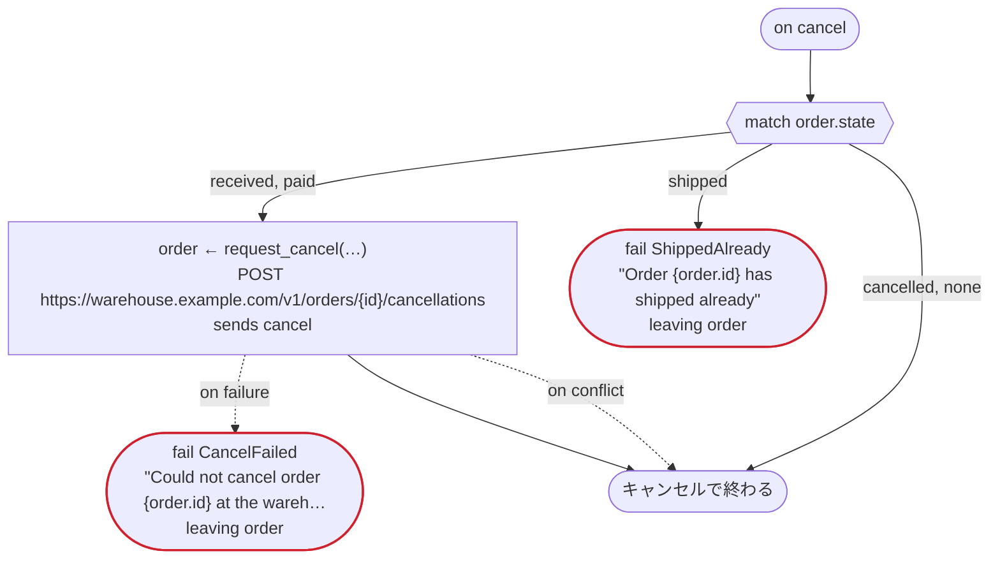

# ship_order v1

For an order in the warehouse's system, ask for the payment, have it shipped, and wait for word of the delivery. The warehouse's system keeps the order's state, which moves as rulec's rule order_state says. Written for Temporal: the warehouse's calls are activities dandori writes, and the notice is an activity you write; the carrier's system tells the workflow of the order about the delivery, by the order's id (an event); and an order the shop cancels on the way is cancelled at the warehouse too (on cancel). The loop over the reminders goes on in a new run when its history grows long

`examples/order/temporal/order.flow` を `dandori doc` で描いたものです。入力は `order_id: string`、出力は `carrier: urgency.carrier` です。

## flow

四角はタスク、両脇に線のある四角は規則、斜めの四角は外から値が届くタスク（イベントやコールバックの応答）、六角形は `match`、角の丸い四角は待ち、ステップを囲む枠はループです。破線の矢印は、呼び出しがその場で処理するエラーです。

## on failure

呼び出しが失敗し、そのエラーをその場で処理しないときに走ります（61・65・68・72・78・79・82・84 行目の呼び出しから）。最後まで走ると、ワークフローはそのエラーで失敗します。

## on cancel

ワークフローがキャンセルされると、そのとき待っている呼び出しや wait から、ここに来ます。最後まで走ると、ワークフローはキャンセルで終わります。

## 呼び出し

| 行 | 呼び出し | 呼ぶもの | リトライ | タイムアウト | 失敗したとき | 呼び出しのあとの案件 |
|---:|---|---|---|---|---|---|
| 61 | `order ← get_order(…)` | `GET https://warehouse.example.com/v1/orders/{id}`, `observes`, `idempotent` | 1 秒おきに 3 回（busy） | — | `busy`, `timeout`, `failure` → `on failure` | `order`: `received`, `paid`, `shipped`, `delivered`, `cancelled` |
| 65 | `r = notify(…)` | 自分で書くタスク, `key` | 5 秒おきに 2 回（failure, timeout） | — | `no_recipient` → 66 行目 `timeout`, `failure` → `on failure` | — |
| 68 | `order ← get_order(…)` | `GET https://warehouse.example.com/v1/orders/{id}`, `observes`, `idempotent` | 1 秒おきに 3 回（busy） | — | `busy`, `timeout`, `failure` → `on failure` | `order`: `received`, `paid`, `cancelled` |
| 72 | `order ← request_cancel(…)` | `POST https://warehouse.example.com/v1/orders/{id}/cancellations`, `sends cancel`, `key` | — | — | `conflict` → 73 行目 `timeout`, `failure` → `on failure` | `order`: `cancelled` |
| 78 | `decision = urgency(…)` | 規則 `urgency.rule` | 2 回（1 秒後と 2 秒後、failure） | — | `timeout`, `failure` → `on failure` | — |
| 79 | `order ← request_shipment(…)` | `POST https://warehouse.example.com/v1/orders/{id}/shipments`, `sends ship`, `key` | — | — | `conflict` → 80 行目 `timeout`, `failure` → `on failure` | `order`: `shipped` |
| 82 | `n = notify(…)` | 自分で書くタスク, `key` | 5 秒おきに 2 回（failure, timeout） | — | `no_recipient`, `timeout`, `failure` → `on failure` | — |
| 84 | `order ← delivered()` | `event`, `observes` | — | 7 日 | `timeout` → 85 行目 `failure` → `on failure` | `order`: `shipped`, `delivered` |
| 99 | `order ← request_cancel(…)` | `POST https://warehouse.example.com/v1/orders/{id}/cancellations`, `sends cancel`, `key` | — | — | `conflict` → 100 行目 `timeout`, `failure` → 101 行目 | `order`: `cancelled` |

## 終わり方

ワークフローの終わり方のすべてと、そのとき各案件がとりうる状態です。外部のサービスで起きるイベントも含めています。

| 行 | 終わり方 | `order` |
|---:|---|---|
| 66 | `fail NoContact` `leaving order` | そのまま引き渡す: `received`, `paid`, `cancelled` |
| 74 | `fail NotPaid` "No payment came in three days" | `cancelled` |
| 75 | `fail Canceled` "The order was canceled" | `cancelled` |
| 76 | `fail AlreadyShipped` "The order has shipped already" `leaving order` | そのまま引き渡す: `shipped`, `delivered` |
| 80 | `fail Canceled` "The order was canceled before it shipped" | `cancelled` |
| 85 | `fail DeliveryLate` "No word of the delivery in seven days" `leaving order` | そのまま引き渡す: `shipped`, `delivered` |
| 87 | `succeed carrier = decision.carrier` | `delivered` |
| 88 | `fail DeliveryLate` "Still shipped after word of the delivery" `leaving order` | そのまま引き渡す: `shipped`, `delivered` |
| 91 | `fail Stopped` "Stopped on the way; the order stays in the warehouse's system as it is" `leaving order` | そのまま引き渡す: 始まっていないか、`received`, `paid`, `shipped`, `delivered`, `cancelled` |
| 101 | `fail CancelFailed` "Could not cancel order {order.id} at the warehouse" `leaving order` | そのまま引き渡す: `received`, `paid`, `cancelled` |
| 102 | `fail ShippedAlready` "Order {order.id} has shipped already" `leaving order` | そのまま引き渡す: `shipped`, `delivered` |
| 102 | `on cancel` が最後まで走り、ワークフローはキャンセルで終わる | 始まっていないか、`cancelled` |

