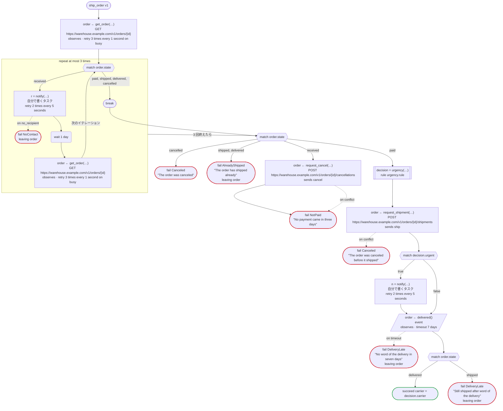
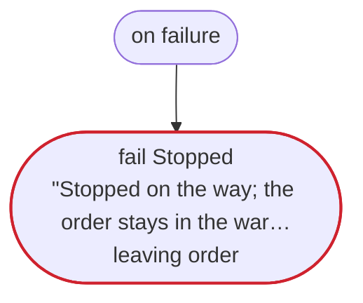
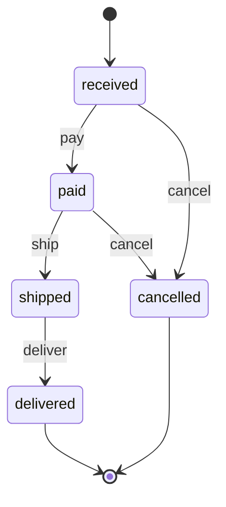

# ship_order v1

For an order in the warehouse's system, ask for the payment, have it shipped, and wait for word of the delivery. The warehouse's system keeps the order's state, which moves as rulec's rule order_state says. Written for Temporal: the warehouse's calls are activities dandori writes, and the notice is an activity you write; the carrier's system tells the workflow of the order about the delivery, by the order's id (an event); and an order the shop cancels on the way is cancelled at the warehouse too (on cancel). The loop over the reminders goes on in a new run when its history grows long

`examples/order/temporal/order.flow` を `dandori doc` で描いたものです。入力は `order_id: string`、出力は `carrier: urgency.carrier` です。

## flow

四角はタスク、両脇に線のある四角は規則、斜めの四角は外から値が届くタスク（イベントやコールバックの応答）、六角形は `match`、角の丸い四角は待ち、ステップを囲む枠はループです。破線の矢印は、呼び出しがその場で処理するエラーです。

## on failure

呼び出しが失敗し、そのエラーをその場で処理しないときに走ります（61・65・68・72・78・79・82・84 行目の呼び出しから）。最後まで走ると、ワークフローはそのエラーで失敗します。

## on cancel

ワークフローがキャンセルされると、そのとき待っている呼び出しや wait から、ここに来ます。最後まで走ると、ワークフローはキャンセルで終わります。

## 呼び出し

| 行 | 呼び出し | 呼ぶもの | リトライ | タイムアウト | 失敗したとき | 呼び出しのあとの案件 |
|---:|---|---|---|---|---|---|
| 61 | `order ← get_order(…)` | `GET https://warehouse.example.com/v1/orders/{id}`, `observes`, `idempotent` | 1 秒おきに 3 回（busy） | — | `busy`, `timeout`, `failure` → `on failure` | `order`: `received`, `paid`, `shipped`, `delivered`, `cancelled` |
| 65 | `r = notify(…)` | 自分で書くタスク, `key` | 5 秒おきに 2 回（failure, timeout） | — | `no_recipient` → 66 行目 `timeout`, `failure` → `on failure` | — |
| 68 | `order ← get_order(…)` | `GET https://warehouse.example.com/v1/orders/{id}`, `observes`, `idempotent` | 1 秒おきに 3 回（busy） | — | `busy`, `timeout`, `failure` → `on failure` | `order`: `received`, `paid`, `cancelled` |
| 72 | `order ← request_cancel(…)` | `POST https://warehouse.example.com/v1/orders/{id}/cancellations`, `sends cancel`, `key` | — | — | `conflict` → 73 行目 `timeout`, `failure` → `on failure` | `order`: `cancelled` |
| 78 | `decision = urgency(…)` | 規則 `urgency.rule` | 2 回（1 秒後と 2 秒後、failure） | — | `timeout`, `failure` → `on failure` | — |
| 79 | `order ← request_shipment(…)` | `POST https://warehouse.example.com/v1/orders/{id}/shipments`, `sends ship`, `key` | — | — | `conflict` → 80 行目 `timeout`, `failure` → `on failure` | `order`: `shipped` |
| 82 | `n = notify(…)` | 自分で書くタスク, `key` | 5 秒おきに 2 回（failure, timeout） | — | `no_recipient`, `timeout`, `failure` → `on failure` | — |
| 84 | `order ← delivered()` | `event`, `observes` | — | 7 日 | `timeout` → 85 行目 `failure` → `on failure` | `order`: `shipped`, `delivered` |
| 99 | `order ← request_cancel(…)` | `POST https://warehouse.example.com/v1/orders/{id}/cancellations`, `sends cancel`, `key` | — | — | `conflict` → 100 行目 `timeout`, `failure` → 101 行目 | `order`: `cancelled` |

## 終わり方

ワークフローの終わり方のすべてと、そのとき各案件がとりうる状態です。外部のサービスで起きるイベントも含めています。

| 行 | 終わり方 | `order` |
|---:|---|---|
| 66 | `fail NoContact` `leaving order` | そのまま引き渡す: `received`, `paid`, `cancelled` |
| 74 | `fail NotPaid` "No payment came in three days" | `cancelled` |
| 75 | `fail Canceled` "The order was canceled" | `cancelled` |
| 76 | `fail AlreadyShipped` "The order has shipped already" `leaving order` | そのまま引き渡す: `shipped`, `delivered` |
| 80 | `fail Canceled` "The order was canceled before it shipped" | `cancelled` |
| 85 | `fail DeliveryLate` "No word of the delivery in seven days" `leaving order` | そのまま引き渡す: `shipped`, `delivered` |
| 87 | `succeed carrier = decision.carrier` | `delivered` |
| 88 | `fail DeliveryLate` "Still shipped after word of the delivery" `leaving order` | そのまま引き渡す: `shipped`, `delivered` |
| 91 | `fail Stopped` "Stopped on the way; the order stays in the warehouse's system as it is" `leaving order` | そのまま引き渡す: 始まっていないか、`received`, `paid`, `shipped`, `delivered`, `cancelled` |
| 101 | `fail CancelFailed` "Could not cancel order {order.id} at the warehouse" `leaving order` | そのまま引き渡す: `received`, `paid`, `cancelled` |
| 102 | `fail ShippedAlready` "Order {order.id} has shipped already" `leaving order` | そのまま引き渡す: `shipped`, `delivered` |
| 102 | `on cancel` が最後まで走り、ワークフローはキャンセルで終わる | 始まっていないか、`cancelled` |

## 規則

このワークフローが呼ぶ規則を、`rulec doc` が承認する人向けに描いたものです。

<code>order_state</code> · order_state v1 · <code>../rules/order_state.rule</code>

<!-- rulec 0.21.2 が order_state.rule (sha256:5b6ae1fbd5cf) から生成。これは読み取り専用の資料で、本物は .rule のほうです。編集しても戻せません（§1.6）。 -->
# 規則 order_state v1

Where an online order goes on a payment, a shipment, a delivery or a request to cancel it, and how much is refunded. The caller keeps the state; the rule decides one event at a time. Written for the example

## 入力

| 名前 | 型 | 範囲 | 注記 |
|---|---|---|---|
| state | state（5 値） |  |  |
| event | event（4 値） |  |  |
| amount_paid | money[JPY, incl_tax] | 0JPY 〜 100万JPY |  |

## 出力

| 名前 | 型 | 丸め | 注記 |
|---|---|---|---|
| next_state | state（5 値） |  |  |
| refund | money[JPY, incl_tax] | down(1JPY) |  |
| accepted | bool |  |  |

## 型

列挙は**閉じた**有限集合です。値を足すと、それを見ていない表が完全性検査で割れます。

- **state**（5 値）— received、paid、shipped、delivered、cancelled
- **event**（4 値）— pay、ship、deliver、cancel

## 表 step（policy unique）

| 列 | 出どころ |
|---|---|
| state | 入力 |
| event | 入力 |
| → next_state | この規則の出力 |
| → refund | この規則の出力 |
| → accepted | この規則の出力 |

| # | state | event | → next_state（state） | → refund（money[JPY, incl_tax] / down(1JPY)） | → accepted（bool） | 注記 |
|---|---|---|---|---|---|---|
| 1 | received | pay | paid | 0JPY | true |  |
| 2 | received | cancel | cancelled | 0JPY | true |  |
| 3 | received | ship, deliver | state | 0JPY | false |  |
| 4 | paid | ship | shipped | 0JPY | true |  |
| 5 | paid | cancel | cancelled | amount_paid | true |  |
| 6 | paid | pay, deliver | state | 0JPY | false |  |
| 7 | shipped | deliver | delivered | 0JPY | true |  |
| 8 | shipped | pay, ship, cancel | state | 0JPY | false | a cancel after the shipment goes through a return |
| 9 | delivered | - | state | 0JPY | false |  |
| 10 | cancelled | - | state | 0JPY | false | a payment that comes after a cancel does not bring the order back |

**`rulec check` が確かめたこと**

- どの入力の組合せも、いずれかの行に当てはまります（E101 完全性）
- どの入力にも当てはまらない行はありません（E102）
- 二つ以上の行に同時に当てはまる入力はありません（E105 重なり）。行の並べ替えは意味を変えません

## ステートマシン: order

この規則はステートマシンの一歩です。呼び出しのたびに状態（入力 state）を受け取り、次の状態（出力 next_state）を返します。**状態を覚えておくのは呼び出す側で、生成コードは何も覚えません。**行き先を決めるのは表 step です。

| 始まりの状態 | 終わりの状態 |
|---|---|
| received | delivered、cancelled |

一つの案件は、amount_paid を最初の呼び出しから最後の呼び出しまで同じ値で渡します（`held`）。下の主張は、それを変えない呼び出しの並びについてのものです。

### 状態ごとの行き先

| 状態 | 行き先（表 step の行） |
|---|---|
| received | pay（行1） → paid / cancel（行2） → cancelled / ship, deliver（行3） → 留まる |
| paid | ship（行4） → shipped / cancel（行5） → cancelled / pay, deliver（行6） → 留まる |
| shipped | deliver（行7） → delivered / pay, ship, cancel（行8） → 留まる |
| delivered | どの呼び出しでも（行9） → 留まる |
| cancelled | どの呼び出しでも（行10） → 留まる |

### `rulec check` が呼び出しの並び全体について確かめたこと

- received から着ける状態は received・paid・shipped・delivered・cancelled です。すべての状態に着けます。
- 終わりの状態 delivered・cancelled からは、ほかの状態へ移る呼び出しがありません。
- どの状態に着いても、終わりの状態へ行く手順が残っています。
- `never shipped after cancelled`: cancelled のあとに shipped に着く手順はありません。
- `once refund >0JPY`: refund が >0JPY になる呼び出しは、一件の案件で一回までです。

### 手順の例（検証済み）

**delivered**

| # | state | event | amount_paid | → next_state | refund | accepted |
|---|---|---|---|---|---|---|
| 1 | received | pay | 3000JPY | paid | 0JPY | true |
| 2 | paid | ship | 3000JPY | shipped | 0JPY | true |
| 3 | shipped | deliver | 3000JPY | delivered | 0JPY | true |

**late_pay**

| # | state | event | amount_paid | → next_state | refund | accepted |
|---|---|---|---|---|---|---|
| 1 | received | pay | 3000JPY | paid | 0JPY | true |
| 2 | paid | cancel | 3000JPY | cancelled | 3000JPY | true |
| 3 | cancelled | pay | 3000JPY | cancelled | 0JPY | false |

一行目は received から始まり、二行目からは一つ前の呼び出しが返した状態から始まります（左の列）。`rulec check` が参照評価器で順に実行し、すべて宣言どおりの値になりました（E107）。

## 例（検証済み）

| state | event | amount_paid | → next_state | refund | accepted |
|---|---|---|---|---|---|
| received | cancel | 0JPY | cancelled | 0JPY | true |
| shipped | cancel | 3000JPY | shipped | 0JPY | false |

この 2 件は `rulec check` が参照評価器で実行し、すべて宣言どおりの値になりました（E107）。例は**実行される仕様**です。

<code>urgency</code> · urgency v1 · <code>../rules/urgency.rule</code>

<!-- rulec 0.21.2 が urgency.rule (sha256:5ff6efc93a9b) から生成。これは読み取り専用の資料で、本物は .rule のほうです。編集しても戻せません（§1.6）。 -->
# 規則 urgency v1

Whether an order goes out in a hurry, and by which carrier: a member's always does, and anyone else's from 30,000 yen. Written for the example

## 入力

| 名前 | 型 | 範囲 | 注記 |
|---|---|---|---|
| member | bool |  |  |
| amount | money[JPY, incl_tax] | 0JPY 〜 100万JPY |  |

## 出力

| 名前 | 型 | 丸め | 注記 |
|---|---|---|---|
| urgent | bool |  |  |
| carrier | carrier（2 値） |  |  |

## 型

列挙は**閉じた**有限集合です。値を足すと、それを見ていない表が完全性検査で割れます。

- **carrier**（2 値）— standard、next_day

## 表 decide（policy unique）

| 列 | 出どころ |
|---|---|
| member | 入力 |
| amount | 入力 |
| → urgent | この規則の出力 |
| → carrier | この規則の出力 |

| # | member | amount | → urgent（bool） | → carrier（carrier） |
|---|---|---|---|---|
| 1 | true | - | true | next_day |
| 2 | false | >=30000JPY | true | next_day |
| 3 | false | <30000JPY | false | standard |

**`rulec check` が確かめたこと**

- どの入力の組合せも、いずれかの行に当てはまります（E101 完全性）
- どの入力にも当てはまらない行はありません（E102）
- 二つ以上の行に同時に当てはまる入力はありません（E105 重なり）。行の並べ替えは意味を変えません

## 例（検証済み）

| member | amount | → urgent | carrier |
|---|---|---|---|
| true | 1000JPY | true | next_day |
| false | 5000JPY | false | standard |
| false | 30000JPY | true | next_day |

この 3 件は `rulec check` が参照評価器で実行し、すべて宣言どおりの値になりました（E107）。例は**実行される仕様**です。

