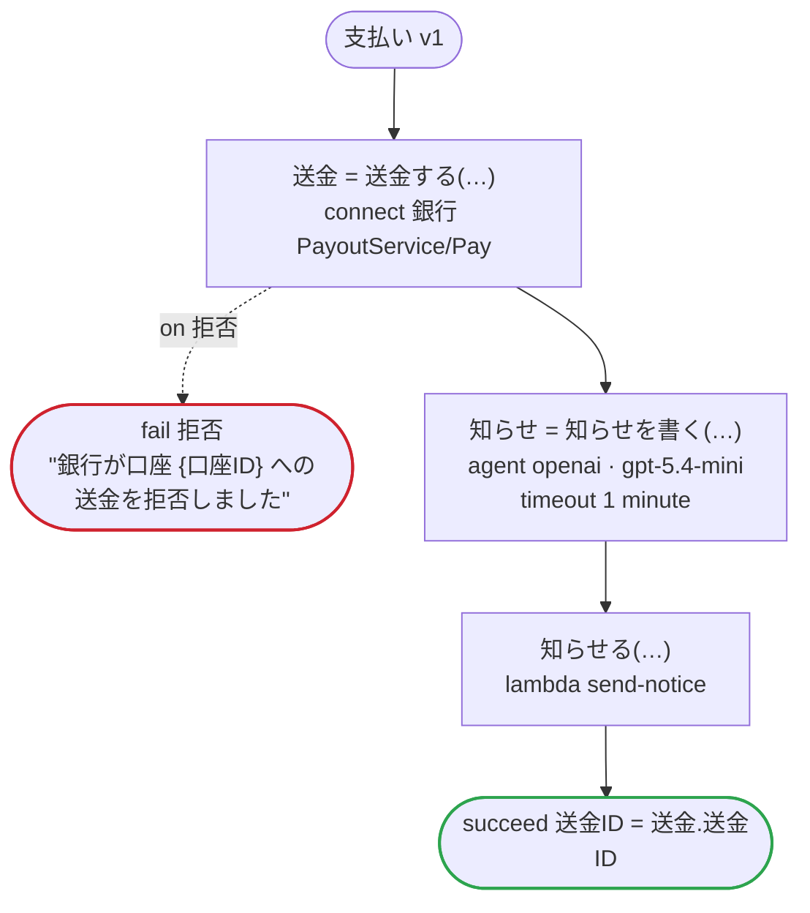

# 支払い v1

売り手に売上を支払う。銀行の API が、売り手が登録している口座に送金し、モデルが知らせを下書きする。フローが運ぶのは口座の ID だけで、銀行の契約が秘密と印を付けた番号と名義は運ばない

`examples/payout/payout.ja.flow`, drawn by `dandori doc`. Inputs: `売り手ID: string`, `口座ID: string`, `金額: money[円, incl_tax]`. Outputs: `送金ID: string`.

## flow

A rectangle is a task, one with a line down each side a rule, a slanted one a task whose value comes from outside (an event, or the answer to a callback), a hexagon a `match`, a rounded box a wait, and a box around steps a loop. A dashed arrow is an error the call handles.

## Calls

| Line | Call | Calls | Retries | Timeout | When it fails |
|---:|---|---|---|---|---|
| 34 | `送金 = 送金する(…)` | `connect 銀行 PayoutService/Pay`, `key` | — | — | `拒否` → line 35 `timeout`, `failure` → the workflow fails |
| 36 | `知らせ = 知らせを書く(…)` | `agent openai · gpt-5.4-mini` | — | 1 minute | `timeout`, `failure` → the workflow fails |
| 37 | `知らせる(…)` | `lambda send-notice`, `idempotent` | — | — | `timeout`, `failure` → the workflow fails |

## Ends

Every way the workflow can end.

| Line | End |
|---:|---|
| 35 | `fail 拒否` "銀行が口座 {口座ID} への送金を拒否しました" |
| 38 | `succeed 送金ID = 送金.送金ID` |

