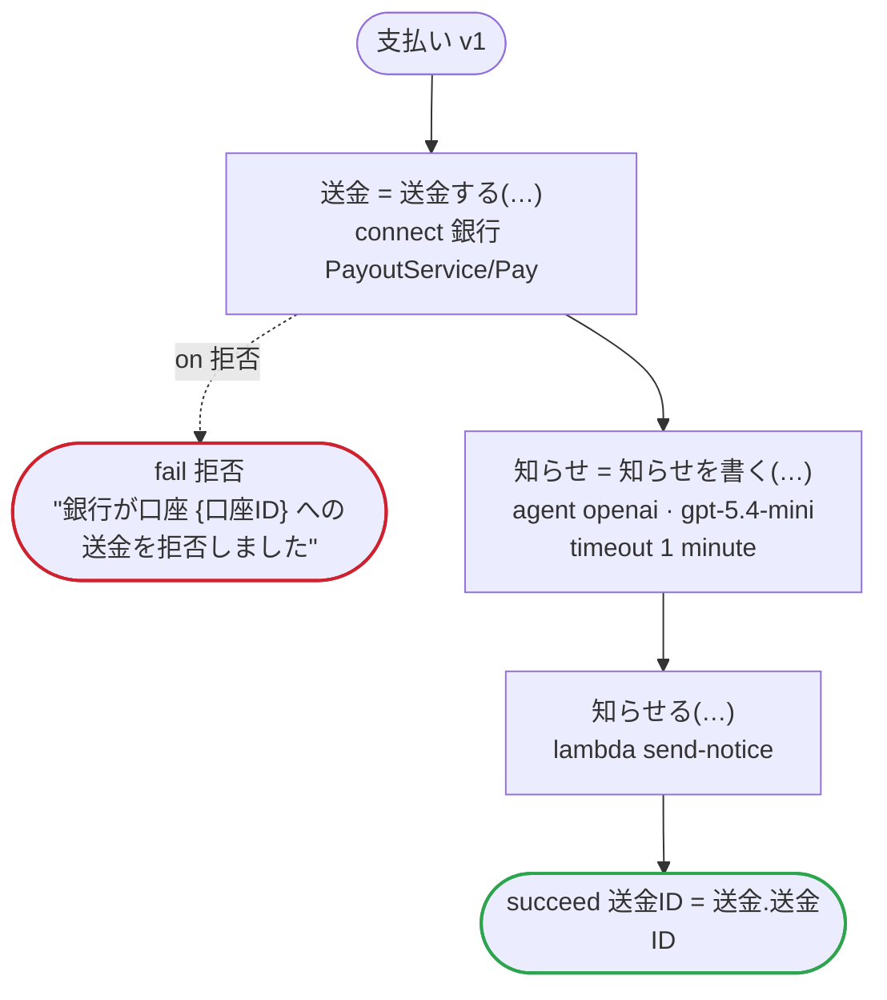

# 支払い v1

売り手に売上を支払う。銀行の API が、売り手が登録している口座に送金し、モデルが知らせを下書きする。フローが運ぶのは口座の ID だけで、銀行の契約が秘密と印を付けた番号と名義は運ばない

`examples/payout/payout.ja.flow` を `dandori doc` で描いたものです。入力は `売り手ID: string`・`口座ID: string`・`金額: money[円, incl_tax]`、出力は `送金ID: string` です。

## flow

四角はタスク、両脇に線のある四角は規則、斜めの四角は外から値が届くタスク（イベントやコールバックの応答）、六角形は `match`、角の丸い四角は待ち、ステップを囲む枠はループです。破線の矢印は、呼び出しがその場で処理するエラーです。

## 呼び出し

| 行 | 呼び出し | 呼ぶもの | リトライ | タイムアウト | 失敗したとき |
|---:|---|---|---|---|---|
| 34 | `送金 = 送金する(…)` | `connect 銀行 PayoutService/Pay`・`key` | — | — | `拒否` → 35 行目 `timeout`・`failure` → ワークフローが失敗する |
| 36 | `知らせ = 知らせを書く(…)` | `agent openai · gpt-5.4-mini` | — | 1 分 | `timeout`・`failure` → ワークフローが失敗する |
| 37 | `知らせる(…)` | `lambda send-notice`・`idempotent` | — | — | `timeout`・`failure` → ワークフローが失敗する |

## 終わり方

ワークフローの終わり方のすべてです。

| 行 | 終わり方 |
|---:|---|
| 35 | `fail 拒否` "銀行が口座 {口座ID} への送金を拒否しました" |
| 38 | `succeed 送金ID = 送金.送金ID` |

