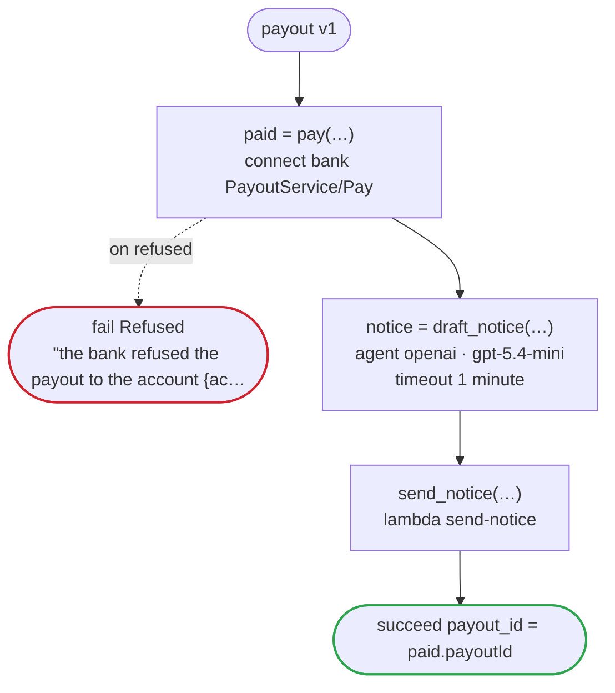

# payout v1

Pay a seller what their sales came to: the bank's API pays the account the seller keeps on file, and a model drafts the notice. The flow carries the account's id, and never its number or the name it is held in, which the bank's contract marks secret

`examples/payout/payout.flow`, drawn by `dandori doc`. Inputs: `seller_id: string`, `account_id: string`, `amount: money[JPY, incl_tax]`. Outputs: `payout_id: string`.

## flow

A rectangle is a task, one with a line down each side a rule, a slanted one a task whose value comes from outside (an event, or the answer to a callback), a hexagon a `match`, a rounded box a wait, and a box around steps a loop. A dashed arrow is an error the call handles.

## Calls

| Line | Call | Calls | Retries | Timeout | When it fails |
|---:|---|---|---|---|---|
| 34 | `paid = pay(…)` | `connect bank PayoutService/Pay`, `key` | — | — | `refused` → line 35 `timeout`, `failure` → the workflow fails |
| 36 | `notice = draft_notice(…)` | `agent openai · gpt-5.4-mini` | — | 1 minute | `timeout`, `failure` → the workflow fails |
| 37 | `send_notice(…)` | `lambda send-notice`, `idempotent` | — | — | `timeout`, `failure` → the workflow fails |

## Ends

Every way the workflow can end.

| Line | End |
|---:|---|
| 35 | `fail Refused` "the bank refused the payout to the account {account_id}" |
| 38 | `succeed payout_id = paid.payoutId` |

