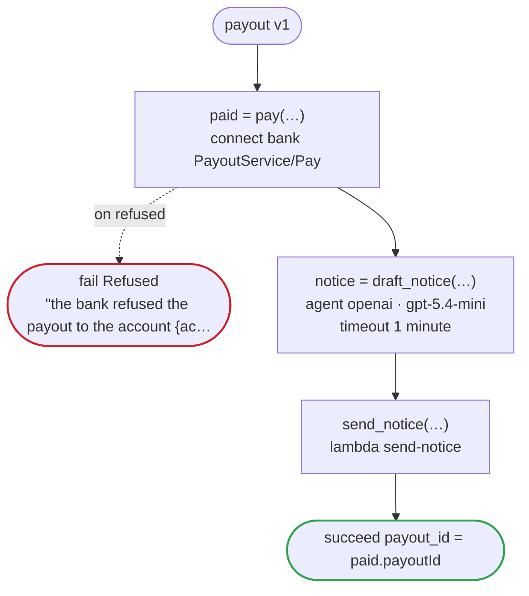

# payout v1

Pay a seller what their sales came to: the bank's API pays the account the seller keeps on file, and a model drafts the notice. The flow carries the account's id, and never its number or the name it is held in, which the bank's contract marks secret

`examples/payout/payout.flow` を `dandori doc` で描いたものです。入力は `seller_id: string`・`account_id: string`・`amount: money[JPY, incl_tax]`、出力は `payout_id: string` です。

## flow

四角はタスク、両脇に線のある四角は規則、斜めの四角は外から値が届くタスク（イベントやコールバックの応答）、六角形は `match`、角の丸い四角は待ち、ステップを囲む枠はループです。破線の矢印は、呼び出しがその場で処理するエラーです。

## 呼び出し

| 行 | 呼び出し | 呼ぶもの | リトライ | タイムアウト | 失敗したとき |
|---:|---|---|---|---|---|
| 34 | `paid = pay(…)` | `connect bank PayoutService/Pay`・`key` | — | — | `refused` → 35 行目 `timeout`・`failure` → ワークフローが失敗する |
| 36 | `notice = draft_notice(…)` | `agent openai · gpt-5.4-mini` | — | 1 分 | `timeout`・`failure` → ワークフローが失敗する |
| 37 | `send_notice(…)` | `lambda send-notice`・`idempotent` | — | — | `timeout`・`failure` → ワークフローが失敗する |

## 終わり方

ワークフローの終わり方のすべてです。

| 行 | 終わり方 |
|---:|---|
| 35 | `fail Refused` "the bank refused the payout to the account {account_id}" |
| 38 | `succeed payout_id = paid.payoutId` |

