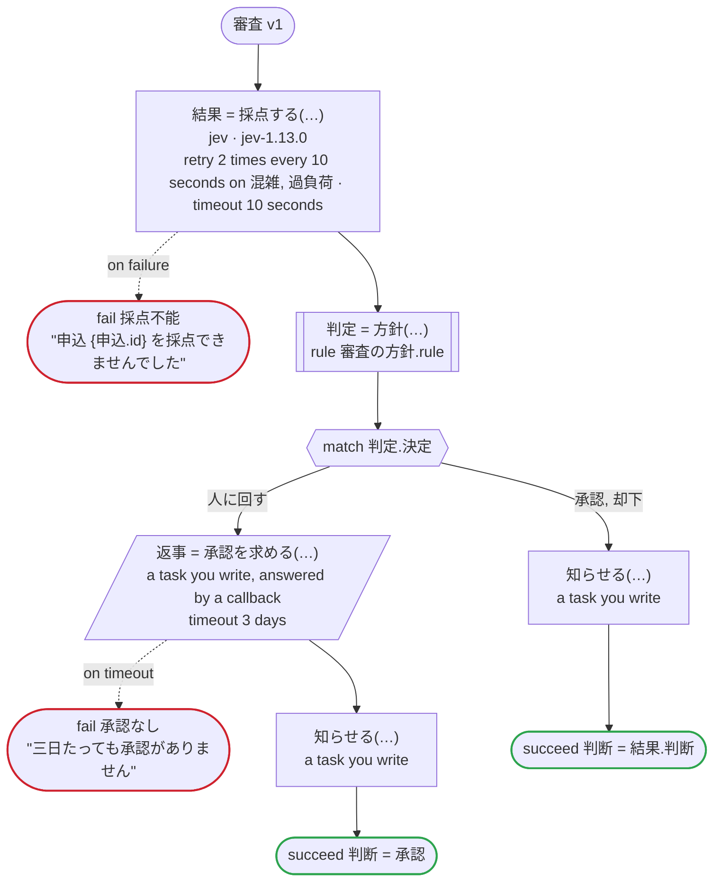

# 審査 v1

Jev が申込を採点してその確信度も返し、その判断をそのまま実行するか、人の承認に回すかを規則が決める。そのまま承認するには、そのまま却下するより高い確信度が要る。Temporal 向けの版：採点は生成したアクティビティで、専用のタスクキューのワーカーの上で、TypeSafe の API キー（TYPESAFE_API_KEY）で Jev を呼ぶ。そのワーカーは別の言語で書かれていてもよい。お知らせも専用のタスクキューで動く、自分で書くアクティビティ。規則はワークフローのワーカーで動く。承認する人のツールは、生成したクライアントが送る Update でコールバックに応答する

`examples/review/temporal/review.ja.flow`, drawn by `dandori doc`. Inputs: `申込: 申込`. Outputs: `判断: 方針.判断`.

## flow

A rectangle is a task, one with a line down each side a rule, a slanted one a task whose value comes from outside (an event, or the answer to a callback), a hexagon a `match`, a rounded box a wait, and a box around steps a loop. A dashed arrow is an error the call handles.

## Calls

| Line | Call | Calls | Retries | Timeout | When it fails |
|---:|---|---|---|---|---|
| 49 | `結果 = 採点する(…)` | `jev · jev-1.13.0` | 2 times every 10 seconds (混雑, 過負荷) | 10 seconds | `混雑`, `過負荷`, `timeout`, `failure` → line 50 |
| 51 | `判定 = 方針(…)` | rule `審査の方針.rule` | 2 times, after 1 second and 2 (failure) | — | `timeout`, `failure` → the workflow fails |
| 55 | `返事 = 承認を求める(…)` | a task you write, answered by a callback | — | 3 days | `timeout` → line 56 `failure` → the workflow fails |
| 57 | `知らせる(…)` | a task you write, `idempotent` | — | — | `timeout`, `failure` → the workflow fails |
| 59 | `知らせる(…)` | a task you write, `idempotent` | — | — | `timeout`, `failure` → the workflow fails |

## Ends

Every way the workflow can end.

| Line | End |
|---:|---|
| 50 | `fail 採点不能` "申込 {申込.id} を採点できませんでした" |
| 56 | `fail 承認なし` "三日たっても承認がありません" |
| 58 | `succeed 判断 = 承認` |
| 60 | `succeed 判断 = 結果.判断` |

