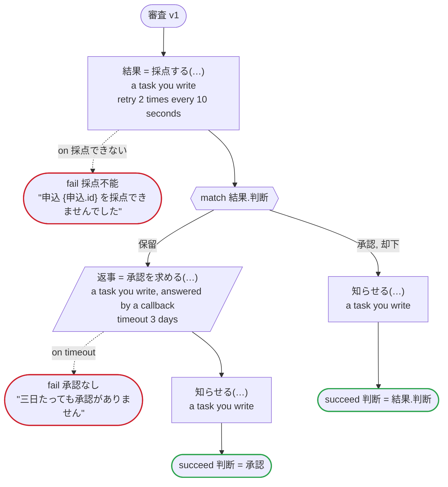

# 審査 v1

申し込みを採点にかけ、採点が保留なら人の承認を待つ。タスクはどれも自分で書くもの。Temporal 向けの版：採点は専用のタスクキューのワーカーで動き、そのワーカーは別の言語で書かれていてもよい。お知らせも同じ。承認する人のツールは、生成したクライアントが送る Update でコールバックに応答する

`examples/review/temporal/review.ja.flow`, drawn by `dandori doc`. Inputs: `申込: 申込`. Outputs: `判断: 判断`.

## flow

A rectangle is a task, one with a line down each side a rule, a slanted one a task whose value comes from outside (an event, or the answer to a callback), a hexagon a `match`, a rounded box a wait, and a box around steps a loop. A dashed arrow is an error the call handles.

## Calls

| Line | Call | Calls | Retries | Timeout | When it fails |
|---:|---|---|---|---|---|
| 40 | `結果 = 採点する(…)` | a task you write, `idempotent` | 2 times every 10 seconds (failure, timeout) | — | `採点できない` → line 41 `timeout`, `failure` → the workflow fails |
| 45 | `返事 = 承認を求める(…)` | a task you write, answered by a callback | — | 3 days | `timeout` → line 46 `failure` → the workflow fails |
| 47 | `知らせる(…)` | a task you write, `idempotent` | — | — | `timeout`, `failure` → the workflow fails |
| 49 | `知らせる(…)` | a task you write, `idempotent` | — | — | `timeout`, `failure` → the workflow fails |

## Ends

Every way the workflow can end.

| Line | End |
|---:|---|
| 41 | `fail 採点不能` "申込 {申込.id} を採点できませんでした" |
| 46 | `fail 承認なし` "三日たっても承認がありません" |
| 48 | `succeed 判断 = 承認` |
| 50 | `succeed 判断 = 結果.判断` |

