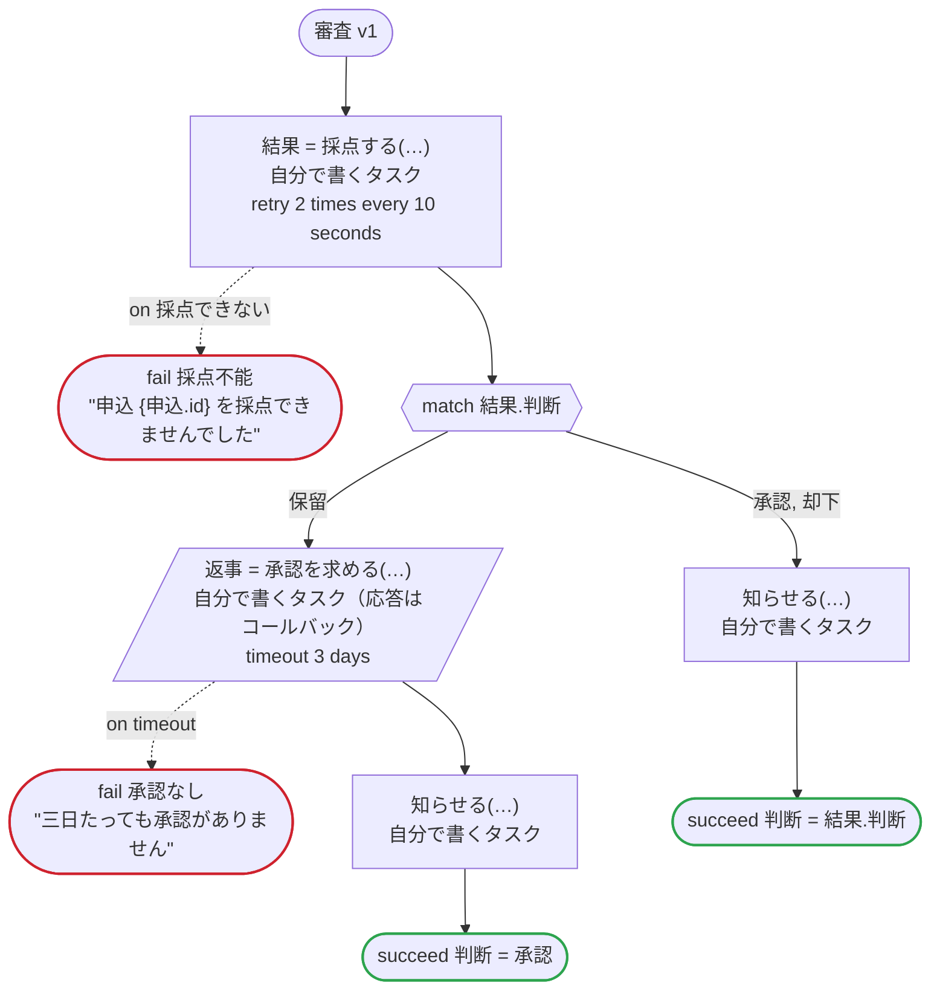

# 審査 v1

申し込みを採点にかけ、採点が保留なら人の承認を待つ。タスクはどれも自分で書くもの。Temporal 向けの版：採点は専用のタスクキューのワーカーで動き、そのワーカーは別の言語で書かれていてもよい。お知らせも同じ。承認する人のツールは、生成したクライアントが送る Update でコールバックに応答する

`examples/review/temporal/review.ja.flow` を `dandori doc` で描いたものです。入力は `申込: 申込`、出力は `判断: 判断` です。

## flow

四角はタスク、両脇に線のある四角は規則、斜めの四角は外から値が届くタスク（イベントやコールバックの応答）、六角形は `match`、角の丸い四角は待ち、ステップを囲む枠はループです。破線の矢印は、呼び出しがその場で処理するエラーです。

## 呼び出し

| 行 | 呼び出し | 呼ぶもの | リトライ | タイムアウト | 失敗したとき |
|---:|---|---|---|---|---|
| 40 | `結果 = 採点する(…)` | 自分で書くタスク, `idempotent` | 10 秒おきに 2 回（failure, timeout） | — | `採点できない` → 41 行目 `timeout`, `failure` → ワークフローが失敗する |
| 45 | `返事 = 承認を求める(…)` | 自分で書くタスク（応答はコールバック） | — | 3 日 | `timeout` → 46 行目 `failure` → ワークフローが失敗する |
| 47 | `知らせる(…)` | 自分で書くタスク, `idempotent` | — | — | `timeout`, `failure` → ワークフローが失敗する |
| 49 | `知らせる(…)` | 自分で書くタスク, `idempotent` | — | — | `timeout`, `failure` → ワークフローが失敗する |

## 終わり方

ワークフローの終わり方のすべてです。

| 行 | 終わり方 |
|---:|---|
| 41 | `fail 採点不能` "申込 {申込.id} を採点できませんでした" |
| 46 | `fail 承認なし` "三日たっても承認がありません" |
| 48 | `succeed 判断 = 承認` |
| 50 | `succeed 判断 = 結果.判断` |

