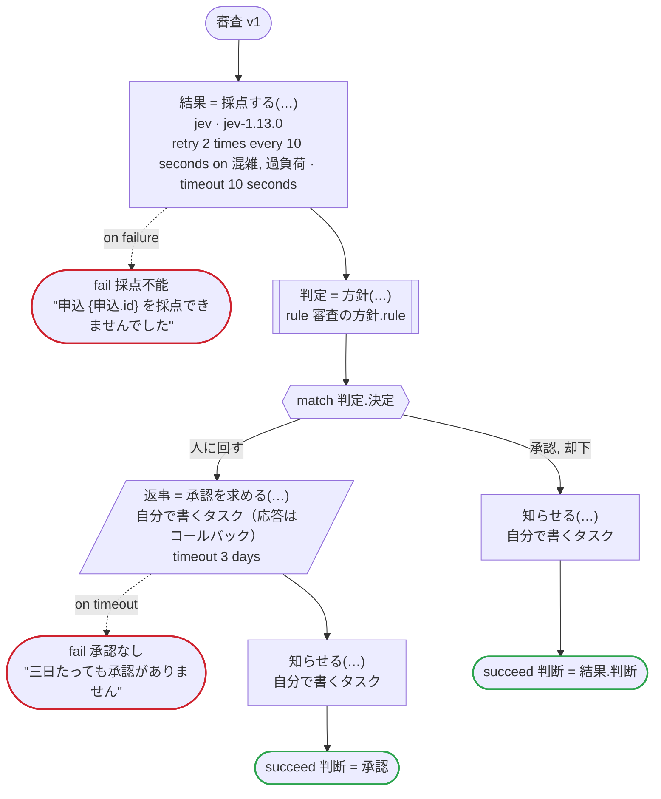

# 審査 v1

Jev が申込を採点してその確信度も返し、その判断をそのまま実行するか、人の承認に回すかを規則が決める。そのまま承認するには、そのまま却下するより高い確信度が要る。Temporal 向けの版：採点は生成したアクティビティで、専用のタスクキューのワーカーの上で、TypeSafe の API キー（TYPESAFE_API_KEY）で Jev を呼ぶ。そのワーカーは別の言語で書かれていてもよい。お知らせも専用のタスクキューで動く、自分で書くアクティビティ。規則はワークフローのワーカーで動く。承認する人のツールは、生成したクライアントが送る Update でコールバックに応答する

`examples/review/temporal/review.ja.flow` を `dandori doc` で描いたものです。入力は `申込: 申込`、出力は `判断: 方針.判断` です。

## flow

四角はタスク、両脇に線のある四角は規則、斜めの四角は外から値が届くタスク（イベントやコールバックの応答）、六角形は `match`、角の丸い四角は待ち、ステップを囲む枠はループです。破線の矢印は、呼び出しがその場で処理するエラーです。

## 呼び出し

| 行 | 呼び出し | 呼ぶもの | リトライ | タイムアウト | 失敗したとき |
|---:|---|---|---|---|---|
| 49 | `結果 = 採点する(…)` | `jev · jev-1.13.0` | 10 秒おきに 2 回（混雑, 過負荷） | 10 秒 | `混雑`, `過負荷`, `timeout`, `failure` → 50 行目 |
| 51 | `判定 = 方針(…)` | 規則 `審査の方針.rule` | 2 回（1 秒後と 2 秒後、failure） | — | `timeout`, `failure` → ワークフローが失敗する |
| 55 | `返事 = 承認を求める(…)` | 自分で書くタスク（応答はコールバック） | — | 3 日 | `timeout` → 56 行目 `failure` → ワークフローが失敗する |
| 57 | `知らせる(…)` | 自分で書くタスク, `idempotent` | — | — | `timeout`, `failure` → ワークフローが失敗する |
| 59 | `知らせる(…)` | 自分で書くタスク, `idempotent` | — | — | `timeout`, `failure` → ワークフローが失敗する |

## 終わり方

ワークフローの終わり方のすべてです。

| 行 | 終わり方 |
|---:|---|
| 50 | `fail 採点不能` "申込 {申込.id} を採点できませんでした" |
| 56 | `fail 承認なし` "三日たっても承認がありません" |
| 58 | `succeed 判断 = 承認` |
| 60 | `succeed 判断 = 結果.判断` |

## 規則

このワークフローが呼ぶ規則を、`rulec doc` が承認する人向けに描いたものです。

<code>方針</code> · 審査の方針 v1 · <code>../rules/審査の方針.rule</code>

<!-- rulec 0.22.0 が 審査の方針.rule (sha256:0c12a93ec001) から生成。これは読み取り専用の資料で、本物は .rule のほうです。編集しても戻せません（§1.6）。 -->
# 規則 審査の方針 v1

申込の採点の判断を、そのまま実行するか人に回すかを、採点の確信度で決める。そのまま承認するには、そのまま却下するより高い確信度が要る。書き下ろしの例

## 入力

| 名前 | 型 | 範囲 | 注記 |
|---|---|---|---|
| 判断 | 判断（3 値） |  |  |
| 確信度 | rate | 0 〜 1 |  |

## 出力

| 名前 | 型 | 丸め | 注記 |
|---|---|---|---|
| 決定 | 決定（3 値） |  |  |

## 型

列挙は**閉じた**有限集合です。値を足すと、それを見ていない表が完全性検査で割れます。

- **判断**（3 値）— 却下、保留、承認
- **決定**（3 値）— 承認、却下、人に回す

## 表 決め方（policy unique）

| 列 | 出どころ |
|---|---|
| 判断 | 入力 |
| 確信度 | 入力 |
| → 決定 | この規則の出力 |

| # | 判断 | 確信度 | → 決定（決定） |
|---|---|---|---|
| 1 | 承認 | >=90% | 承認 |
| 2 | 承認 | <90% | 人に回す |
| 3 | 却下 | >=80% | 却下 |
| 4 | 却下 | <80% | 人に回す |
| 5 | 保留 | - | 人に回す |

**`rulec check` が確かめたこと**

- どの入力の組合せも、いずれかの行に当てはまります（E101 完全性）
- どの入力にも当てはまらない行はありません（E102）
- 二つ以上の行に同時に当てはまる入力はありません（E105 重なり）。行の並べ替えは意味を変えません

## 例（検証済み）

| 判断 | 確信度 | → 決定 |
|---|---|---|
| 承認 | 95% | 承認 |
| 承認 | 89% | 人に回す |
| 却下 | 80% | 却下 |
| 保留 | 99% | 人に回す |

この 4 件は `rulec check` が参照評価器で実行し、すべて宣言どおりの値になりました（E107）。例は**実行される仕様**です。

