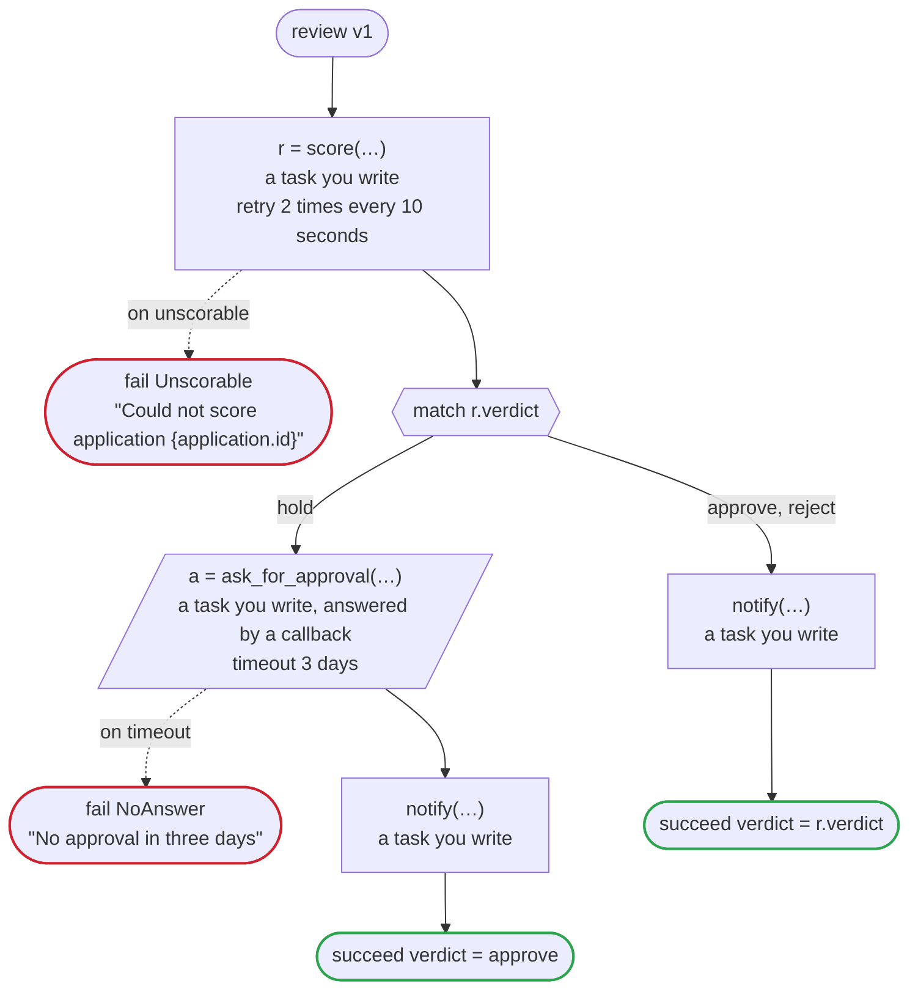

# review v1

Send an application to be scored, and when the score says hold, wait for a person's approval. Every task is one you write. Written for Temporal: scoring runs on the workers of its own task queue, which may be written in another language, and so does the notice; the approver's tool answers the callback by the update the generated client sends

`examples/review/temporal/review.flow`, drawn by `dandori doc`. Inputs: `application: Application`. Outputs: `verdict: Verdict`.

## flow

A rectangle is a task, one with a line down each side a rule, a slanted one a task whose value comes from outside (an event, or the answer to a callback), a hexagon a `match`, a rounded box a wait, and a box around steps a loop. A dashed arrow is an error the call handles.

## Calls

| Line | Call | Calls | Retries | Timeout | When it fails |
|---:|---|---|---|---|---|
| 40 | `r = score(…)` | a task you write, `idempotent` | 2 times every 10 seconds (failure, timeout) | — | `unscorable` → line 41 `timeout`, `failure` → the workflow fails |
| 45 | `a = ask_for_approval(…)` | a task you write, answered by a callback | — | 3 days | `timeout` → line 46 `failure` → the workflow fails |
| 47 | `notify(…)` | a task you write, `idempotent` | — | — | `timeout`, `failure` → the workflow fails |
| 49 | `notify(…)` | a task you write, `idempotent` | — | — | `timeout`, `failure` → the workflow fails |

## Ends

Every way the workflow can end.

| Line | End |
|---:|---|
| 41 | `fail Unscorable` "Could not score application {application.id}" |
| 46 | `fail NoAnswer` "No approval in three days" |
| 48 | `succeed verdict = approve` |
| 50 | `succeed verdict = r.verdict` |

