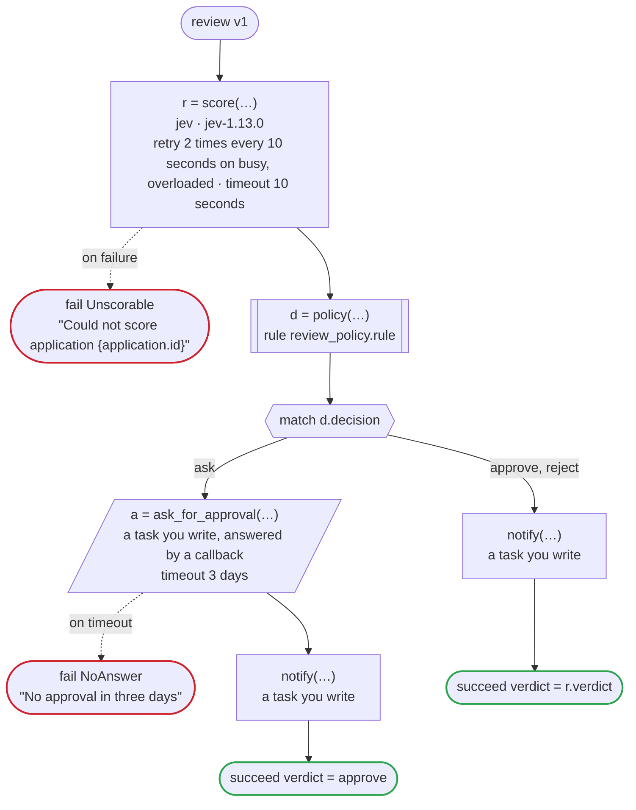

# review v1

Jev scores an application and says how sure it is, and a rule decides whether the verdict is acted on at once or goes to a person for approval: approving at once asks more certainty than rejecting at once. Written for Temporal: the scoring is an activity dandori writes, which calls Jev with TypeSafe's key (TYPESAFE_API_KEY) on the workers of its own task queue, which may be written in another language, and so does the notice, an activity you write; the rule runs in the worker of the workflow; the approver's tool answers the callback by the update the generated client sends

`examples/review/temporal/review.flow`, drawn by `dandori doc`. Inputs: `application: Application`. Outputs: `verdict: policy.verdict`.

## flow

A rectangle is a task, one with a line down each side a rule, a slanted one a task whose value comes from outside (an event, or the answer to a callback), a hexagon a `match`, a rounded box a wait, and a box around steps a loop. A dashed arrow is an error the call handles.

## Calls

| Line | Call | Calls | Retries | Timeout | When it fails |
|---:|---|---|---|---|---|
| 49 | `r = score(…)` | `jev · jev-1.13.0` | 2 times every 10 seconds (busy, overloaded) | 10 seconds | `busy`, `overloaded`, `timeout`, `failure` → line 50 |
| 51 | `d = policy(…)` | rule `review_policy.rule` | 2 times, after 1 second and 2 (failure) | — | `timeout`, `failure` → the workflow fails |
| 55 | `a = ask_for_approval(…)` | a task you write, answered by a callback | — | 3 days | `timeout` → line 56 `failure` → the workflow fails |
| 57 | `notify(…)` | a task you write, `idempotent` | — | — | `timeout`, `failure` → the workflow fails |
| 59 | `notify(…)` | a task you write, `idempotent` | — | — | `timeout`, `failure` → the workflow fails |

## Ends

Every way the workflow can end.

| Line | End |
|---:|---|
| 50 | `fail Unscorable` "Could not score application {application.id}" |
| 56 | `fail NoAnswer` "No approval in three days" |
| 58 | `succeed verdict = approve` |
| 60 | `succeed verdict = r.verdict` |

## Rules

The rules this workflow calls, as `rulec doc` renders them for whoever approves them.

<code>policy</code> · review_policy v1 · <code>../rules/review_policy.rule</code>

<!-- Generated by rulec 0.21.2 from review_policy.rule (sha256:d71c8b54077c). This is a read-only rendering; the source of truth is the .rule file. Edits cannot be carried back (§1.6). -->
# Rule review_policy v1

Whether the scoring's verdict on an application is acted on at once or goes to a person, by how sure the scoring is of it: approving at once asks more certainty than rejecting at once. Written for the example

## Inputs

| Name | Type | Range | Notes |
|---|---|---|---|
| verdict | verdict (3 values) |  |  |
| sure | rate | 0 〜 1 |  |

## Outputs

| Name | Type | Rounding | Notes |
|---|---|---|---|
| decision | decision (3 values) |  |  |

## Types

An enum is a **closed** finite set. Add a value, and every table that does not look at it fails the completeness check.

- **verdict** (3 values) — reject, hold, approve
- **decision** (3 values) — approve, reject, ask

## Table act (policy unique)

| Column | Source |
|---|---|
| verdict | Input |
| sure | Input |
| → decision | Output of this rule |

| # | verdict | sure | → decision (decision) |
|---|---|---|---|
| 1 | approve | >=90% | approve |
| 2 | approve | <90% | ask |
| 3 | reject | >=80% | reject |
| 4 | reject | <80% | ask |
| 5 | hold | - | ask |

**What `rulec check` verified**

- Every combination of inputs matches some row (E101 completeness)
- There is no row that can never match (E102 unreachable row)
- No input matches two or more rows at once (E105 overlap). Reordering the rows does not change the meaning

## Examples (verified)

| verdict | sure | → decision |
|---|---|---|
| approve | 95% | approve |
| approve | 89% | ask |
| reject | 80% | reject |
| hold | 99% | ask |

`rulec check` ran these 4 examples through the reference evaluator, and every one produced the declared values (E107). The examples are an **executable specification**.

