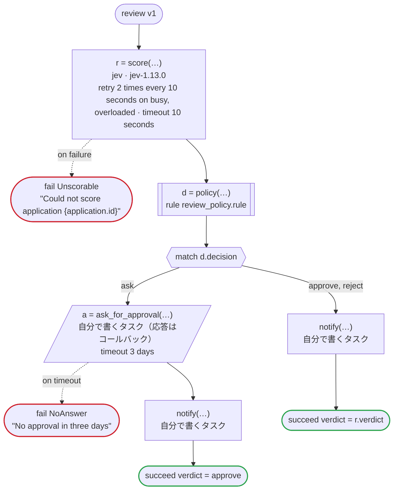

# review v1

Jev scores an application and says how sure it is, and a rule decides whether the verdict is acted on at once or goes to a person for approval: approving at once asks more certainty than rejecting at once. Written for Temporal: the scoring is an activity dandori writes, which calls Jev with TypeSafe's key (TYPESAFE_API_KEY) on the workers of its own task queue, which may be written in another language, and so does the notice, an activity you write; the rule runs in the worker of the workflow; the approver's tool answers the callback by the update the generated client sends

`examples/review/temporal/review.flow` を `dandori doc` で描いたものです。入力は `application: Application`、出力は `verdict: policy.verdict` です。

## flow

四角はタスク、両脇に線のある四角は規則、斜めの四角は外から値が届くタスク（イベントやコールバックの応答）、六角形は `match`、角の丸い四角は待ち、ステップを囲む枠はループです。破線の矢印は、呼び出しがその場で処理するエラーです。

## 呼び出し

| 行 | 呼び出し | 呼ぶもの | リトライ | タイムアウト | 失敗したとき |
|---:|---|---|---|---|---|
| 49 | `r = score(…)` | `jev · jev-1.13.0` | 10 秒おきに 2 回（busy, overloaded） | 10 秒 | `busy`, `overloaded`, `timeout`, `failure` → 50 行目 |
| 51 | `d = policy(…)` | 規則 `review_policy.rule` | 2 回（1 秒後と 2 秒後、failure） | — | `timeout`, `failure` → ワークフローが失敗する |
| 55 | `a = ask_for_approval(…)` | 自分で書くタスク（応答はコールバック） | — | 3 日 | `timeout` → 56 行目 `failure` → ワークフローが失敗する |
| 57 | `notify(…)` | 自分で書くタスク, `idempotent` | — | — | `timeout`, `failure` → ワークフローが失敗する |
| 59 | `notify(…)` | 自分で書くタスク, `idempotent` | — | — | `timeout`, `failure` → ワークフローが失敗する |

## 終わり方

ワークフローの終わり方のすべてです。

| 行 | 終わり方 |
|---:|---|
| 50 | `fail Unscorable` "Could not score application {application.id}" |
| 56 | `fail NoAnswer` "No approval in three days" |
| 58 | `succeed verdict = approve` |
| 60 | `succeed verdict = r.verdict` |

## 規則

このワークフローが呼ぶ規則を、`rulec doc` が承認する人向けに描いたものです。

<code>policy</code> · review_policy v1 · <code>../rules/review_policy.rule</code>

<!-- rulec 0.21.2 が review_policy.rule (sha256:d71c8b54077c) から生成。これは読み取り専用の資料で、本物は .rule のほうです。編集しても戻せません（§1.6）。 -->
# 規則 review_policy v1

Whether the scoring's verdict on an application is acted on at once or goes to a person, by how sure the scoring is of it: approving at once asks more certainty than rejecting at once. Written for the example

## 入力

| 名前 | 型 | 範囲 | 注記 |
|---|---|---|---|
| verdict | verdict（3 値） |  |  |
| sure | rate | 0 〜 1 |  |

## 出力

| 名前 | 型 | 丸め | 注記 |
|---|---|---|---|
| decision | decision（3 値） |  |  |

## 型

列挙は**閉じた**有限集合です。値を足すと、それを見ていない表が完全性検査で割れます。

- **verdict**（3 値）— reject、hold、approve
- **decision**（3 値）— approve、reject、ask

## 表 act（policy unique）

| 列 | 出どころ |
|---|---|
| verdict | 入力 |
| sure | 入力 |
| → decision | この規則の出力 |

| # | verdict | sure | → decision（decision） |
|---|---|---|---|
| 1 | approve | >=90% | approve |
| 2 | approve | <90% | ask |
| 3 | reject | >=80% | reject |
| 4 | reject | <80% | ask |
| 5 | hold | - | ask |

**`rulec check` が確かめたこと**

- どの入力の組合せも、いずれかの行に当てはまります（E101 完全性）
- どの入力にも当てはまらない行はありません（E102）
- 二つ以上の行に同時に当てはまる入力はありません（E105 重なり）。行の並べ替えは意味を変えません

## 例（検証済み）

| verdict | sure | → decision |
|---|---|---|
| approve | 95% | approve |
| approve | 89% | ask |
| reject | 80% | reject |
| hold | 99% | ask |

この 4 件は `rulec check` が参照評価器で実行し、すべて宣言どおりの値になりました（E107）。例は**実行される仕様**です。

