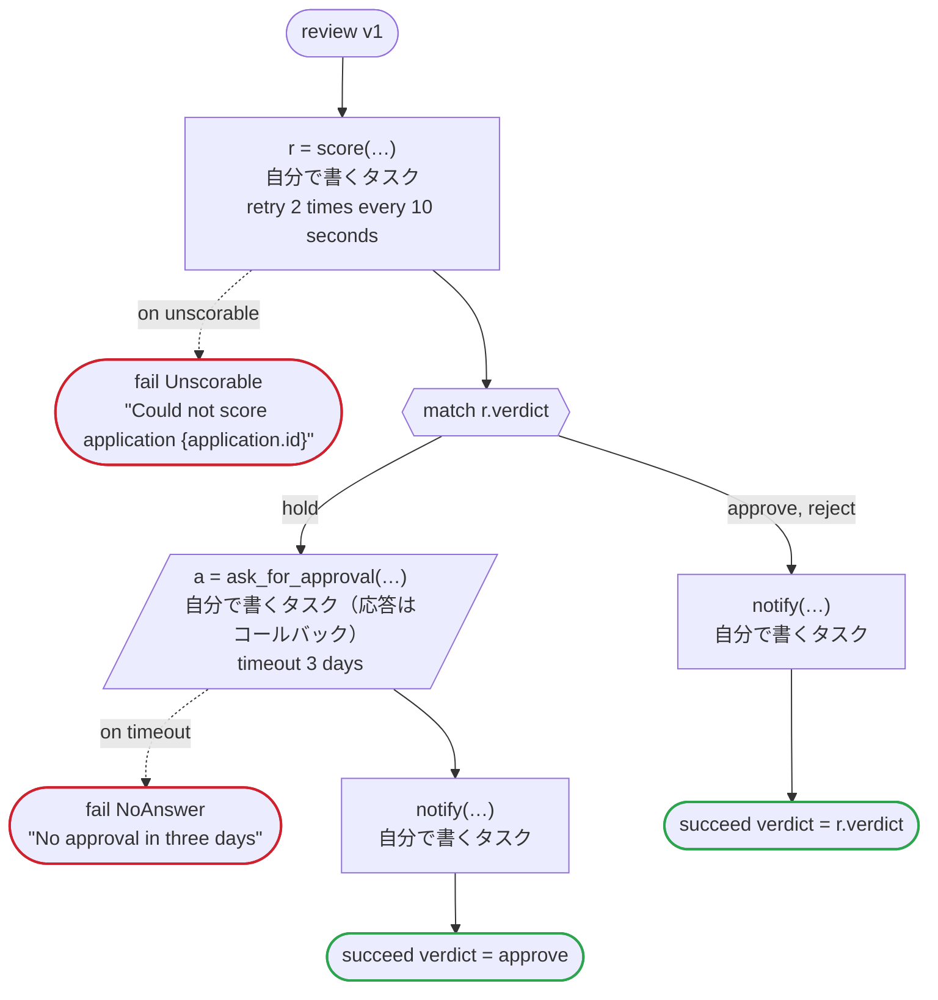

# review v1

Send an application to be scored, and when the score says hold, wait for a person's approval. Every task is one you write. Written for Temporal: scoring runs on the workers of its own task queue, which may be written in another language, and so does the notice; the approver's tool answers the callback by the update the generated client sends

`examples/review/temporal/review.flow` を `dandori doc` で描いたものです。入力は `application: Application`、出力は `verdict: Verdict` です。

## flow

四角はタスク、両脇に線のある四角は規則、斜めの四角は外から値が届くタスク（イベントやコールバックの応答）、六角形は `match`、角の丸い四角は待ち、ステップを囲む枠はループです。破線の矢印は、呼び出しがその場で処理するエラーです。

## 呼び出し

| 行 | 呼び出し | 呼ぶもの | リトライ | タイムアウト | 失敗したとき |
|---:|---|---|---|---|---|
| 40 | `r = score(…)` | 自分で書くタスク, `idempotent` | 10 秒おきに 2 回（failure, timeout） | — | `unscorable` → 41 行目 `timeout`, `failure` → ワークフローが失敗する |
| 45 | `a = ask_for_approval(…)` | 自分で書くタスク（応答はコールバック） | — | 3 日 | `timeout` → 46 行目 `failure` → ワークフローが失敗する |
| 47 | `notify(…)` | 自分で書くタスク, `idempotent` | — | — | `timeout`, `failure` → ワークフローが失敗する |
| 49 | `notify(…)` | 自分で書くタスク, `idempotent` | — | — | `timeout`, `failure` → ワークフローが失敗する |

## 終わり方

ワークフローの終わり方のすべてです。

| 行 | 終わり方 |
|---:|---|
| 41 | `fail Unscorable` "Could not score application {application.id}" |
| 46 | `fail NoAnswer` "No approval in three days" |
| 48 | `succeed verdict = approve` |
| 50 | `succeed verdict = r.verdict` |

