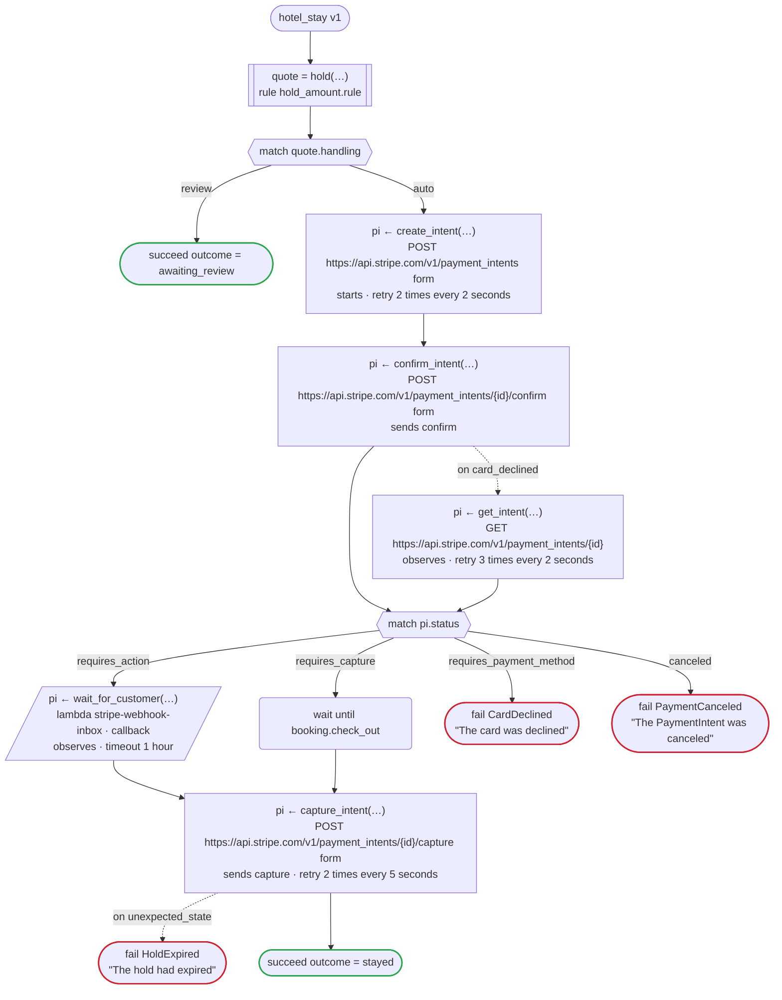
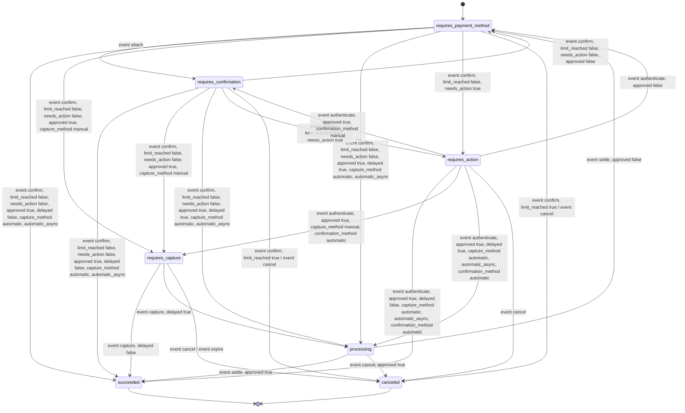

# hotel_stay v1

When a stay is booked, hold an amount on the card, and capture it on the day of check-out. A rule decides the amount and whether the front desk looks first; the payment is a Stripe PaymentIntent

`tests/fixtures/hotel_naive.flow`, drawn by `dandori doc`. Inputs: `booking: Booking`. Outputs: `outcome: Outcome`.

**`dandori check` finds 4 error(s) in this workflow**; they are at the end, each with the run that gets there.

## flow



A rectangle is a task, one with a line down each side a rule, a slanted one a task whose value comes from outside (an event, or the answer to a callback), a hexagon a `match`, a rounded box a wait, and a box around steps a loop. A dashed arrow is an error the call handles.

## Calls

| Line | Call | Calls | Retries | Timeout | When it fails | Case after |
|---:|---|---|---|---|---|---|
| 81 | `quote = hold(…)` | rule `hold_amount.rule` | 2 times, after 1 second and 2 (failure) | — | `timeout`, `failure` → the workflow fails | — |
| 84 | `pi ← create_intent(…)` | `POST https://api.stripe.com/v1/payment_intents form`, `starts payment_intent.payment then attach`, `key` | 2 times every 2 seconds (failure, timeout) | — | `timeout`, `failure` → the workflow fails | `pi`: `requires_confirmation` |
| 85 | `pi ← confirm_intent(…)` | `POST https://api.stripe.com/v1/payment_intents/{id}/confirm form`, `sends confirm`, `key` | — | — | `card_declined` → line 86<br>`unexpected_state`, `timeout`, `failure` → the workflow fails | `pi`: `requires_payment_method`, `requires_action`, `requires_capture`, `canceled` |
| 86 | `pi ← get_intent(…)` | `GET https://api.stripe.com/v1/payment_intents/{id}`, `observes`, `idempotent` | 3 times every 2 seconds (failure, timeout) | — | `timeout`, `failure` → the workflow fails | `pi`: `requires_payment_method`, `requires_confirmation`, `requires_action`, `requires_capture`, `canceled` |
| 89 | `pi ← wait_for_customer(…)` | `lambda stripe-webhook-inbox · callback`, `observes` | — | 1 hour | `timeout`, `failure` → the workflow fails | `pi`: `requires_payment_method`, `requires_action`, `requires_capture`, `canceled` |
| 93 | `pi ← capture_intent(…)` | `POST https://api.stripe.com/v1/payment_intents/{id}/capture form`, `sends capture`, `key` | 2 times every 5 seconds (failure, timeout) | — | `unexpected_state` → line 94<br>`timeout`, `failure` → the workflow fails | `pi`: `processing`, `succeeded` |

## Ends

Every way the workflow can end, and what each case can be then, the events on the other side included.

| Line | End | `pi` |
|---:|---|---|
| 83 | `succeed outcome = awaiting_review` | not started |
| 91 | `fail CardDeclined` "The card was declined" | `requires_payment_method` |
| 92 | `fail PaymentCanceled` "The PaymentIntent was canceled" | `canceled` |
| 94 | `fail HoldExpired` "The hold had expired" | `requires_payment_method`, `requires_action`, `requires_capture`, `canceled` |
| 95 | `succeed outcome = stayed` | `requires_payment_method`, `processing`, `succeeded` |

## Rules

The rules this workflow calls, as `rulec doc` renders them for whoever approves them.

<details>
<summary><code>hold</code> · hold_amount v1 · <code>../../examples/hotel/rules/hold_amount.rule</code></summary>

<!-- Generated by rulec 0.22.0 from hold_amount.rule (sha256:0ce5f2bc9d81). This is a read-only rendering; the source of truth is the .rule file. Edits cannot be carried back (§1.6). -->
# Rule hold_amount v1

How much a booking holds on the card, and whether the front desk looks at it first: the nightly rate times the nights, and a stay of fifteen nights or more goes to the desk. Written for the example

## Inputs

| Name | Type | Range | Notes |
|---|---|---|---|
| room | room (3 values) |  |  |
| nights | number | 1 〜 30 |  |

## Outputs

| Name | Type | Rounding | Notes |
|---|---|---|---|
| amount | money[JPY, incl_tax] | down(1JPY) |  |
| handling | handling (2 values) |  |  |

## Types

An enum is a **closed** finite set. Add a value, and every table that does not look at it fails the completeness check.

- **room** (3 values) — standard, deluxe, suite
- **handling** (2 values) — auto, review

## Derived Values and Definitions

Intermediate values that can be placed in a table column. The expressions are as written in the source file, and the ranges are the declared ones.

| Name | Kind | Expression | Range | Notes |
|---|---|---|---|---|
| amount | Definition | `per_night * nights` |  |  |

## Table rate (policy unique)

| Column | Source |
|---|---|
| room | Input |
| → per_night | (this table only) |

| # | room | → per_night (money[JPY, incl_tax]) |
|---|---|---|
| 1 | standard | 12000JPY |
| 2 | deluxe | 18000JPY |
| 3 | suite | 40000JPY |

**What `rulec check` verified**

- Every combination of inputs matches some row (E101 completeness)
- There is no row that can never match (E102 unreachable row)
- No input matches two or more rows at once (E105 overlap). Reordering the rows does not change the meaning

## Table decide (policy unique)

| Column | Source |
|---|---|
| nights | Input |
| → handling | Output of this rule |

| # | nights | → handling (handling) |
|---|---|---|
| 1 | <=14 | auto |
| 2 | >=15 | review |

**What `rulec check` verified**

- Every combination of inputs matches some row (E101 completeness)
- There is no row that can never match (E102 unreachable row)
- No input matches two or more rows at once (E105 overlap). Reordering the rows does not change the meaning

## Examples (verified)

| room | nights | → amount | handling |
|---|---|---|---|
| standard | 2 | 24000JPY | auto |
| suite | 15 | 600000JPY | review |

`rulec check` ran these 2 examples through the reference evaluator, and every one produced the declared values (E107). The examples are an **executable specification**.

</details>

<details>
<summary><code>payment_intent</code> · payment_intent v1 · <code>../../examples/hotel/rules/payment_intent.rule</code></summary>

<!-- Generated by rulec 0.22.0 from payment_intent.rule (sha256:ec6477bfd9ec). This is a read-only rendering; the source of truth is the .rule file. Edits cannot be carried back (§1.6). -->
# Rule payment_intent v1

Where a Stripe PaymentIntent's status goes when it is confirmed, authenticated, captured or canceled, and when a delayed payment settles. Transcribed from Stripe's documentation

## Inputs

| Name | Type | Range | Notes |
|---|---|---|---|
| status | status (7 values) |  |  |
| event | event (7 values) |  | attach: a payment method is attached without confirming |
| limit_reached | bool |  | this confirmation is past the limit Stripe puts on one PaymentIntent, which varies |
| needs_action | bool |  | the payment method asks for a further step, such as 3D Secure |
| approved | bool |  | the issuer or the bank lets the attempt through; for a cancel, Stripe accepts it |
| delayed | bool |  | the payment method confirms success only days later, as a bank debit does |
| capture_method | capture_method (3 values) |  |  |
| confirmation_method | confirmation_method (2 values) |  |  |

## Outputs

| Name | Type | Rounding | Notes |
|---|---|---|---|
| next_status | status (7 values) |  |  |
| funds | funds (4 values) |  |  |
| refused | bool |  | the status does not take this event: an API call gets payment_intent_unexpected_state |

## Types

An enum is a **closed** finite set. Add a value, and every table that does not look at it fails the completeness check.

- **status** (7 values) — requires_payment_method, requires_confirmation, requires_action, processing, requires_capture, succeeded, canceled
- **event** (7 values) — attach, confirm, authenticate, settle, capture, cancel, expire
- **capture_method** (3 values) — automatic, automatic_async, manual
- **confirmation_method** (2 values) — automatic, manual
- **funds** (4 values) — untouched, held, captured, released

## Groups

A group is a named subset of an enum. One word written in a table cell stands for all the values below.

- **unconfirmed** (2 values) — requires_payment_method, requires_confirmation

This group covers 2 values of the 7 values of status; the following belong to no group: requires_action, processing, requires_capture, succeeded, canceled (counted from the declarations by this rendering).

## Table transition (policy unique)

lifecycle, status, and the API reference for each call

| Column | Source |
|---|---|
| status | Input |
| event | Input |
| limit_reached | Input |
| needs_action | Input |
| approved | Input |
| delayed | Input |
| capture_method | Input |
| confirmation_method | Input |
| → next_status | Output of this rule |
| → funds | Output of this rule |
| → refused | Output of this rule |

| # | status | event | limit_reached | needs_action | approved | delayed | capture_method | confirmation_method | → next_status (status) | → funds (funds) | → refused (bool) | Notes |
|---|---|---|---|---|---|---|---|---|---|---|---|---|
| 1 | unconfirmed | attach | - | - | - | - | - | - | requires_confirmation | untouched | false | lifecycle; from requires_confirmation, assumed the same |
| 2 | unconfirmed | confirm | true | - | - | - | - | - | canceled | untouched | false | confirm |
| 3 | unconfirmed | confirm | false | true | - | - | - | - | requires_action | untouched | false | confirm |
| 4 | unconfirmed | confirm | false | false | false | - | - | - | requires_payment_method | untouched | false | confirm |
| 5 | unconfirmed | confirm | false | false | true | - | manual | - | requires_capture | held | false | confirm |
| 6 | unconfirmed | confirm | false | false | true | true | automatic, automatic_async | - | processing | untouched | false | lifecycle |
| 7 | unconfirmed | confirm | false | false | true | false | automatic, automatic_async | - | succeeded | captured | false | confirm |
| 8 | unconfirmed | cancel | - | - | - | - | - | - | canceled | untouched | false | cancel |
| 9 | unconfirmed | authenticate, settle, capture, expire | - | - | - | - | - | - | status | untouched | true | capture, errors |
| 10 | requires_action | authenticate | - | - | false | - | - | - | requires_payment_method | untouched | false | 3ds |
| 11 | requires_action | authenticate | - | - | true | - | - | manual | requires_confirmation | untouched | false | confirm |
| 12 | requires_action | authenticate | - | - | true | - | manual | automatic | requires_capture | held | false | 3ds |
| 13 | requires_action | authenticate | - | - | true | true | automatic, automatic_async | automatic | processing | untouched | false | lifecycle |
| 14 | requires_action | authenticate | - | - | true | false | automatic, automatic_async | automatic | succeeded | captured | false | 3ds, lifecycle |
| 15 | requires_action | cancel | - | - | - | - | - | - | canceled | untouched | false | cancel |
| 16 | requires_action | attach, confirm, settle, capture, expire | - | - | - | - | - | - | status | untouched | true | errors; for attach and confirm the pages say nothing, assumed refused |
| 17 | processing | settle | - | - | true | - | - | - | succeeded | captured | false | lifecycle, status |
| 18 | processing | settle | - | - | false | - | - | - | requires_payment_method | untouched | false | lifecycle |
| 19 | processing | cancel | - | - | true | - | - | - | canceled | untouched | false | lifecycle: ACH, ACSS, AU BECS, BACS, NZ BECS and SEPA, inside a window |
| 20 | processing | cancel | - | - | false | - | - | - | status | untouched | true | lifecycle; cancel says "in rare cases" |
| 21 | processing | attach, confirm, authenticate, capture, expire | - | - | - | - | - | - | status | untouched | true | errors |
| 22 | requires_capture | capture | - | - | - | false | - | - | succeeded | captured | false | capture, lifecycle |
| 23 | requires_capture | capture | - | - | - | true | - | - | processing | untouched | false | lifecycle names no method; hold says bank debits cannot be held |
| 24 | requires_capture | cancel | - | - | - | - | - | - | canceled | released | false | cancel |
| 25 | requires_capture | expire | - | - | - | - | - | - | canceled | released | false | hold, capture |
| 26 | requires_capture | attach, confirm, authenticate, settle | - | - | - | - | - | - | status | untouched | true | errors |
| 27 | succeeded | - | - | - | - | - | - | - | status | untouched | true | lifecycle, status: refunds go through the Refunds API |
| 28 | canceled | - | - | - | - | - | - | - | status | untouched | true | cancel, lifecycle |

Groups appearing in the cells of this table: **unconfirmed** (2 values). Their members are in the "Groups" section.

**What `rulec check` verified**

- Every combination of inputs matches some row (E101 completeness)
- There is no row that can never match (E102 unreachable row)
- No input matches two or more rows at once (E105 overlap). Reordering the rows does not change the meaning

## State machine: payment

This rule is one step of a state machine. Every call is passed the state (input status) and answers the next one (output next_status). **The caller keeps the state; the generated code keeps nothing.** Where a case goes is decided by table transition.

| Initial state | Final states |
|---|---|
| requires_payment_method | succeeded, canceled |

One case passes capture_method, confirmation_method with the same value from its first call to its last (`held`). The claims below are about the sequences of calls that keep it.



### Where each state goes

| State | Goes to (row of table transition) |
|---|---|
| requires_payment_method | event attach（row 1） → requires_confirmation / event confirm, limit_reached true（row 2） → canceled / event confirm, limit_reached false, needs_action true（row 3） → requires_action / event confirm, limit_reached false, needs_action false, approved false（row 4） → stays / event confirm, limit_reached false, needs_action false, approved true, capture_method manual（row 5） → requires_capture / event confirm, limit_reached false, needs_action false, approved true, delayed true, capture_method automatic, automatic_async（row 6） → processing / event confirm, limit_reached false, needs_action false, approved true, delayed false, capture_method automatic, automatic_async（row 7） → succeeded / event cancel（row 8） → canceled / event authenticate, settle, capture, expire（row 9） → stays |
| requires_confirmation | event attach（row 1） → stays / event confirm, limit_reached true（row 2） → canceled / event confirm, limit_reached false, needs_action true（row 3） → requires_action / event confirm, limit_reached false, needs_action false, approved false（row 4） → requires_payment_method / event confirm, limit_reached false, needs_action false, approved true, capture_method manual（row 5） → requires_capture / event confirm, limit_reached false, needs_action false, approved true, delayed true, capture_method automatic, automatic_async（row 6） → processing / event confirm, limit_reached false, needs_action false, approved true, delayed false, capture_method automatic, automatic_async（row 7） → succeeded / event cancel（row 8） → canceled / event authenticate, settle, capture, expire（row 9） → stays |
| requires_action | event authenticate, approved false（row 10） → requires_payment_method / event authenticate, approved true, confirmation_method manual（row 11） → requires_confirmation / event authenticate, approved true, capture_method manual, confirmation_method automatic（row 12） → requires_capture / event authenticate, approved true, delayed true, capture_method automatic, automatic_async, confirmation_method automatic（row 13） → processing / event authenticate, approved true, delayed false, capture_method automatic, automatic_async, confirmation_method automatic（row 14） → succeeded / event cancel（row 15） → canceled / event attach, confirm, settle, capture, expire（row 16） → stays |
| processing | event settle, approved true（row 17） → succeeded / event settle, approved false（row 18） → requires_payment_method / event cancel, approved true（row 19） → canceled / event cancel, approved false（row 20） → stays / event attach, confirm, authenticate, capture, expire（row 21） → stays |
| requires_capture | event capture, delayed false（row 22） → succeeded / event capture, delayed true（row 23） → processing / event cancel（row 24） → canceled / event expire（row 25） → canceled / event attach, confirm, authenticate, settle（row 26） → stays |
| succeeded | any call（row 27） → stays |
| canceled | any call（row 28） → stays |

### What `rulec check` proved about every sequence of calls

- From requires_payment_method a case can reach requires_payment_method, requires_confirmation, requires_action, processing, requires_capture, succeeded, canceled. Every state is reached.
- No call moves a case out of the final states succeeded, canceled.
- Whatever state a case reaches, a way to a final state remains.
- `never succeeded after canceled`: no sequence of calls reaches succeeded after canceled.
- `once funds captured`: funds is answered captured at most once in a case.

### Scenarios (verified)

**card_with_3ds**

| # | status | event | limit_reached | needs_action | approved | delayed | capture_method | confirmation_method | → next_status | funds | refused |
|---|---|---|---|---|---|---|---|---|---|---|---|
| 1 | requires_payment_method | confirm | false | true | false | false | automatic_async | automatic | requires_action | untouched | false |
| 2 | requires_action | authenticate | false | false | true | false | automatic_async | automatic | succeeded | captured | false |

**authorize_then_capture**

| # | status | event | limit_reached | needs_action | approved | delayed | capture_method | confirmation_method | → next_status | funds | refused |
|---|---|---|---|---|---|---|---|---|---|---|---|
| 1 | requires_payment_method | confirm | false | false | true | false | manual | automatic | requires_capture | held | false |
| 2 | requires_capture | capture | false | false | true | false | manual | automatic | succeeded | captured | false |

**hold_expires**

| # | status | event | limit_reached | needs_action | approved | delayed | capture_method | confirmation_method | → next_status | funds | refused |
|---|---|---|---|---|---|---|---|---|---|---|---|
| 1 | requires_payment_method | confirm | false | false | true | false | manual | automatic | requires_capture | held | false |
| 2 | requires_capture | expire | false | false | false | false | manual | automatic | canceled | released | false |
| 3 | canceled | capture | false | false | true | false | manual | automatic | canceled | untouched | true |

**debit_fails_card_retries**

| # | status | event | limit_reached | needs_action | approved | delayed | capture_method | confirmation_method | → next_status | funds | refused |
|---|---|---|---|---|---|---|---|---|---|---|---|
| 1 | requires_payment_method | confirm | false | false | true | true | automatic | automatic | processing | untouched | false |
| 2 | processing | cancel | false | false | false | true | automatic | automatic | processing | untouched | true |
| 3 | processing | settle | false | false | false | true | automatic | automatic | requires_payment_method | untouched | false |
| 4 | requires_payment_method | confirm | false | false | true | false | automatic | automatic | succeeded | captured | false |

**manual_confirmation**

| # | status | event | limit_reached | needs_action | approved | delayed | capture_method | confirmation_method | → next_status | funds | refused |
|---|---|---|---|---|---|---|---|---|---|---|---|
| 1 | requires_payment_method | attach | false | false | false | false | automatic | manual | requires_confirmation | untouched | false |
| 2 | requires_confirmation | confirm | false | true | false | false | automatic | manual | requires_action | untouched | false |
| 3 | requires_action | authenticate | false | false | true | false | automatic | manual | requires_confirmation | untouched | false |
| 4 | requires_confirmation | confirm | false | false | true | false | automatic | manual | succeeded | captured | false |

**too_many_confirmations**

| # | status | event | limit_reached | needs_action | approved | delayed | capture_method | confirmation_method | → next_status | funds | refused |
|---|---|---|---|---|---|---|---|---|---|---|---|
| 1 | requires_payment_method | confirm | false | false | false | false | automatic | automatic | requires_payment_method | untouched | false |
| 2 | requires_payment_method | confirm | true | false | false | false | automatic | automatic | canceled | untouched | false |
| 3 | canceled | confirm | false | false | true | false | automatic | automatic | canceled | untouched | true |

The first call starts in requires_payment_method, and every later one in the state the call before it answered (the left column). `rulec check` ran them in order through the reference evaluator, and every one produced the declared values (E107).

## Examples (verified)

| status | event | limit_reached | needs_action | approved | delayed | capture_method | confirmation_method | → next_status | funds | refused |
|---|---|---|---|---|---|---|---|---|---|---|
| requires_capture | cancel | false | false | false | false | manual | automatic | canceled | released | false |
| succeeded | cancel | false | false | false | false | automatic | automatic | succeeded | untouched | true |
| processing | cancel | false | false | true | true | automatic | automatic | canceled | untouched | false |

`rulec check` ran these 3 examples through the reference evaluator, and every one produced the declared values (E107). The examples are an **executable specification**.

</details>

## What check says

What `dandori check` says of this workflow, each with the run that gets there.

```text
warning[W104]: tests/fixtures/hotel_naive.flow:81:1: nothing says what range `booking.nights` is in (the field `nights` of `Booking` has no range), and `nights` of the rule `hold` takes `>=1 <=30`
    81 |   let quote = hold(room: booking.room, nights: booking.nights)
warning[W101]: tests/fixtures/hotel_naive.flow:85:1: if `confirm_intent` fails, the workflow fails with the case `pi` in requires_payment_method, requires_confirmation, requires_action, requires_capture; 4 call(s) can fail like this. Handle the error at the call, or add `on failure` to settle the case
    85 |   pi <- confirm_intent(id: pi.id)
  the run that gets there:
      81  quote = hold(…)
      84  match quote.handling: auto
      84  create_intent: pi starts in requires_confirmation
      85  confirm_intent: pi requires_confirmation → requires_payment_method
      85  confirm_intent fails (timeout, failure)
error[E010]: tests/fixtures/hotel_naive.flow:87:1: `match` has no arm for requires_confirmation, which `pi.status` can be here
    87 |   match pi.status
  the run that gets there:
      81  quote = hold(…)
      84  match quote.handling: auto
      84  create_intent: pi starts in requires_confirmation
      86  confirm_intent fails: on card_declined
      86  get_intent: pi is requires_confirmation
error[E020]: tests/fixtures/hotel_naive.flow:91:1: the workflow can fail here with the case `pi` in requires_payment_method, which is not final (succeeded, canceled are); settle it first, or write `leaving pi` to hand it over as it is
    91 |     requires_payment_method => fail CardDeclined "The card was declined"
  the run that gets there:
      81  quote = hold(…)
      84  match quote.handling: auto
      84  create_intent: pi starts in requires_confirmation
      85  confirm_intent: pi requires_confirmation → requires_payment_method
      91  match pi.status: requires_payment_method
      91  fail CardDeclined
error[E020]: tests/fixtures/hotel_naive.flow:94:1: the workflow can fail here with the case `pi` in requires_payment_method, requires_action, requires_capture, which is not final (succeeded, canceled are); settle it first, or write `leaving pi` to hand it over as it is
    94 |     on unexpected_state => fail HoldExpired "The hold had expired"
  the run that gets there:
      81  quote = hold(…)
      84  match quote.handling: auto
      84  create_intent: pi starts in requires_confirmation
      85  confirm_intent: pi requires_confirmation → requires_action
      88  match pi.status: requires_action
          `authenticate` happens on the other side: pi requires_action → requires_payment_method
      89  wait_for_customer: pi is requires_payment_method
      93  capture_intent: capture is refused (unexpected_state)
      94  fail HoldExpired
error[E020]: tests/fixtures/hotel_naive.flow:95:1: the workflow can end here with the case `pi` in requires_payment_method, processing, which is not final (succeeded, canceled are)
    95 |   succeed outcome = stayed
  the run that gets there:
      81  quote = hold(…)
      84  match quote.handling: auto
      84  create_intent: pi starts in requires_confirmation
      85  confirm_intent: pi requires_confirmation → requires_capture
      90  match pi.status: requires_capture
      90  wait until booking.check_out
      93  capture_intent: pi requires_capture → processing
          `settle` happens on the other side: pi processing → requires_payment_method
      95  succeed
```
