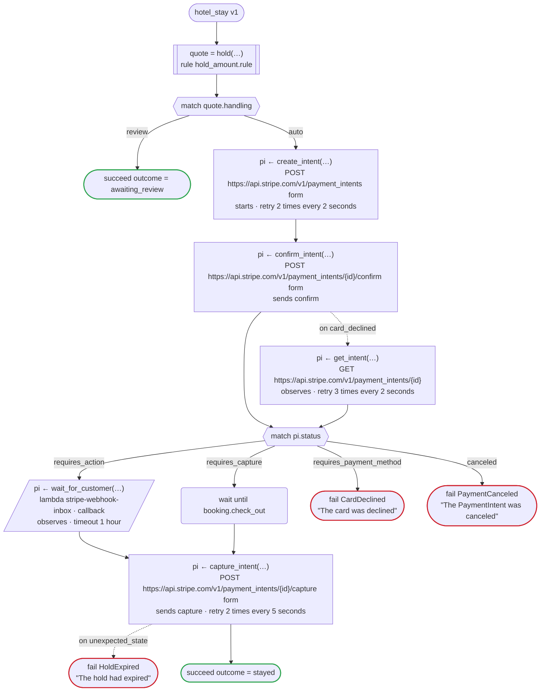

# hotel_stay v1

When a stay is booked, hold an amount on the card, and capture it on the day of check-out. A rule decides the amount and whether the front desk looks first; the payment is a Stripe PaymentIntent

`tests/fixtures/hotel_naive.flow` を `dandori doc` で描いたものです。入力は `booking: Booking`、出力は `outcome: Outcome` です。

**`dandori check` はこのワークフローにエラーを 4 件見つけています。** 最後に、それぞれのそうなる例と一緒に載せています。

## flow



四角はタスク、両脇に線のある四角は規則、斜めの四角は外から値が届くタスク（イベントやコールバックの応答）、六角形は `match`、角の丸い四角は待ち、ステップを囲む枠はループです。破線の矢印は、呼び出しがその場で処理するエラーです。

## 呼び出し

| 行 | 呼び出し | 呼ぶもの | リトライ | タイムアウト | 失敗したとき | 呼び出しのあとの案件 |
|---:|---|---|---|---|---|---|
| 81 | `quote = hold(…)` | 規則 `hold_amount.rule` | 2 回（1 秒後と 2 秒後、failure） | — | `timeout`, `failure` → ワークフローが失敗する | — |
| 84 | `pi ← create_intent(…)` | `POST https://api.stripe.com/v1/payment_intents form`, `starts payment_intent.payment then attach`, `key` | 2 秒おきに 2 回（failure, timeout） | — | `timeout`, `failure` → ワークフローが失敗する | `pi`: `requires_confirmation` |
| 85 | `pi ← confirm_intent(…)` | `POST https://api.stripe.com/v1/payment_intents/{id}/confirm form`, `sends confirm`, `key` | — | — | `card_declined` → 86 行目<br>`unexpected_state`, `timeout`, `failure` → ワークフローが失敗する | `pi`: `requires_payment_method`, `requires_action`, `requires_capture`, `canceled` |
| 86 | `pi ← get_intent(…)` | `GET https://api.stripe.com/v1/payment_intents/{id}`, `observes`, `idempotent` | 2 秒おきに 3 回（failure, timeout） | — | `timeout`, `failure` → ワークフローが失敗する | `pi`: `requires_payment_method`, `requires_confirmation`, `requires_action`, `requires_capture`, `canceled` |
| 89 | `pi ← wait_for_customer(…)` | `lambda stripe-webhook-inbox · callback`, `observes` | — | 1 時間 | `timeout`, `failure` → ワークフローが失敗する | `pi`: `requires_payment_method`, `requires_action`, `requires_capture`, `canceled` |
| 93 | `pi ← capture_intent(…)` | `POST https://api.stripe.com/v1/payment_intents/{id}/capture form`, `sends capture`, `key` | 5 秒おきに 2 回（failure, timeout） | — | `unexpected_state` → 94 行目<br>`timeout`, `failure` → ワークフローが失敗する | `pi`: `processing`, `succeeded` |

## 終わり方

ワークフローの終わり方のすべてと、そのとき各案件がとりうる状態です。外部のサービスで起きるイベントも含めています。

| 行 | 終わり方 | `pi` |
|---:|---|---|
| 83 | `succeed outcome = awaiting_review` | 始まっていない |
| 91 | `fail CardDeclined` "The card was declined" | `requires_payment_method` |
| 92 | `fail PaymentCanceled` "The PaymentIntent was canceled" | `canceled` |
| 94 | `fail HoldExpired` "The hold had expired" | `requires_payment_method`, `requires_action`, `requires_capture`, `canceled` |
| 95 | `succeed outcome = stayed` | `requires_payment_method`, `processing`, `succeeded` |

## 検査の結果

`dandori check` の結果です。それぞれにそうなる例が付いています。

```text
警告[W104]: tests/fixtures/hotel_naive.flow:81:1: `booking.nights` の範囲が分かりません（`Booking` のフィールド `nights` に範囲がありません）。規則 `hold` の `nights` が受け取るのは `>=1 <=30` です
    81 |   let quote = hold(room: booking.room, nights: booking.nights)
警告[W101]: tests/fixtures/hotel_naive.flow:85:1: `confirm_intent` が失敗すると、案件 `pi` が requires_payment_method, requires_confirmation, requires_action, requires_capture のままワークフローが失敗します。そうなる呼び出しは 4 か所です。呼び出しでエラーを処理するか、`on failure` を足して案件を片付けてください
    85 |   pi <- confirm_intent(id: pi.id)
  そうなる例:
      81  quote = hold(…)
      84  match quote.handling: auto
      84  create_intent: pi が requires_confirmation で始まる
      85  confirm_intent: pi が requires_confirmation → requires_payment_method
      85  confirm_intent が失敗する（timeout・failure）
エラー[E010]: tests/fixtures/hotel_naive.flow:87:1: `match` に requires_confirmation の分岐がありません。ここで `pi.status` はその値を取りえます
    87 |   match pi.status
  そうなる例:
      81  quote = hold(…)
      84  match quote.handling: auto
      84  create_intent: pi が requires_confirmation で始まる
      86  confirm_intent が失敗する: on card_declined
      86  get_intent: pi は requires_confirmation
エラー[E020]: tests/fixtures/hotel_naive.flow:91:1: 案件 `pi` が requires_payment_method のまま、ここでワークフローが失敗することがあります（終わりの状態は succeeded, canceled）。先に片付けるか、そのまま引き渡すなら `leaving pi` と書いてください
    91 |     requires_payment_method => fail CardDeclined "The card was declined"
  そうなる例:
      81  quote = hold(…)
      84  match quote.handling: auto
      84  create_intent: pi が requires_confirmation で始まる
      85  confirm_intent: pi が requires_confirmation → requires_payment_method
      91  match pi.status: requires_payment_method
      91  fail CardDeclined
エラー[E020]: tests/fixtures/hotel_naive.flow:94:1: 案件 `pi` が requires_payment_method, requires_action, requires_capture のまま、ここでワークフローが失敗することがあります（終わりの状態は succeeded, canceled）。先に片付けるか、そのまま引き渡すなら `leaving pi` と書いてください
    94 |     on unexpected_state => fail HoldExpired "The hold had expired"
  そうなる例:
      81  quote = hold(…)
      84  match quote.handling: auto
      84  create_intent: pi が requires_confirmation で始まる
      85  confirm_intent: pi が requires_confirmation → requires_action
      88  match pi.status: requires_action
          外部のサービスで `authenticate` が起きる: pi requires_action → requires_payment_method
      89  wait_for_customer: pi は requires_payment_method
      93  capture_intent: capture が拒否される（unexpected_state）
      94  fail HoldExpired
エラー[E020]: tests/fixtures/hotel_naive.flow:95:1: 案件 `pi` が requires_payment_method, processing のまま、ここでワークフローが終わることがあります（終わりの状態は succeeded, canceled）
    95 |   succeed outcome = stayed
  そうなる例:
      81  quote = hold(…)
      84  match quote.handling: auto
      84  create_intent: pi が requires_confirmation で始まる
      85  confirm_intent: pi が requires_confirmation → requires_capture
      90  match pi.status: requires_capture
      90  booking.check_out まで待つ
      93  capture_intent: pi が requires_capture → processing
          外部のサービスで `settle` が起きる: pi processing → requires_payment_method
      95  succeed
```
