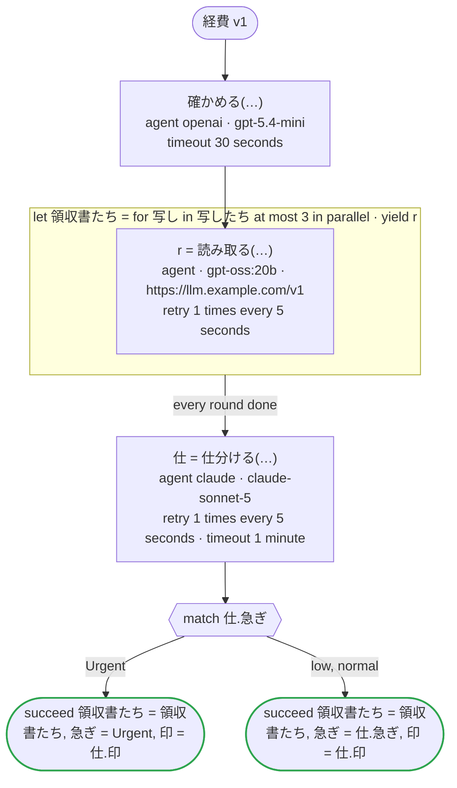

# 経費 v1

エージェントの端の振る舞い：リスト・単位・時刻・無いことがある値・範囲のある数を持つ答え、答えを読まない呼び出し、並列の回の中のエージェント、大文字と小文字の違う列挙の値で答える Claude のエージェント、OpenAI のほかの Open Responses のサーバーで読むエージェント

`tests/flows/agents.flow`, drawn by `dandori doc`. Inputs: `写したち: list[string]`. Outputs: `領収書たち: list[領収書]`, `急ぎ: 急ぎ`, `印: list[急ぎ]`.

## flow

A rectangle is a task, one with a line down each side a rule, a slanted one a task whose value comes from outside (an event, or the answer to a callback), a hexagon a `match`, a rounded box a wait, and a box around steps a loop. A dashed arrow is an error the call handles.

## Calls

| Line | Call | Calls | Retries | Timeout | When it fails |
|---:|---|---|---|---|---|
| 57 | `確かめる(…)` | `agent openai · gpt-5.4-mini` | — | 30 seconds | `timeout`, `failure` → the workflow fails |
| 59 | `r = 読み取る(…)` | `agent · gpt-oss:20b · https://llm.example.com/v1` | 1 time every 5 seconds (failure, timeout) | — | `timeout`, `failure` → the round fails, and then the workflow |
| 61 | `仕 = 仕分ける(…)` | `agent claude · claude-sonnet-5` | 1 time every 5 seconds (failure, timeout) | 1 minute | `timeout`, `failure` → the workflow fails |

## Ends

Every way the workflow can end.

| Line | End |
|---:|---|
| 63 | `succeed 領収書たち = 領収書たち, 急ぎ = Urgent, 印 = 仕.印` |
| 64 | `succeed 領収書たち = 領収書たち, 急ぎ = 仕.急ぎ, 印 = 仕.印` |

