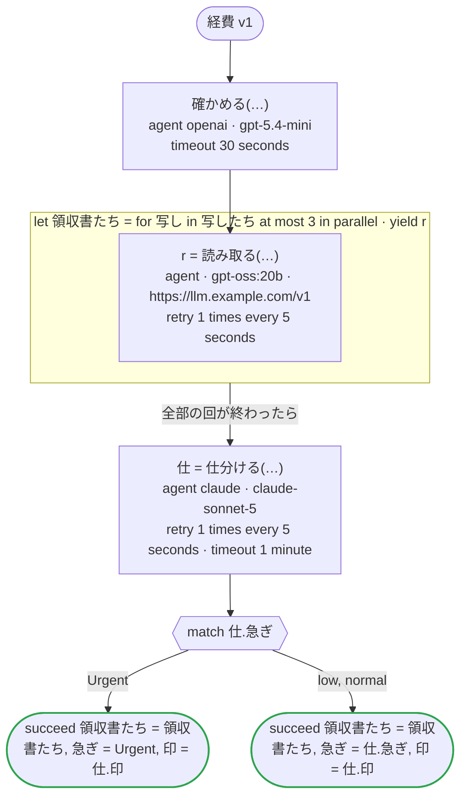

# 経費 v1

エージェントの端の振る舞い：リスト・単位・時刻・無いことがある値・範囲のある数を持つ答え、答えを読まない呼び出し、並列の回の中のエージェント、大文字と小文字の違う列挙の値で答える Claude のエージェント、OpenAI のほかの Open Responses のサーバーで読むエージェント

`tests/flows/agents.flow` を `dandori doc` で描いたものです。入力は `写したち: list[string]`、出力は `領収書たち: list[領収書]`, `急ぎ: 急ぎ`, `印: list[急ぎ]` です。

## flow

四角はタスク、両脇に線のある四角は規則、斜めの四角は外から値が届くタスク（イベントやコールバックの応答）、六角形は `match`、角の丸い四角は待ち、ステップを囲む枠はループです。破線の矢印は、呼び出しがその場で処理するエラーです。

## 呼び出し

| 行 | 呼び出し | 呼ぶもの | リトライ | タイムアウト | 失敗したとき |
|---:|---|---|---|---|---|
| 57 | `確かめる(…)` | `agent openai · gpt-5.4-mini` | — | 30 秒 | `timeout`, `failure` → ワークフローが失敗する |
| 59 | `r = 読み取る(…)` | `agent · gpt-oss:20b · https://llm.example.com/v1` | 5 秒おきに 1 回（failure, timeout） | — | `timeout`, `failure` → その回が失敗し、ワークフローも失敗する |
| 61 | `仕 = 仕分ける(…)` | `agent claude · claude-sonnet-5` | 5 秒おきに 1 回（failure, timeout） | 1 分 | `timeout`, `failure` → ワークフローが失敗する |

## 終わり方

ワークフローの終わり方のすべてです。

| 行 | 終わり方 |
|---:|---|
| 63 | `succeed 領収書たち = 領収書たち, 急ぎ = Urgent, 印 = 仕.印` |
| 64 | `succeed 領収書たち = 領収書たち, 急ぎ = 仕.急ぎ, 印 = 仕.印` |

