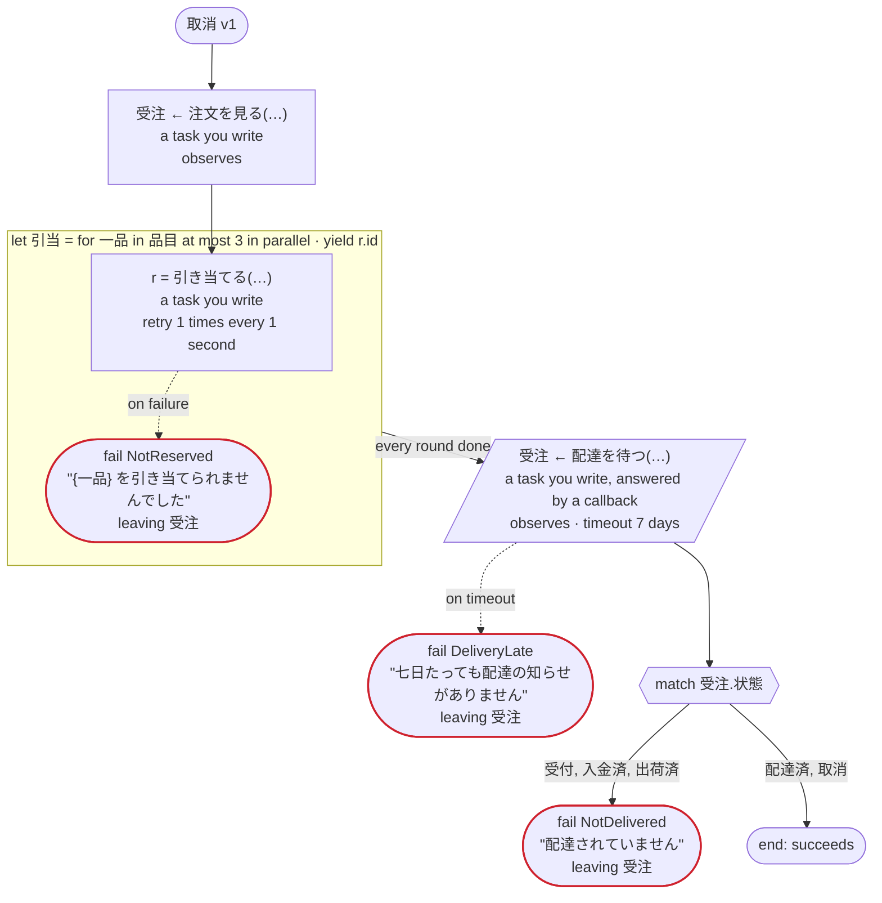
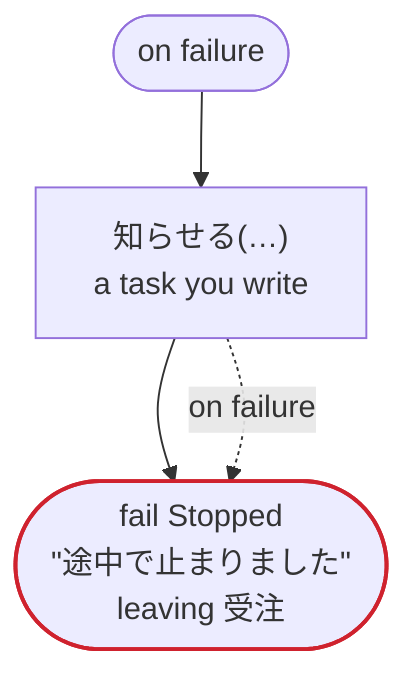
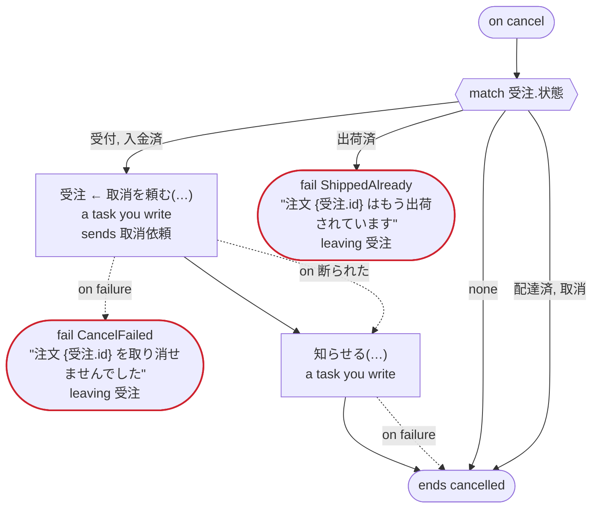

# 取消 v1

キャンセルのエッジケース：案件を片付ける on cancel、リトライとエラーの処理を素通りするキャンセル、並列のイテレーションの中のキャンセル、コールバックを待つあいだのキャンセル、on failure の最中のキャンセル。Temporal 向け

`tests/flows/cancel.flow`, drawn by `dandori doc`. Inputs: `注文ID: string`, `品目: list[string]`.

## flow

A rectangle is a task, one with a line down each side a rule, a slanted one a task whose value comes from outside (an event, or the answer to a callback), a hexagon a `match`, a rounded box a wait, and a box around steps a loop. A dashed arrow is an error the call handles.

## on failure

Runs when a call fails and nothing at the call handles the error: from the calls on lines 46 and 51. When it runs to its end, the workflow fails with that error.

## on cancel

Runs when the workflow is cancelled, from the call or the wait the run is at. When it runs to its end, the workflow ends cancelled.

## Calls

| Line | Call | Calls | Retries | Timeout | When it fails | Case after |
|---:|---|---|---|---|---|---|
| 46 | `受注 ← 注文を見る(…)` | a task you write, `observes`, `idempotent` | — | — | `timeout`, `failure` → `on failure` | `受注`: `受付`, `入金済`, `出荷済`, `配達済`, `取消` |
| 48 | `r = 引き当てる(…)` | a task you write, `idempotent` | 1 time every 1 second (failure, timeout) | — | `timeout`, `failure` → line 49 | — |
| 51 | `受注 ← 配達を待つ(…)` | a task you write, answered by a callback, `observes` | — | 7 days | `timeout` → line 52 `failure` → `on failure` | `受注`: `受付`, `入金済`, `出荷済`, `配達済`, `取消` |
| 58 | `知らせる(…)` | a task you write, `key` | — | — | `timeout`, `failure` → line 59 | — |
| 67 | `受注 ← 取消を頼む(…)` | a task you write, `sends 取消依頼`, `key` | — | — | `断られた` → line 68 `timeout`, `failure` → line 69 | `受注`: `取消` |
| 70 | `知らせる(…)` | a task you write, `key` | — | — | `timeout`, `failure` → line 71 | — |

## Ends

Every way the workflow can end, and what each case can be then, the events on the other side included.

| Line | End | `受注` |
|---:|---|---|
| 49 | `fail NotReserved` "{一品} を引き当てられませんでした" `leaving 受注` | handed over as it is: `受付`, `入金済`, `出荷済`, `配達済`, `取消` |
| 52 | `fail DeliveryLate` "七日たっても配達の知らせがありません" `leaving 受注` | handed over as it is: `受付`, `入金済`, `出荷済`, `配達済`, `取消` |
| 55 | `fail NotDelivered` "配達されていません" `leaving 受注` | handed over as it is: `受付`, `入金済`, `出荷済`, `配達済`, `取消` |
| 55 | the flow runs to its end, and the workflow succeeds | `配達済`, `取消` |
| 60 | `fail Stopped` "途中で止まりました" `leaving 受注` | handed over as it is: not started, or `受付`, `入金済`, `出荷済`, `配達済`, `取消` |
| 69 | `fail CancelFailed` "注文 {受注.id} を取り消せませんでした" `leaving 受注` | handed over as it is: `受付`, `入金済`, `取消` |
| 72 | `fail ShippedAlready` "注文 {受注.id} はもう出荷されています" `leaving 受注` | handed over as it is: `出荷済`, `配達済` |
| 73 | `on cancel` runs to its end, and the workflow ends cancelled | not started, or `配達済`, `取消` |

