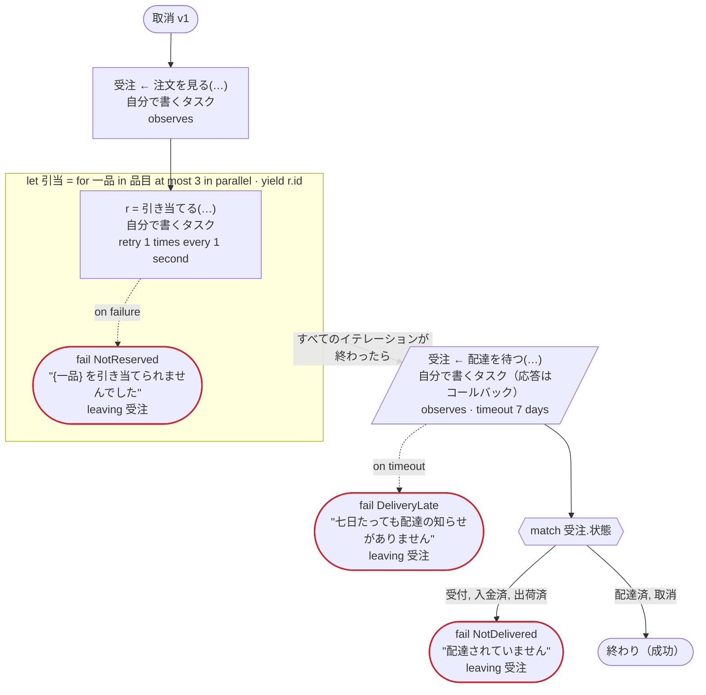
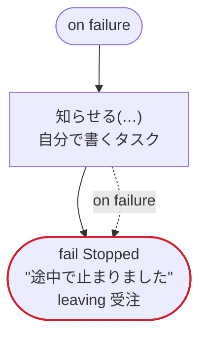
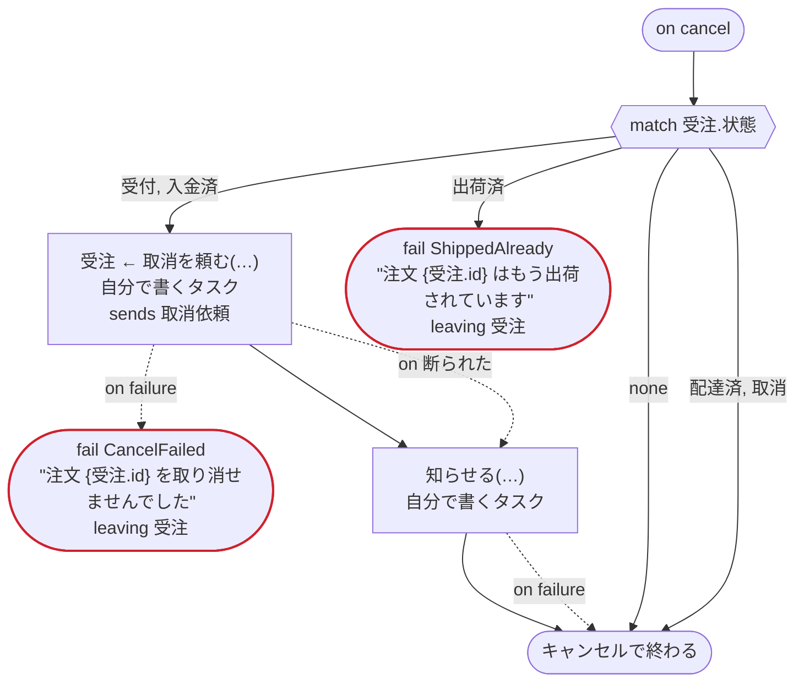

# 取消 v1

キャンセルのエッジケース：案件を片付ける on cancel、リトライとエラーの処理を素通りするキャンセル、並列のイテレーションの中のキャンセル、コールバックを待つあいだのキャンセル、on failure の最中のキャンセル。Temporal 向け

`tests/flows/cancel.flow` を `dandori doc` で描いたものです。入力は `注文ID: string`, `品目: list[string]` です。

## flow

四角はタスク、両脇に線のある四角は規則、斜めの四角は外から値が届くタスク（イベントやコールバックの応答）、六角形は `match`、角の丸い四角は待ち、ステップを囲む枠はループです。破線の矢印は、呼び出しがその場で処理するエラーです。

## on failure

呼び出しが失敗し、そのエラーをその場で処理しないときに走ります（46・51 行目の呼び出しから）。最後まで走ると、ワークフローはそのエラーで失敗します。

## on cancel

ワークフローがキャンセルされると、そのとき待っている呼び出しや wait から、ここに来ます。最後まで走ると、ワークフローはキャンセルで終わります。

## 呼び出し

| 行 | 呼び出し | 呼ぶもの | リトライ | タイムアウト | 失敗したとき | 呼び出しのあとの案件 |
|---:|---|---|---|---|---|---|
| 46 | `受注 ← 注文を見る(…)` | 自分で書くタスク, `observes`, `idempotent` | — | — | `timeout`, `failure` → `on failure` | `受注`: `受付`, `入金済`, `出荷済`, `配達済`, `取消` |
| 48 | `r = 引き当てる(…)` | 自分で書くタスク, `idempotent` | 1 秒おきに 1 回（failure, timeout） | — | `timeout`, `failure` → 49 行目 | — |
| 51 | `受注 ← 配達を待つ(…)` | 自分で書くタスク（応答はコールバック）, `observes` | — | 7 日 | `timeout` → 52 行目 `failure` → `on failure` | `受注`: `受付`, `入金済`, `出荷済`, `配達済`, `取消` |
| 58 | `知らせる(…)` | 自分で書くタスク, `key` | — | — | `timeout`, `failure` → 59 行目 | — |
| 67 | `受注 ← 取消を頼む(…)` | 自分で書くタスク, `sends 取消依頼`, `key` | — | — | `断られた` → 68 行目 `timeout`, `failure` → 69 行目 | `受注`: `取消` |
| 70 | `知らせる(…)` | 自分で書くタスク, `key` | — | — | `timeout`, `failure` → 71 行目 | — |

## 終わり方

ワークフローの終わり方のすべてと、そのとき各案件がとりうる状態です。外部のサービスで起きるイベントも含めています。

| 行 | 終わり方 | `受注` |
|---:|---|---|
| 49 | `fail NotReserved` "{一品} を引き当てられませんでした" `leaving 受注` | そのまま引き渡す: `受付`, `入金済`, `出荷済`, `配達済`, `取消` |
| 52 | `fail DeliveryLate` "七日たっても配達の知らせがありません" `leaving 受注` | そのまま引き渡す: `受付`, `入金済`, `出荷済`, `配達済`, `取消` |
| 55 | `fail NotDelivered` "配達されていません" `leaving 受注` | そのまま引き渡す: `受付`, `入金済`, `出荷済`, `配達済`, `取消` |
| 55 | flow が最後まで走り、ワークフローは成功する | `配達済`, `取消` |
| 60 | `fail Stopped` "途中で止まりました" `leaving 受注` | そのまま引き渡す: 始まっていないか、`受付`, `入金済`, `出荷済`, `配達済`, `取消` |
| 69 | `fail CancelFailed` "注文 {受注.id} を取り消せませんでした" `leaving 受注` | そのまま引き渡す: `受付`, `入金済`, `取消` |
| 72 | `fail ShippedAlready` "注文 {受注.id} はもう出荷されています" `leaving 受注` | そのまま引き渡す: `出荷済`, `配達済` |
| 73 | `on cancel` が最後まで走り、ワークフローはキャンセルで終わる | 始まっていないか、`配達済`, `取消` |

