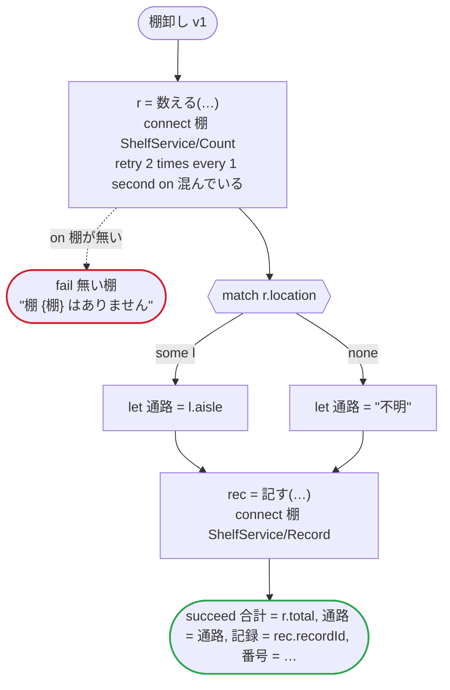

# 棚卸し v1

Connect で呼ぶ棚の数え直し：protobuf の JSON が既定値で省く項目（空の文字列、0、false、列挙の最初の値、空のリストとマップ、文字列の 64 ビットの整数）を、レスポンスの中、中のメッセージ、メッセージのリストで埋めて読み、次の呼び出しに渡す。値が設定されていない google.protobuf.Value もレスポンスの JSON から省かれるので、json のフィールドは、レスポンスに無ければ null として読んで次の呼び出しに渡す。場所と記録の型は .proto のメッセージから作り、品・数え・状態は手で書く（ゼロ値を持つ列挙を自分で書く形を残すため）

`tests/flows/connect.flow` を `dandori doc` で描いたものです。入力は `棚: string`、出力は `合計: int`, `通路: string`, `記録: string`, `番号: string` です。

## flow

四角はタスク、両脇に線のある四角は規則、斜めの四角は外から値が届くタスク（イベントやコールバックの応答）、六角形は `match`、角の丸い四角は待ち、ステップを囲む枠はループです。破線の矢印は、呼び出しがその場で処理するエラーです。

## 呼び出し

| 行 | 呼び出し | 呼ぶもの | リトライ | タイムアウト | 失敗したとき |
|---:|---|---|---|---|---|
| 46 | `r = 数える(…)` | `connect 棚 ShelfService/Count` | 1 秒おきに 2 回（混んでいる） | — | `棚が無い` → 47 行目 `混んでいる`, `timeout`, `failure` → ワークフローが失敗する |
| 51 | `rec = 記す(…)` | `connect 棚 ShelfService/Record`, `key` | — | — | `timeout`, `failure` → ワークフローが失敗する |

## 終わり方

ワークフローの終わり方のすべてです。

| 行 | 終わり方 |
|---:|---|
| 47 | `fail 無い棚` "棚 {棚} はありません" |
| 52 | `succeed 合計 = r.total, 通路 = 通路, 記録 = rec.recordId, 番号 = r.serial` |

