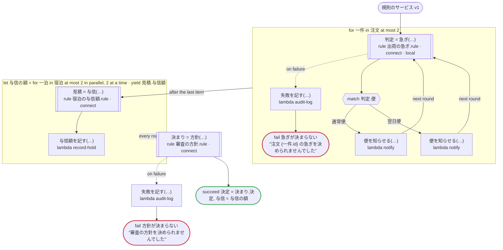
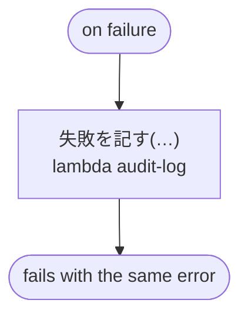

# 規則のサービス v1

規則を Connect のサービスとして呼ぶ：呼ぶ規則は日本語の三つ（出荷の急ぎ・宿泊の与信額・審査の方針）で、どれも use rule の下の connect で呼ぶ。数は文字列で、列挙は .proto の名前で送る。答えは、protobuf の JSON が省く項目（false と 0）を埋め、数を文字列から、列挙を .proto の名前から読み直して、次の呼び出しに渡す。ローカルアクティビティ（local）で呼ぶ規則、並列のイテレーションの中の呼び出し、エラーを処理する呼び出しと処理しない呼び出しがある

`tests/flows/connect_rules.flow`, drawn by `dandori doc`. Inputs: `注文: list[注文]`, `宿泊: list[宿泊]`, `見立て: 見立て`. Outputs: `決定: 方針.決定`, `与信: list[money[円, incl_tax]]`.

## flow

A rectangle is a task, one with a line down each side a rule, a slanted one a task whose value comes from outside (an event, or the answer to a callback), a hexagon a `match`, a rounded box a wait, and a box around steps a loop. A dashed arrow is an error the call handles.

## on failure

Runs when a call fails and nothing at the call handles the error: from the calls on lines 56, 59, 60, 62, 63 and 67. When it runs to its end, the workflow fails with that error.

## Calls

| Line | Call | Calls | Retries | Timeout | When it fails |
|---:|---|---|---|---|---|
| 54 | `判定 = 急ぎ(…)` | rule `出荷の急ぎ.rule`, by Connect at `https://rules.example.com`, a local activity on Temporal | 2 times, after 1 second and 2 (failure) | — | `timeout`, `failure` → line 55 |
| 56 | `失敗を記す(…)` | `lambda audit-log`, `idempotent` | — | — | `timeout`, `failure` → `on failure` |
| 59 | `便を知らせる(…)` | `lambda notify`, `idempotent` | — | — | `timeout`, `failure` → `on failure` |
| 60 | `便を知らせる(…)` | `lambda notify`, `idempotent` | — | — | `timeout`, `failure` → `on failure` |
| 62 | `見積 = 与信(…)` | rule `宿泊の与信額.rule`, by Connect at `https://rules.example.com` | 2 times, after 1 second and 2 (failure) | — | `timeout`, `failure` → the round fails, then `on failure` |
| 63 | `与信額を記す(…)` | `lambda record-hold`, `idempotent` | — | — | `timeout`, `failure` → the round fails, then `on failure` |
| 65 | `決まり = 方針(…)` | rule `審査の方針.rule`, by Connect at `https://rules.example.com` | 2 times, after 1 second and 2 (failure) | — | `timeout`, `failure` → line 66 |
| 67 | `失敗を記す(…)` | `lambda audit-log`, `idempotent` | — | — | `timeout`, `failure` → `on failure` |
| 72 | `失敗を記す(…)` | `lambda audit-log`, `idempotent` | — | — | `timeout`, `failure` → the workflow fails |

## Ends

Every way the workflow can end.

| Line | End |
|---:|---|
| 57 | `fail 急ぎが決まらない` "注文 {一件.id} の急ぎを決められませんでした" |
| 68 | `fail 方針が決まらない` "審査の方針を決められませんでした" |
| 69 | `succeed 決定 = 決まり.決定, 与信 = 与信の額` |
| 72 | `on failure` runs to its end, and the workflow fails with the error that started it |

## Rules

The rules this workflow calls, as `rulec doc` renders them for whoever approves them.

<code>急ぎ</code> · 出荷の急ぎ v1 · <code>../../examples/order/rules/出荷の急ぎ.rule</code>

<!-- Generated by rulec 0.22.0 from 出荷の急ぎ.rule (sha256:3f566b643eb8). This is a read-only rendering; the source of truth is the .rule file. Edits cannot be carried back (§1.6). -->
# Rule 出荷の急ぎ v1

注文を急ぎで出すかどうかと、使う便。会員はいつも急ぎ、それ以外は三万円以上なら急ぎ。書き下ろしの例

## Inputs

| Name | Type | Range | Notes |
|---|---|---|---|
| 会員 | bool |  |  |
| 金額 | money[円, incl_tax] | 0円 〜 100万円 |  |

## Outputs

| Name | Type | Rounding | Notes |
|---|---|---|---|
| 急ぎ | bool |  |  |
| 便 | 便 (2 values) |  |  |

## Types

An enum is a **closed** finite set. Add a value, and every table that does not look at it fails the completeness check.

- **便** (2 values) — 通常便, 翌日便

## Table 急ぎの判定 (policy unique)

| Column | Source |
|---|---|
| 会員 | Input |
| 金額 | Input |
| → 急ぎ | Output of this rule |
| → 便 | Output of this rule |

| # | 会員 | 金額 | → 急ぎ (bool) | → 便 (便) |
|---|---|---|---|---|
| 1 | true | - | true | 翌日便 |
| 2 | false | >=30000円 | true | 翌日便 |
| 3 | false | <30000円 | false | 通常便 |

**What `rulec check` verified**

- Every combination of inputs matches some row (E101 completeness)
- There is no row that can never match (E102 unreachable row)
- No input matches two or more rows at once (E105 overlap). Reordering the rows does not change the meaning

## Examples (verified)

| 会員 | 金額 | → 急ぎ | 便 |
|---|---|---|---|
| true | 1000円 | true | 翌日便 |
| false | 5000円 | false | 通常便 |
| false | 30000円 | true | 翌日便 |

`rulec check` ran these 3 examples through the reference evaluator, and every one produced the declared values (E107). The examples are an **executable specification**.

<code>与信</code> · 宿泊の与信額 v1 · <code>../../examples/hotel/rules/宿泊の与信額.rule</code>

<!-- Generated by rulec 0.22.0 from 宿泊の与信額.rule (sha256:7c4298374720). This is a read-only rendering; the source of truth is the .rule file. Edits cannot be carried back (§1.6). -->
# Rule 宿泊の与信額 v1

予約のときにカードで押さえる額と、フロントの確認に回すかどうか。客室の一泊の額に泊数を掛ける。15 泊以上は確認に回す。書き下ろしの例

## Inputs

| Name | Type | Range | Notes |
|---|---|---|---|
| 客室 | 客室 (3 values) |  |  |
| 泊数 | number | 1 〜 30 |  |

## Outputs

| Name | Type | Rounding | Notes |
|---|---|---|---|
| 与信額 | money[円, incl_tax] | down(1円) |  |
| 扱い | 扱い (2 values) |  |  |

## Types

An enum is a **closed** finite set. Add a value, and every table that does not look at it fails the completeness check.

- **客室** (3 values) — standard, deluxe, suite
- **扱い** (2 values) — 自動, 確認

## Derived Values and Definitions

Intermediate values that can be placed in a table column. The expressions are as written in the source file, and the ranges are the declared ones.

| Name | Kind | Expression | Range | Notes |
|---|---|---|---|---|
| 与信額 | Definition | `一泊 × 泊数` |  |  |

## Table 一泊の額 (policy unique)

| Column | Source |
|---|---|
| 客室 | Input |
| → 一泊 | (this table only) |

| # | 客室 | → 一泊 (money[円, incl_tax]) |
|---|---|---|
| 1 | standard | 12000円 |
| 2 | deluxe | 18000円 |
| 3 | suite | 40000円 |

**What `rulec check` verified**

- Every combination of inputs matches some row (E101 completeness)
- There is no row that can never match (E102 unreachable row)
- No input matches two or more rows at once (E105 overlap). Reordering the rows does not change the meaning

## Table 扱いの判定 (policy unique)

| Column | Source |
|---|---|
| 泊数 | Input |
| → 扱い | Output of this rule |

| # | 泊数 | → 扱い (扱い) |
|---|---|---|
| 1 | <=14 | 自動 |
| 2 | >=15 | 確認 |

**What `rulec check` verified**

- Every combination of inputs matches some row (E101 completeness)
- There is no row that can never match (E102 unreachable row)
- No input matches two or more rows at once (E105 overlap). Reordering the rows does not change the meaning

## Examples (verified)

| 客室 | 泊数 | → 与信額 | 扱い |
|---|---|---|---|
| standard | 2 | 24000円 | 自動 |
| suite | 15 | 600000円 | 確認 |

`rulec check` ran these 2 examples through the reference evaluator, and every one produced the declared values (E107). The examples are an **executable specification**.

<code>方針</code> · 審査の方針 v1 · <code>../../examples/review/rules/審査の方針.rule</code>

<!-- Generated by rulec 0.22.0 from 審査の方針.rule (sha256:0c12a93ec001). This is a read-only rendering; the source of truth is the .rule file. Edits cannot be carried back (§1.6). -->
# Rule 審査の方針 v1

申込の採点の判断を、そのまま実行するか人に回すかを、採点の確信度で決める。そのまま承認するには、そのまま却下するより高い確信度が要る。書き下ろしの例

## Inputs

| Name | Type | Range | Notes |
|---|---|---|---|
| 判断 | 判断 (3 values) |  |  |
| 確信度 | rate | 0 〜 1 |  |

## Outputs

| Name | Type | Rounding | Notes |
|---|---|---|---|
| 決定 | 決定 (3 values) |  |  |

## Types

An enum is a **closed** finite set. Add a value, and every table that does not look at it fails the completeness check.

- **判断** (3 values) — 却下, 保留, 承認
- **決定** (3 values) — 承認, 却下, 人に回す

## Table 決め方 (policy unique)

| Column | Source |
|---|---|
| 判断 | Input |
| 確信度 | Input |
| → 決定 | Output of this rule |

| # | 判断 | 確信度 | → 決定 (決定) |
|---|---|---|---|
| 1 | 承認 | >=90% | 承認 |
| 2 | 承認 | <90% | 人に回す |
| 3 | 却下 | >=80% | 却下 |
| 4 | 却下 | <80% | 人に回す |
| 5 | 保留 | - | 人に回す |

**What `rulec check` verified**

- Every combination of inputs matches some row (E101 completeness)
- There is no row that can never match (E102 unreachable row)
- No input matches two or more rows at once (E105 overlap). Reordering the rows does not change the meaning

## Examples (verified)

| 判断 | 確信度 | → 決定 |
|---|---|---|
| 承認 | 95% | 承認 |
| 承認 | 89% | 人に回す |
| 却下 | 80% | 却下 |
| 保留 | 99% | 人に回す |

`rulec check` ran these 4 examples through the reference evaluator, and every one produced the declared values (E107). The examples are an **executable specification**.

