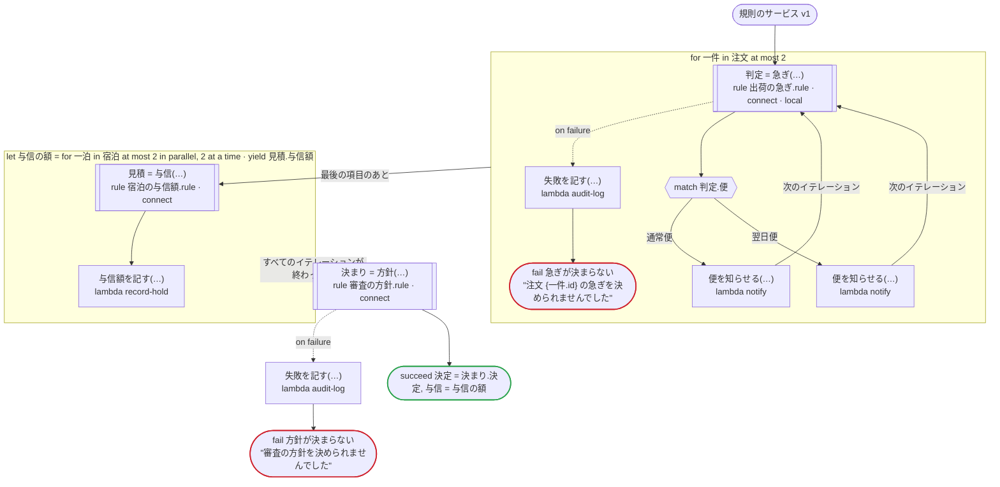
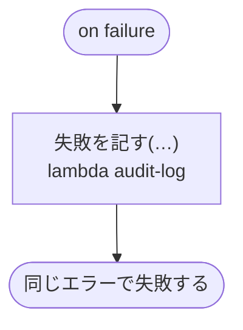

# 規則のサービス v1

規則を Connect のサービスとして呼ぶ：呼ぶ規則は日本語の三つ（出荷の急ぎ・宿泊の与信額・審査の方針）で、どれも use rule の下の connect で呼ぶ。数は文字列で、列挙は .proto の名前で送る。答えは、protobuf の JSON が省く項目（false と 0）を埋め、数を文字列から、列挙を .proto の名前から読み直して、次の呼び出しに渡す。ローカルアクティビティ（local）で呼ぶ規則、並列のイテレーションの中の呼び出し、エラーを処理する呼び出しと処理しない呼び出しがある

`tests/flows/connect_rules.flow` を `dandori doc` で描いたものです。入力は `注文: list[注文]`, `宿泊: list[宿泊]`, `見立て: 見立て`、出力は `決定: 方針.決定`, `与信: list[money[円, incl_tax]]` です。

## flow

四角はタスク、両脇に線のある四角は規則、斜めの四角は外から値が届くタスク（イベントやコールバックの応答）、六角形は `match`、角の丸い四角は待ち、ステップを囲む枠はループです。破線の矢印は、呼び出しがその場で処理するエラーです。

## on failure

呼び出しが失敗し、そのエラーをその場で処理しないときに走ります（56・59・60・62・63・67 行目の呼び出しから）。最後まで走ると、ワークフローはそのエラーで失敗します。

## 呼び出し

| 行 | 呼び出し | 呼ぶもの | リトライ | タイムアウト | 失敗したとき |
|---:|---|---|---|---|---|
| 54 | `判定 = 急ぎ(…)` | 規則 `出荷の急ぎ.rule`（Connect で `https://rules.example.com` に）（Temporal ではローカルアクティビティ） | 2 回（1 秒後と 2 秒後、failure） | — | `timeout`, `failure` → 55 行目 |
| 56 | `失敗を記す(…)` | `lambda audit-log`, `idempotent` | — | — | `timeout`, `failure` → `on failure` |
| 59 | `便を知らせる(…)` | `lambda notify`, `idempotent` | — | — | `timeout`, `failure` → `on failure` |
| 60 | `便を知らせる(…)` | `lambda notify`, `idempotent` | — | — | `timeout`, `failure` → `on failure` |
| 62 | `見積 = 与信(…)` | 規則 `宿泊の与信額.rule`（Connect で `https://rules.example.com` に） | 2 回（1 秒後と 2 秒後、failure） | — | `timeout`, `failure` → そのイテレーションが失敗し、`on failure` へ |
| 63 | `与信額を記す(…)` | `lambda record-hold`, `idempotent` | — | — | `timeout`, `failure` → そのイテレーションが失敗し、`on failure` へ |
| 65 | `決まり = 方針(…)` | 規則 `審査の方針.rule`（Connect で `https://rules.example.com` に） | 2 回（1 秒後と 2 秒後、failure） | — | `timeout`, `failure` → 66 行目 |
| 67 | `失敗を記す(…)` | `lambda audit-log`, `idempotent` | — | — | `timeout`, `failure` → `on failure` |
| 72 | `失敗を記す(…)` | `lambda audit-log`, `idempotent` | — | — | `timeout`, `failure` → ワークフローが失敗する |

## 終わり方

ワークフローの終わり方のすべてです。

| 行 | 終わり方 |
|---:|---|
| 57 | `fail 急ぎが決まらない` "注文 {一件.id} の急ぎを決められませんでした" |
| 68 | `fail 方針が決まらない` "審査の方針を決められませんでした" |
| 69 | `succeed 決定 = 決まり.決定, 与信 = 与信の額` |
| 72 | `on failure` が最後まで走り、ワークフローは始まりのエラーで失敗する |

## 規則

このワークフローが呼ぶ規則を、`rulec doc` が承認する人向けに描いたものです。

<code>急ぎ</code> · 出荷の急ぎ v1 · <code>../../examples/order/rules/出荷の急ぎ.rule</code>

<!-- rulec 0.22.0 が 出荷の急ぎ.rule (sha256:3f566b643eb8) から生成。これは読み取り専用の資料で、本物は .rule のほうです。編集しても戻せません（§1.6）。 -->
# 規則 出荷の急ぎ v1

注文を急ぎで出すかどうかと、使う便。会員はいつも急ぎ、それ以外は三万円以上なら急ぎ。書き下ろしの例

## 入力

| 名前 | 型 | 範囲 | 注記 |
|---|---|---|---|
| 会員 | bool |  |  |
| 金額 | money[円, incl_tax] | 0円 〜 100万円 |  |

## 出力

| 名前 | 型 | 丸め | 注記 |
|---|---|---|---|
| 急ぎ | bool |  |  |
| 便 | 便（2 値） |  |  |

## 型

列挙は**閉じた**有限集合です。値を足すと、それを見ていない表が完全性検査で割れます。

- **便**（2 値）— 通常便、翌日便

## 表 急ぎの判定（policy unique）

| 列 | 出どころ |
|---|---|
| 会員 | 入力 |
| 金額 | 入力 |
| → 急ぎ | この規則の出力 |
| → 便 | この規則の出力 |

| # | 会員 | 金額 | → 急ぎ（bool） | → 便（便） |
|---|---|---|---|---|
| 1 | true | - | true | 翌日便 |
| 2 | false | >=30000円 | true | 翌日便 |
| 3 | false | <30000円 | false | 通常便 |

**`rulec check` が確かめたこと**

- どの入力の組合せも、いずれかの行に当てはまります（E101 完全性）
- どの入力にも当てはまらない行はありません（E102）
- 二つ以上の行に同時に当てはまる入力はありません（E105 重なり）。行の並べ替えは意味を変えません

## 例（検証済み）

| 会員 | 金額 | → 急ぎ | 便 |
|---|---|---|---|
| true | 1000円 | true | 翌日便 |
| false | 5000円 | false | 通常便 |
| false | 30000円 | true | 翌日便 |

この 3 件は `rulec check` が参照評価器で実行し、すべて宣言どおりの値になりました（E107）。例は**実行される仕様**です。

<code>与信</code> · 宿泊の与信額 v1 · <code>../../examples/hotel/rules/宿泊の与信額.rule</code>

<!-- rulec 0.22.0 が 宿泊の与信額.rule (sha256:7c4298374720) から生成。これは読み取り専用の資料で、本物は .rule のほうです。編集しても戻せません（§1.6）。 -->
# 規則 宿泊の与信額 v1

予約のときにカードで押さえる額と、フロントの確認に回すかどうか。客室の一泊の額に泊数を掛ける。15 泊以上は確認に回す。書き下ろしの例

## 入力

| 名前 | 型 | 範囲 | 注記 |
|---|---|---|---|
| 客室 | 客室（3 値） |  |  |
| 泊数 | number | 1 〜 30 |  |

## 出力

| 名前 | 型 | 丸め | 注記 |
|---|---|---|---|
| 与信額 | money[円, incl_tax] | down(1円) |  |
| 扱い | 扱い（2 値） |  |  |

## 型

列挙は**閉じた**有限集合です。値を足すと、それを見ていない表が完全性検査で割れます。

- **客室**（3 値）— standard、deluxe、suite
- **扱い**（2 値）— 自動、確認

## 導出と定義

表の列に置ける中間の値です。式はもとの規則のとおりで、範囲は宣言されたものです。

| 名前 | 種類 | 式 | 範囲 | 注記 |
|---|---|---|---|---|
| 与信額 | 定義 | `一泊 × 泊数` |  |  |

## 表 一泊の額（policy unique）

| 列 | 出どころ |
|---|---|
| 客室 | 入力 |
| → 一泊 | （この表の中だけ） |

| # | 客室 | → 一泊（money[円, incl_tax]） |
|---|---|---|
| 1 | standard | 12000円 |
| 2 | deluxe | 18000円 |
| 3 | suite | 40000円 |

**`rulec check` が確かめたこと**

- どの入力の組合せも、いずれかの行に当てはまります（E101 完全性）
- どの入力にも当てはまらない行はありません（E102）
- 二つ以上の行に同時に当てはまる入力はありません（E105 重なり）。行の並べ替えは意味を変えません

## 表 扱いの判定（policy unique）

| 列 | 出どころ |
|---|---|
| 泊数 | 入力 |
| → 扱い | この規則の出力 |

| # | 泊数 | → 扱い（扱い） |
|---|---|---|
| 1 | <=14 | 自動 |
| 2 | >=15 | 確認 |

**`rulec check` が確かめたこと**

- どの入力の組合せも、いずれかの行に当てはまります（E101 完全性）
- どの入力にも当てはまらない行はありません（E102）
- 二つ以上の行に同時に当てはまる入力はありません（E105 重なり）。行の並べ替えは意味を変えません

## 例（検証済み）

| 客室 | 泊数 | → 与信額 | 扱い |
|---|---|---|---|
| standard | 2 | 24000円 | 自動 |
| suite | 15 | 600000円 | 確認 |

この 2 件は `rulec check` が参照評価器で実行し、すべて宣言どおりの値になりました（E107）。例は**実行される仕様**です。

<code>方針</code> · 審査の方針 v1 · <code>../../examples/review/rules/審査の方針.rule</code>

<!-- rulec 0.22.0 が 審査の方針.rule (sha256:0c12a93ec001) から生成。これは読み取り専用の資料で、本物は .rule のほうです。編集しても戻せません（§1.6）。 -->
# 規則 審査の方針 v1

申込の採点の判断を、そのまま実行するか人に回すかを、採点の確信度で決める。そのまま承認するには、そのまま却下するより高い確信度が要る。書き下ろしの例

## 入力

| 名前 | 型 | 範囲 | 注記 |
|---|---|---|---|
| 判断 | 判断（3 値） |  |  |
| 確信度 | rate | 0 〜 1 |  |

## 出力

| 名前 | 型 | 丸め | 注記 |
|---|---|---|---|
| 決定 | 決定（3 値） |  |  |

## 型

列挙は**閉じた**有限集合です。値を足すと、それを見ていない表が完全性検査で割れます。

- **判断**（3 値）— 却下、保留、承認
- **決定**（3 値）— 承認、却下、人に回す

## 表 決め方（policy unique）

| 列 | 出どころ |
|---|---|
| 判断 | 入力 |
| 確信度 | 入力 |
| → 決定 | この規則の出力 |

| # | 判断 | 確信度 | → 決定（決定） |
|---|---|---|---|
| 1 | 承認 | >=90% | 承認 |
| 2 | 承認 | <90% | 人に回す |
| 3 | 却下 | >=80% | 却下 |
| 4 | 却下 | <80% | 人に回す |
| 5 | 保留 | - | 人に回す |

**`rulec check` が確かめたこと**

- どの入力の組合せも、いずれかの行に当てはまります（E101 完全性）
- どの入力にも当てはまらない行はありません（E102）
- 二つ以上の行に同時に当てはまる入力はありません（E105 重なり）。行の並べ替えは意味を変えません

## 例（検証済み）

| 判断 | 確信度 | → 決定 |
|---|---|---|
| 承認 | 95% | 承認 |
| 承認 | 89% | 人に回す |
| 却下 | 80% | 却下 |
| 保留 | 99% | 人に回す |

この 4 件は `rulec check` が参照評価器で実行し、すべて宣言どおりの値になりました（E107）。例は**実行される仕様**です。

