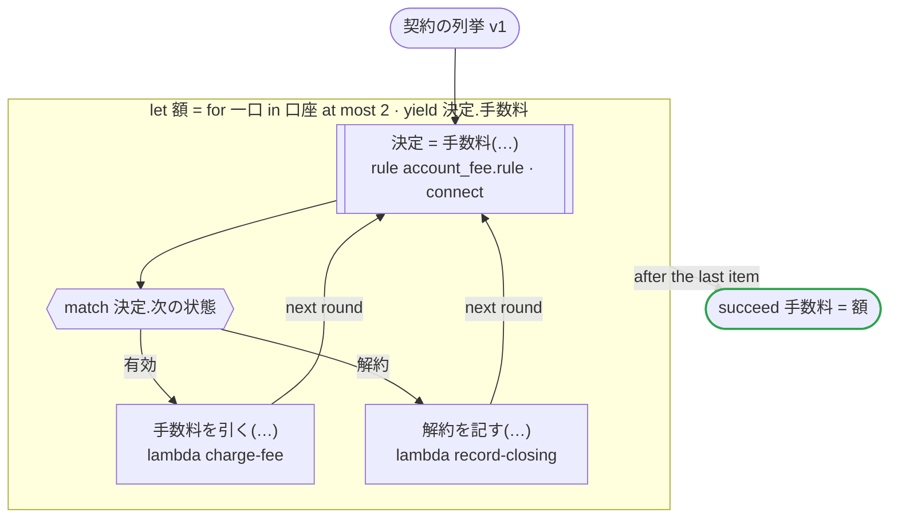

# 契約の列挙 v1

契約の列挙を取り込んだ規則を Connect のサービスとして呼ぶ：口座の手数料の規則は、状態の列挙を契約（account.proto）から取り込む。契約の値には接頭辞が無く、0 番も「有効」という状態なので、サービスは「有効」の結果を JSON から省く。どのプラットフォームも、値の名前を rulec api から読み、省かれた状態を「有効」として読み、送るときは「有効」も名前（ACTIVE）を書いて送る

`tests/flows/connect_rules_contract.flow`, drawn by `dandori doc`. Inputs: `口座: list[口座]`. Outputs: `手数料: list[money[円]]`.

## flow

A rectangle is a task, one with a line down each side a rule, a slanted one a task whose value comes from outside (an event, or the answer to a callback), a hexagon a `match`, a rounded box a wait, and a box around steps a loop. A dashed arrow is an error the call handles.

## Calls

| Line | Call | Calls | Retries | Timeout | When it fails |
|---:|---|---|---|---|---|
| 29 | `決定 = 手数料(…)` | rule `account_fee.rule`, by Connect at `https://rules.example.com` | 2 times, after 1 second and 2 (failure) | — | `timeout`, `failure` → the workflow fails |
| 31 | `手数料を引く(…)` | `lambda charge-fee`, `idempotent` | — | — | `timeout`, `failure` → the workflow fails |
| 32 | `解約を記す(…)` | `lambda record-closing`, `idempotent` | — | — | `timeout`, `failure` → the workflow fails |

## Ends

Every way the workflow can end.

| Line | End |
|---:|---|
| 34 | `succeed 手数料 = 額` |

## Rules

The rules this workflow calls, as `rulec doc` renders them for whoever approves them.

<code>手数料</code> · 口座の手数料 v1 · <code>../fixtures/rules/account_fee.rule</code>

<!-- Generated by rulec 0.22.0 from account_fee.rule (sha256:bdb2f090c3a1). This is a read-only rendering; the source of truth is the .rule file. Edits cannot be carried back (§1.6). -->
# Rule 口座の手数料 v1

口座の月の手数料と、次の月の状態。状態の列挙は契約（account.proto）から取り込む。契約の値には接頭辞が無く、0 番も「有効」という状態の一つである。書き下ろしの例

## Inputs

| Name | Type | Range | Notes |
|---|---|---|---|
| 状態 | 口座の状態 (2 values) |  |  |
| 残高 | money[円] | 0円 〜 1000万円 |  |

## Outputs

| Name | Type | Rounding | Notes |
|---|---|---|---|
| 手数料 | money[円] | down(10円) |  |
| 次の状態 | 口座の状態 (2 values) |  |  |

## Types

An enum is a **closed** finite set. Add a value, and every table that does not look at it fails the completeness check.

- **口座の状態** (2 values) — 有効, 解約
  - This set is owned by `Status` in `account.proto`. `rulec check` holds the two together (E032 when they differ, E033 when a value has no row).

For an imported enum, a value that appears in no row and carries no `default` is an **error** (E033): the value arrived through a change made elsewhere, and nobody has read it yet.

## Table 手数料表 (policy unique)

| Column | Source |
|---|---|
| 状態 | Input |
| 残高 | Input |
| → 手数料 | Output of this rule |
| → 次の状態 | Output of this rule |

| # | 状態 | 残高 | → 手数料 (money[円] / down(10円)) | → 次の状態 (口座の状態) |
|---|---|---|---|---|
| 1 | 有効 | >=10000円 | 0円 | 有効 |
| 2 | 有効 | <10000円 | 110円 | 有効 |
| 3 | 解約 | - | 0円 | 解約 |

**What `rulec check` verified**

- Every combination of inputs matches some row (E101 completeness)
- There is no row that can never match (E102 unreachable row)
- No input matches two or more rows at once (E105 overlap). Reordering the rows does not change the meaning

## Examples (verified)

| 状態 | 残高 | → 手数料 | 次の状態 |
|---|---|---|---|
| 有効 | 20000円 | 0円 | 有効 |
| 有効 | 500円 | 110円 | 有効 |
| 解約 | 0円 | 0円 | 解約 |

`rulec check` ran these 3 examples through the reference evaluator, and every one produced the declared values (E107). The examples are an **executable specification**.

