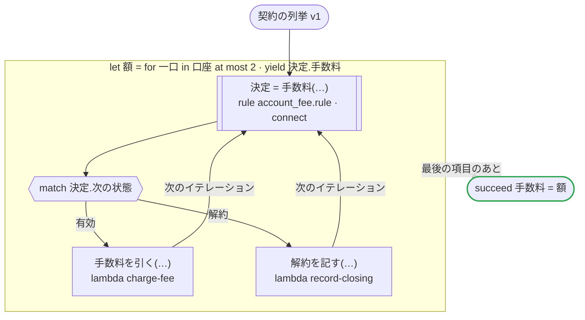

# 契約の列挙 v1

契約の列挙を取り込んだ規則を Connect のサービスとして呼ぶ：口座の手数料の規則は、状態の列挙を契約（account.proto）から取り込む。契約の値には接頭辞が無く、0 番も「有効」という状態なので、サービスは「有効」の結果を JSON から省く。どのプラットフォームも、値の名前を rulec api から読み、省かれた状態を「有効」として読み、送るときは「有効」も名前（ACTIVE）を書いて送る

`tests/flows/connect_rules_contract.flow` を `dandori doc` で描いたものです。入力は `口座: list[口座]`、出力は `手数料: list[money[円]]` です。

## flow

四角はタスク、両脇に線のある四角は規則、斜めの四角は外から値が届くタスク（イベントやコールバックの応答）、六角形は `match`、角の丸い四角は待ち、ステップを囲む枠はループです。破線の矢印は、呼び出しがその場で処理するエラーです。

## 呼び出し

| 行 | 呼び出し | 呼ぶもの | リトライ | タイムアウト | 失敗したとき |
|---:|---|---|---|---|---|
| 29 | `決定 = 手数料(…)` | 規則 `account_fee.rule`（Connect で `https://rules.example.com` に） | 2 回（1 秒後と 2 秒後、failure） | — | `timeout`, `failure` → ワークフローが失敗する |
| 31 | `手数料を引く(…)` | `lambda charge-fee`, `idempotent` | — | — | `timeout`, `failure` → ワークフローが失敗する |
| 32 | `解約を記す(…)` | `lambda record-closing`, `idempotent` | — | — | `timeout`, `failure` → ワークフローが失敗する |

## 終わり方

ワークフローの終わり方のすべてです。

| 行 | 終わり方 |
|---:|---|
| 34 | `succeed 手数料 = 額` |

## 規則

このワークフローが呼ぶ規則を、`rulec doc` が承認する人向けに描いたものです。

<code>手数料</code> · 口座の手数料 v1 · <code>../fixtures/rules/account_fee.rule</code>

<!-- rulec 0.22.0 が account_fee.rule (sha256:bdb2f090c3a1) から生成。これは読み取り専用の資料で、本物は .rule のほうです。編集しても戻せません（§1.6）。 -->
# 規則 口座の手数料 v1

口座の月の手数料と、次の月の状態。状態の列挙は契約（account.proto）から取り込む。契約の値には接頭辞が無く、0 番も「有効」という状態の一つである。書き下ろしの例

## 入力

| 名前 | 型 | 範囲 | 注記 |
|---|---|---|---|
| 状態 | 口座の状態（2 値） |  |  |
| 残高 | money[円] | 0円 〜 1000万円 |  |

## 出力

| 名前 | 型 | 丸め | 注記 |
|---|---|---|---|
| 手数料 | money[円] | down(10円) |  |
| 次の状態 | 口座の状態（2 値） |  |  |

## 型

列挙は**閉じた**有限集合です。値を足すと、それを見ていない表が完全性検査で割れます。

- **口座の状態**（2 値）— 有効、解約
  - この値の集合は `account.proto` の `Status` が持っています。`rulec check` が一致を確かめています（ずれていれば E032、値に行が無ければ E033）。

取り込んだ列挙では、行にも現れず `default` も付いていない値は**エラー**です（E033）。値が増えたのは外の変更で、まだ誰も読んでいないという意味だからです。

## 表 手数料表（policy unique）

| 列 | 出どころ |
|---|---|
| 状態 | 入力 |
| 残高 | 入力 |
| → 手数料 | この規則の出力 |
| → 次の状態 | この規則の出力 |

| # | 状態 | 残高 | → 手数料（money[円] / down(10円)） | → 次の状態（口座の状態） |
|---|---|---|---|---|
| 1 | 有効 | >=10000円 | 0円 | 有効 |
| 2 | 有効 | <10000円 | 110円 | 有効 |
| 3 | 解約 | - | 0円 | 解約 |

**`rulec check` が確かめたこと**

- どの入力の組合せも、いずれかの行に当てはまります（E101 完全性）
- どの入力にも当てはまらない行はありません（E102）
- 二つ以上の行に同時に当てはまる入力はありません（E105 重なり）。行の並べ替えは意味を変えません

## 例（検証済み）

| 状態 | 残高 | → 手数料 | 次の状態 |
|---|---|---|---|
| 有効 | 20000円 | 0円 | 有効 |
| 有効 | 500円 | 110円 | 有効 |
| 解約 | 0円 | 0円 | 解約 |

この 3 件は `rulec check` が参照評価器で実行し、すべて宣言どおりの値になりました（E107）。例は**実行される仕様**です。

