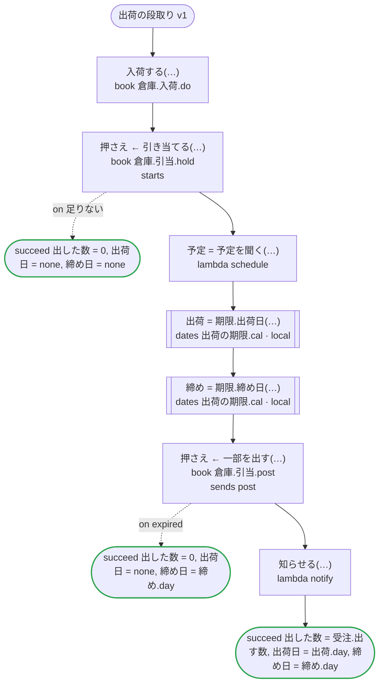
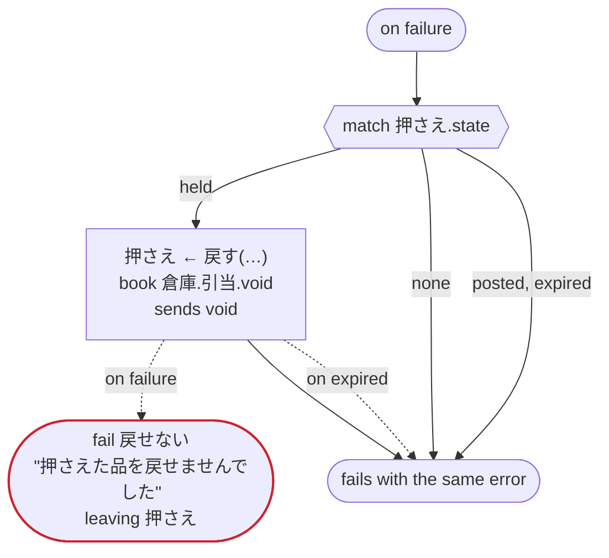

# 出荷の段取り v1

koyomi の日付と chobo の帳簿を試す：入荷をすぐに確定し（do）、注文の数を押さえ（hold）、押さえた分の一部を出荷で確定する（数を渡す post）。日付は一つのファイルの二つ（どちらも時刻が無く、一つは整数の入力も取る）をローカルアクティビティで呼び、起点にはタスクが返した日付と now を渡す。now は文字列の中にも書き、日付をタスクに渡す。どのプラットフォームでも動く

`tests/flows/dates_and_books.flow`, drawn by `dandori doc`. Inputs: `受注: 注文`, `便: string`. Outputs: `出した数: int`, `出荷日: date?`, `締め日: date?`.

## flow

A rectangle is a task, one with a line down each side a rule or a date of a dates file, a slanted one a task whose value comes from outside (an event, or the answer to a callback), a hexagon a `match`, a rounded box a wait, and a box around steps a loop. A dashed arrow is an error the call handles.

## on failure

Runs when a call fails and nothing at the call handles the error: from the calls on lines 59, 60, 62, 63, 64, 65 and 67. When it runs to its end, the workflow fails with that error.

## Calls

| Line | Call | Calls | Retries | Timeout | When it fails | Case after |
|---:|---|---|---|---|---|---|
| 59 | `入荷する(…)` | `book 倉庫.入荷.do` | — | — | `timeout`, `failure` → `on failure` | — |
| 60 | `押さえ ← 引き当てる(…)` | `book 倉庫.引当.hold`, `starts 倉庫.引当` | — | — | `足りない` → line 61 `timeout`, `failure` → `on failure` | `押さえ`: `held` |
| 62 | `予定 = 予定を聞く(…)` | `lambda schedule`, `idempotent` | — | — | `timeout`, `failure` → `on failure` | — |
| 63 | `出荷 = 期限.出荷日(…)` | the date `出荷日` of `出荷の期限.cal`, a local activity on Temporal | 2 times, after 1 second and 2 (failure) | — | `timeout`, `failure` → `on failure` | — |
| 64 | `締め = 期限.締め日(…)` | the date `締め日` of `出荷の期限.cal`, a local activity on Temporal | 2 times, after 1 second and 2 (failure) | — | `timeout`, `failure` → `on failure` | — |
| 65 | `押さえ ← 一部を出す(…)` | `book 倉庫.引当.post`, `sends post` | — | — | `expired` → line 66 `timeout`, `failure` → `on failure` | `押さえ`: `posted` |
| 67 | `知らせる(…)` | `lambda notify`, `idempotent` | — | — | `timeout`, `failure` → `on failure` | — |
| 74 | `押さえ ← 戻す(…)` | `book 倉庫.引当.void`, `sends void` | — | — | `expired` → line 75 `timeout`, `failure` → line 76 | `押さえ`: `voided` |

## Ends

Every way the workflow can end, and what each case can be then, the events on the other side included.

| Line | End | `押さえ` |
|---:|---|---|
| 61 | `succeed 出した数 = 0, 出荷日 = none, 締め日 = none` | not started |
| 66 | `succeed 出した数 = 0, 出荷日 = none, 締め日 = 締め.day` | `expired` |
| 68 | `succeed 出した数 = 受注.出す数, 出荷日 = 出荷.day, 締め日 = 締め.day` | `posted` |
| 76 | `fail 戻せない` "押さえた品を戻せませんでした" `leaving 押さえ` | handed over as it is: `held`, `voided`, `expired` |
| 77 | `on failure` runs to its end, and the workflow fails with the error that started it | not started, or `posted`, `voided`, `expired` |

