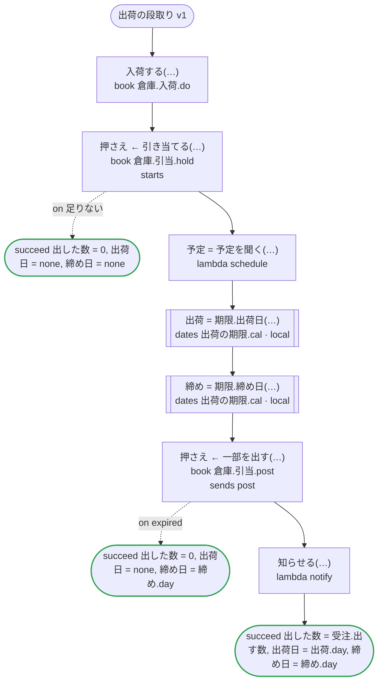
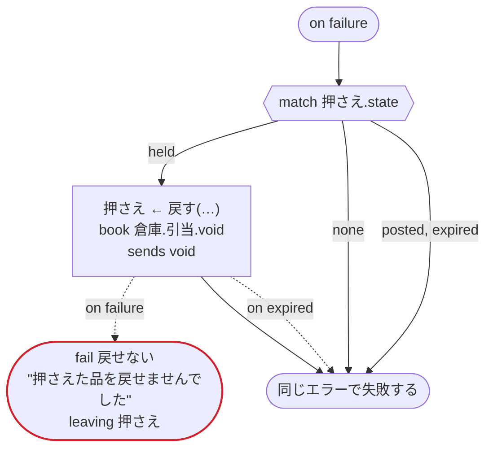

# 出荷の段取り v1

koyomi の日付と chobo の帳簿を試す：入荷をすぐに確定し（do）、注文の数を押さえ（hold）、押さえた分の一部を出荷で確定する（数を渡す post）。日付は一つのファイルの二つ（どちらも時刻が無く、一つは整数の入力も取る）をローカルアクティビティで呼び、起点にはタスクが返した日付と now を渡す。now は文字列の中にも書き、日付をタスクに渡す。どのプラットフォームでも動く

`tests/flows/dates_and_books.flow` を `dandori doc` で描いたものです。入力は `受注: 注文`, `便: string`、出力は `出した数: int`, `出荷日: date?`, `締め日: date?` です。

## flow

四角はタスク、両脇に線のある四角は規則か日付のファイルの日付、斜めの四角は外から値が届くタスク（イベントやコールバックの応答）、六角形は `match`、角の丸い四角は待ち、ステップを囲む枠はループです。破線の矢印は、呼び出しがその場で処理するエラーです。

## on failure

呼び出しが失敗し、そのエラーをその場で処理しないときに走ります（59・60・62・63・64・65・67 行目の呼び出しから）。最後まで走ると、ワークフローはそのエラーで失敗します。

## 呼び出し

| 行 | 呼び出し | 呼ぶもの | リトライ | タイムアウト | 失敗したとき | 呼び出しのあとの案件 |
|---:|---|---|---|---|---|---|
| 59 | `入荷する(…)` | `book 倉庫.入荷.do` | — | — | `timeout`, `failure` → `on failure` | — |
| 60 | `押さえ ← 引き当てる(…)` | `book 倉庫.引当.hold`, `starts 倉庫.引当` | — | — | `足りない` → 61 行目 `timeout`, `failure` → `on failure` | `押さえ`: `held` |
| 62 | `予定 = 予定を聞く(…)` | `lambda schedule`, `idempotent` | — | — | `timeout`, `failure` → `on failure` | — |
| 63 | `出荷 = 期限.出荷日(…)` | `出荷の期限.cal` の日付 `出荷日`（Temporal ではローカルアクティビティ） | 2 回（1 秒後と 2 秒後、failure） | — | `timeout`, `failure` → `on failure` | — |
| 64 | `締め = 期限.締め日(…)` | `出荷の期限.cal` の日付 `締め日`（Temporal ではローカルアクティビティ） | 2 回（1 秒後と 2 秒後、failure） | — | `timeout`, `failure` → `on failure` | — |
| 65 | `押さえ ← 一部を出す(…)` | `book 倉庫.引当.post`, `sends post` | — | — | `expired` → 66 行目 `timeout`, `failure` → `on failure` | `押さえ`: `posted` |
| 67 | `知らせる(…)` | `lambda notify`, `idempotent` | — | — | `timeout`, `failure` → `on failure` | — |
| 74 | `押さえ ← 戻す(…)` | `book 倉庫.引当.void`, `sends void` | — | — | `expired` → 75 行目 `timeout`, `failure` → 76 行目 | `押さえ`: `voided` |

## 終わり方

ワークフローの終わり方のすべてと、そのとき各案件がとりうる状態です。外部のサービスで起きるイベントも含めています。

| 行 | 終わり方 | `押さえ` |
|---:|---|---|
| 61 | `succeed 出した数 = 0, 出荷日 = none, 締め日 = none` | 始まっていない |
| 66 | `succeed 出した数 = 0, 出荷日 = none, 締め日 = 締め.day` | `expired` |
| 68 | `succeed 出した数 = 受注.出す数, 出荷日 = 出荷.day, 締め日 = 締め.day` | `posted` |
| 76 | `fail 戻せない` "押さえた品を戻せませんでした" `leaving 押さえ` | そのまま引き渡す: `held`, `voided`, `expired` |
| 77 | `on failure` が最後まで走り、ワークフローは始まりのエラーで失敗する | 始まっていないか、`posted`, `voided`, `expired` |

