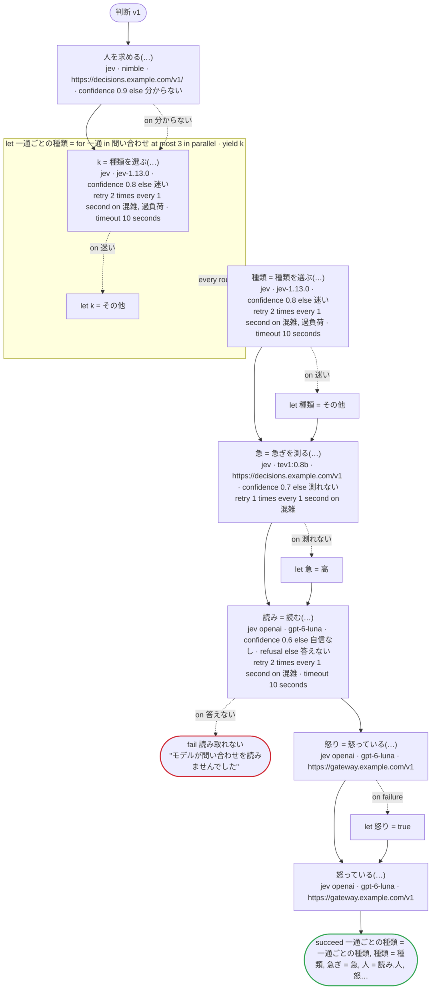
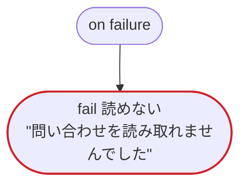

# 判断 v1

判断のタスクを三つの送り先で：TypeSafe の Jev、System One の API のサーバー（`url`。Ollama など）、OpenAI の Decisions API（`jev openai`）とそのほかのサーバー（`url`）。一部の値にだけ意味を書いた choice、score、意味を書いたはいかいいえと書かないもの、一回のリクエストで三つに答え、そのうち一つの確信度を率で受け取るレコード、確信度の下限、宣言した拒否と宣言しない拒否（どちらも、呼び出しで処理するものとしないもの）、結果を読まない呼び出し、ステータスで宣言したエラーのリトライ、W032 の二つの形（System One の API のサーバーのタグの無いモデルと、モデルのバージョンを固定する名前の無い Decisions API）

`tests/flows/decisions.ja.flow`, drawn by `dandori doc`. Inputs: `問い合わせ: list[string]`, `本文: string`, `会員: bool`. Outputs: `一通ごとの種類: list[種類]`, `種類: 種類`, `急ぎ: 急ぎ`, `人: bool`, `怒り: bool`, `確かさ: rate[step 0.01%]`.

## flow



A rectangle is a task, one with a line down each side a rule, a slanted one a task whose value comes from outside (an event, or the answer to a callback), a hexagon a `match`, a rounded box a wait, and a box around steps a loop. A dashed arrow is an error the call handles.

## on failure

Runs when a call fails and nothing at the call handles the error: from the calls on lines 92, 95, 98, 100, 102 and 107. When it runs to its end, the workflow fails with that error.



## Calls

| Line | Call | Calls | Retries | Timeout | When it fails |
|---:|---|---|---|---|---|
| 92 | `人を求める(…)` | `jev · nimble · https://decisions.example.com/v1/ · confidence 0.9 else 分からない` | — | — | `分からない` → line 93<br>`timeout`, `failure` → `on failure` |
| 95 | `k = 種類を選ぶ(…)` | `jev · jev-1.13.0 · confidence 0.8 else 迷い` | 2 times every 1 second (混雑, 過負荷) | 10 seconds | `混雑`, `過負荷` → the round fails, then `on failure`<br>`迷い` → line 96<br>`timeout`, `failure` → the round fails, then `on failure` |
| 98 | `種類 = 種類を選ぶ(…)` | `jev · jev-1.13.0 · confidence 0.8 else 迷い` | 2 times every 1 second (混雑, 過負荷) | 10 seconds | `混雑`, `過負荷` → `on failure`<br>`迷い` → line 99<br>`timeout`, `failure` → `on failure` |
| 100 | `急 = 急ぎを測る(…)` | `jev · tev1:0.8b · https://decisions.example.com/v1 · confidence 0.7 else 測れない` | 1 time every 1 second (混雑) | — | `混雑` → `on failure`<br>`測れない` → line 101<br>`timeout`, `failure` → `on failure` |
| 102 | `読み = 読む(…)` | `jev openai · gpt-6-luna · confidence 0.6 else 自信なし · refusal else 答えない` | 2 times every 1 second (混雑) | 10 seconds | `混雑`, `自信なし` → `on failure`<br>`答えない` → line 103<br>`timeout`, `failure` → `on failure` |
| 104 | `怒り = 怒っている(…)` | `jev openai · gpt-6-luna · https://gateway.example.com/v1` | — | — | `Dandori.Refused`, `timeout`, `failure` → line 105 |
| 107 | `怒っている(…)` | `jev openai · gpt-6-luna · https://gateway.example.com/v1` | — | — | `Dandori.Refused`, `timeout`, `failure` → `on failure` |

## Ends

Every way the workflow can end.

| Line | End |
|---:|---|
| 103 | `fail 読み取れない` "モデルが問い合わせを読みませんでした" |
| 108 | `succeed 一通ごとの種類 = 一通ごとの種類, 種類 = 種類, 急ぎ = 急, 人 = 読み.人, 怒り = 怒り, 確かさ = 読み.確かさ` |
| 111 | `fail 読めない` "問い合わせを読み取れませんでした" |

## What check says

What `dandori check` says of this workflow, each with the run that gets there.

```text
warning[W032]: tests/flows/decisions.ja.flow:56:3: `nimble` has no tag, so it moves to a newer model when the server pulls the model again, with no change here (as Ollama names models, it is `:latest`); how sure one model is means something else to the next, so name the model the confidence is set for with its tag, as `model "tev1:0.8b"`
    56 |   model "nimble"
warning[W032]: tests/flows/decisions.ja.flow:74:3: OpenAI's Decisions API names no version of its model (`gpt-6-luna`), so how sure an answer is may come to mean something else when the model changes, with no change here; check the floor of how sure, and the fields that take it, against real answers from time to time
    74 |   model "gpt-6-luna"
```
