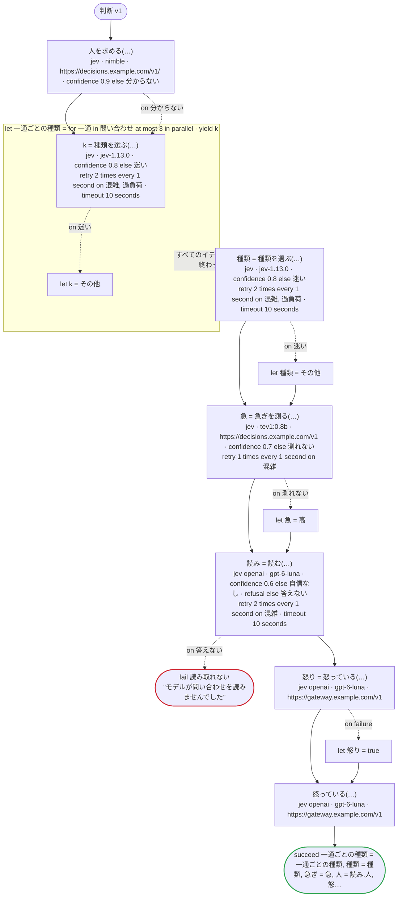
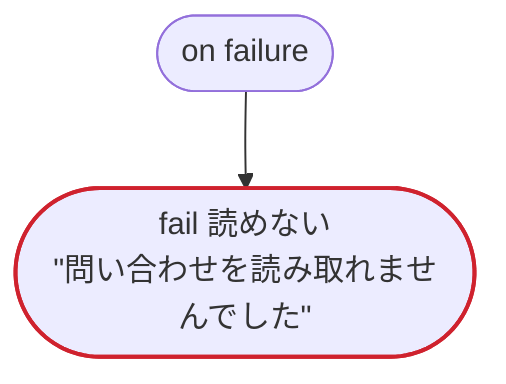

# 判断 v1

判断のタスクを三つの送り先で：TypeSafe の Jev、System One の API のサーバー（`url`。Ollama など）、OpenAI の Decisions API（`jev openai`）とそのほかのサーバー（`url`）。一部の値にだけ意味を書いた choice、score、意味を書いたはいかいいえと書かないもの、一回のリクエストで三つに答え、そのうち一つの確信度を率で受け取るレコード、確信度の下限、宣言した拒否と宣言しない拒否（どちらも、呼び出しで処理するものとしないもの）、結果を読まない呼び出し、ステータスで宣言したエラーのリトライ、W032 の二つの形（System One の API のサーバーのタグの無いモデルと、モデルのバージョンを固定する名前の無い Decisions API）

`tests/flows/decisions.ja.flow` を `dandori doc` で描いたものです。入力は `問い合わせ: list[string]`・`本文: string`・`会員: bool`、出力は `一通ごとの種類: list[種類]`・`種類: 種類`・`急ぎ: 急ぎ`・`人: bool`・`怒り: bool`・`確かさ: rate[step 0.01%]` です。

## flow



四角はタスク、両脇に線のある四角は規則、斜めの四角は外から値が届くタスク（イベントやコールバックの応答）、六角形は `match`、角の丸い四角は待ち、ステップを囲む枠はループです。破線の矢印は、呼び出しがその場で処理するエラーです。

## on failure

呼び出しが失敗し、そのエラーをその場で処理しないときに走ります（92・95・98・100・102・107 行目の呼び出しから）。最後まで走ると、ワークフローはそのエラーで失敗します。



## 呼び出し

| 行 | 呼び出し | 呼ぶもの | リトライ | タイムアウト | 失敗したとき |
|---:|---|---|---|---|---|
| 92 | `人を求める(…)` | `jev · nimble · https://decisions.example.com/v1/ · confidence 0.9 else 分からない` | — | — | `分からない` → 93 行目<br>`timeout`・`failure` → `on failure` |
| 95 | `k = 種類を選ぶ(…)` | `jev · jev-1.13.0 · confidence 0.8 else 迷い` | 1 秒おきに 2 回（混雑・過負荷） | 10 秒 | `混雑`・`過負荷` → そのイテレーションが失敗し、`on failure` へ<br>`迷い` → 96 行目<br>`timeout`・`failure` → そのイテレーションが失敗し、`on failure` へ |
| 98 | `種類 = 種類を選ぶ(…)` | `jev · jev-1.13.0 · confidence 0.8 else 迷い` | 1 秒おきに 2 回（混雑・過負荷） | 10 秒 | `混雑`・`過負荷` → `on failure`<br>`迷い` → 99 行目<br>`timeout`・`failure` → `on failure` |
| 100 | `急 = 急ぎを測る(…)` | `jev · tev1:0.8b · https://decisions.example.com/v1 · confidence 0.7 else 測れない` | 1 秒おきに 1 回（混雑） | — | `混雑` → `on failure`<br>`測れない` → 101 行目<br>`timeout`・`failure` → `on failure` |
| 102 | `読み = 読む(…)` | `jev openai · gpt-6-luna · confidence 0.6 else 自信なし · refusal else 答えない` | 1 秒おきに 2 回（混雑） | 10 秒 | `混雑`・`自信なし` → `on failure`<br>`答えない` → 103 行目<br>`timeout`・`failure` → `on failure` |
| 104 | `怒り = 怒っている(…)` | `jev openai · gpt-6-luna · https://gateway.example.com/v1` | — | — | `Dandori.Refused`・`timeout`・`failure` → 105 行目 |
| 107 | `怒っている(…)` | `jev openai · gpt-6-luna · https://gateway.example.com/v1` | — | — | `Dandori.Refused`・`timeout`・`failure` → `on failure` |

## 終わり方

ワークフローの終わり方のすべてです。

| 行 | 終わり方 |
|---:|---|
| 103 | `fail 読み取れない` "モデルが問い合わせを読みませんでした" |
| 108 | `succeed 一通ごとの種類 = 一通ごとの種類, 種類 = 種類, 急ぎ = 急, 人 = 読み.人, 怒り = 怒り, 確かさ = 読み.確かさ` |
| 111 | `fail 読めない` "問い合わせを読み取れませんでした" |

## 検査の結果

`dandori check` の結果です。それぞれにそうなる例が付いています。

```text
警告[W032]: tests/flows/decisions.ja.flow:56:3: `nimble` にはタグが無いので、サーバーがモデルを取り直すと、ここを変えなくても新しいモデルに移ります（Ollama の名前の付け方では `:latest` と同じです）。確信度の意味はモデルごとに違うので、確信度を合わせたモデルを `model "tev1:0.8b"` のようにタグまで書いてください
    56 |   model "nimble"
警告[W032]: tests/flows/decisions.ja.flow:74:3: OpenAI の Decisions API には、モデルのバージョンを固定する名前がありません（`gpt-6-luna`）。モデルが替わると、ここを変えなくても確信度の意味が変わることがあるので、確信度の下限と確信度を受け取るフィールドを、ときどき実際の答えで確かめ直してください
    74 |   model "gpt-6-luna"
```
