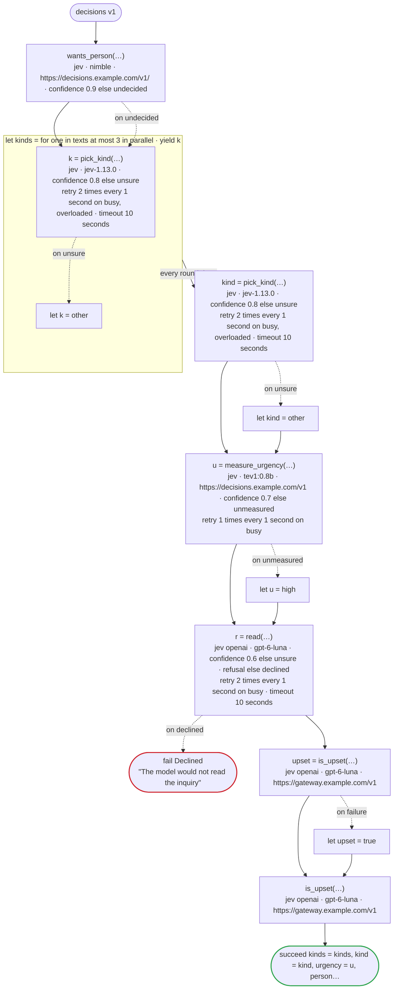
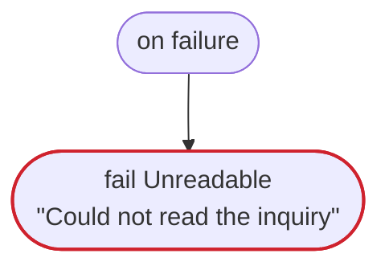

# decisions v1

The decision tasks on their servers: TypeSafe's Jev; a server of the System One API (`url`), such as Ollama; OpenAI's Decisions API (`jev openai`), and another server of it (`url`). A choice with a meaning for some of its values only, a score, yes or no with meanings and without, a record of three answers and how sure of one as a rate, floors of how sure, a refusal declared and one not, each handled at the call and not, a call whose answer is not read, an error by its status retried, and the two forms of W032: a model without a tag on the server of the System One API, and the Decisions API, which names no version of its model

`tests/flows/decisions.flow`, drawn by `dandori doc`. Inputs: `texts: list[string]`, `text: string`, `member: bool`. Outputs: `kinds: list[kind]`, `kind: kind`, `urgency: urgency`, `person: bool`, `upset: bool`, `sure: rate[step 0.01%]`.

## flow



A rectangle is a task, one with a line down each side a rule, a slanted one a task whose value comes from outside (an event, or the answer to a callback), a hexagon a `match`, a rounded box a wait, and a box around steps a loop. A dashed arrow is an error the call handles.

## on failure

Runs when a call fails and nothing at the call handles the error: from the calls on lines 92, 95, 98, 100, 102 and 107. When it runs to its end, the workflow fails with that error.



## Calls

| Line | Call | Calls | Retries | Timeout | When it fails |
|---:|---|---|---|---|---|
| 92 | `wants_person(…)` | `jev · nimble · https://decisions.example.com/v1/ · confidence 0.9 else undecided` | — | — | `undecided` → line 93<br>`timeout`, `failure` → `on failure` |
| 95 | `k = pick_kind(…)` | `jev · jev-1.13.0 · confidence 0.8 else unsure` | 2 times every 1 second (busy, overloaded) | 10 seconds | `busy`, `overloaded` → the round fails, then `on failure`<br>`unsure` → line 96<br>`timeout`, `failure` → the round fails, then `on failure` |
| 98 | `kind = pick_kind(…)` | `jev · jev-1.13.0 · confidence 0.8 else unsure` | 2 times every 1 second (busy, overloaded) | 10 seconds | `busy`, `overloaded` → `on failure`<br>`unsure` → line 99<br>`timeout`, `failure` → `on failure` |
| 100 | `u = measure_urgency(…)` | `jev · tev1:0.8b · https://decisions.example.com/v1 · confidence 0.7 else unmeasured` | 1 time every 1 second (busy) | — | `busy` → `on failure`<br>`unmeasured` → line 101<br>`timeout`, `failure` → `on failure` |
| 102 | `r = read(…)` | `jev openai · gpt-6-luna · confidence 0.6 else unsure · refusal else declined` | 2 times every 1 second (busy) | 10 seconds | `busy`, `unsure` → `on failure`<br>`declined` → line 103<br>`timeout`, `failure` → `on failure` |
| 104 | `upset = is_upset(…)` | `jev openai · gpt-6-luna · https://gateway.example.com/v1` | — | — | `Dandori.Refused`, `timeout`, `failure` → line 105 |
| 107 | `is_upset(…)` | `jev openai · gpt-6-luna · https://gateway.example.com/v1` | — | — | `Dandori.Refused`, `timeout`, `failure` → `on failure` |

## Ends

Every way the workflow can end.

| Line | End |
|---:|---|
| 103 | `fail Declined` "The model would not read the inquiry" |
| 108 | `succeed kinds = kinds, kind = kind, urgency = u, person = r.person, upset = upset, sure = r.sure` |
| 111 | `fail Unreadable` "Could not read the inquiry" |

## What check says

What `dandori check` says of this workflow, each with the run that gets there.

```text
warning[W032]: tests/flows/decisions.flow:56:3: `nimble` has no tag, so it moves to a newer model when the server pulls the model again, with no change here (as Ollama names models, it is `:latest`); how sure one model is means something else to the next, so name the model the confidence is set for with its tag, as `model "tev1:0.8b"`
    56 |   model "nimble"
warning[W032]: tests/flows/decisions.flow:74:3: OpenAI's Decisions API names no version of its model (`gpt-6-luna`), so how sure an answer is may come to mean something else when the model changes, with no change here; check the floor of how sure, and the fields that take it, against real answers from time to time
    74 |   model "gpt-6-luna"
```
