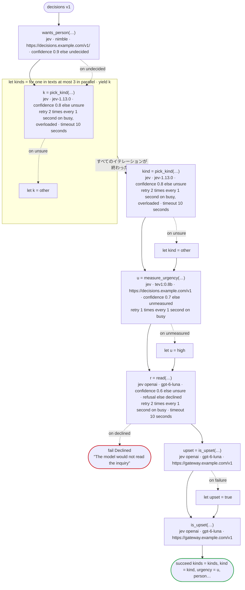
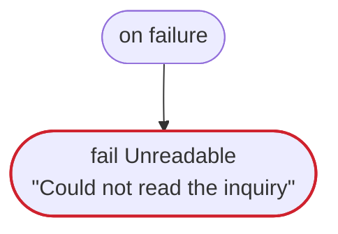

# decisions v1

The decision tasks on their servers: TypeSafe's Jev; a server of the System One API (`url`), such as Ollama; OpenAI's Decisions API (`jev openai`), and another server of it (`url`). A choice with a meaning for some of its values only, a score, yes or no with meanings and without, a record of three answers and how sure of one as a rate, floors of how sure, a refusal declared and one not, each handled at the call and not, a call whose answer is not read, an error by its status retried, and the two forms of W032: a model without a tag on the server of the System One API, and the Decisions API, which names no version of its model

`tests/flows/decisions.flow` を `dandori doc` で描いたものです。入力は `texts: list[string]`・`text: string`・`member: bool`、出力は `kinds: list[kind]`・`kind: kind`・`urgency: urgency`・`person: bool`・`upset: bool`・`sure: rate[step 0.01%]` です。

## flow



四角はタスク、両脇に線のある四角は規則、斜めの四角は外から値が届くタスク（イベントやコールバックの応答）、六角形は `match`、角の丸い四角は待ち、ステップを囲む枠はループです。破線の矢印は、呼び出しがその場で処理するエラーです。

## on failure

呼び出しが失敗し、そのエラーをその場で処理しないときに走ります（92・95・98・100・102・107 行目の呼び出しから）。最後まで走ると、ワークフローはそのエラーで失敗します。



## 呼び出し

| 行 | 呼び出し | 呼ぶもの | リトライ | タイムアウト | 失敗したとき |
|---:|---|---|---|---|---|
| 92 | `wants_person(…)` | `jev · nimble · https://decisions.example.com/v1/ · confidence 0.9 else undecided` | — | — | `undecided` → 93 行目<br>`timeout`・`failure` → `on failure` |
| 95 | `k = pick_kind(…)` | `jev · jev-1.13.0 · confidence 0.8 else unsure` | 1 秒おきに 2 回（busy・overloaded） | 10 秒 | `busy`・`overloaded` → そのイテレーションが失敗し、`on failure` へ<br>`unsure` → 96 行目<br>`timeout`・`failure` → そのイテレーションが失敗し、`on failure` へ |
| 98 | `kind = pick_kind(…)` | `jev · jev-1.13.0 · confidence 0.8 else unsure` | 1 秒おきに 2 回（busy・overloaded） | 10 秒 | `busy`・`overloaded` → `on failure`<br>`unsure` → 99 行目<br>`timeout`・`failure` → `on failure` |
| 100 | `u = measure_urgency(…)` | `jev · tev1:0.8b · https://decisions.example.com/v1 · confidence 0.7 else unmeasured` | 1 秒おきに 1 回（busy） | — | `busy` → `on failure`<br>`unmeasured` → 101 行目<br>`timeout`・`failure` → `on failure` |
| 102 | `r = read(…)` | `jev openai · gpt-6-luna · confidence 0.6 else unsure · refusal else declined` | 1 秒おきに 2 回（busy） | 10 秒 | `busy`・`unsure` → `on failure`<br>`declined` → 103 行目<br>`timeout`・`failure` → `on failure` |
| 104 | `upset = is_upset(…)` | `jev openai · gpt-6-luna · https://gateway.example.com/v1` | — | — | `Dandori.Refused`・`timeout`・`failure` → 105 行目 |
| 107 | `is_upset(…)` | `jev openai · gpt-6-luna · https://gateway.example.com/v1` | — | — | `Dandori.Refused`・`timeout`・`failure` → `on failure` |

## 終わり方

ワークフローの終わり方のすべてです。

| 行 | 終わり方 |
|---:|---|
| 103 | `fail Declined` "The model would not read the inquiry" |
| 108 | `succeed kinds = kinds, kind = kind, urgency = u, person = r.person, upset = upset, sure = r.sure` |
| 111 | `fail Unreadable` "Could not read the inquiry" |

## 検査の結果

`dandori check` の結果です。それぞれにそうなる例が付いています。

```text
警告[W032]: tests/flows/decisions.flow:56:3: `nimble` にはタグが無いので、サーバーがモデルを取り直すと、ここを変えなくても新しいモデルに移ります（Ollama の名前の付け方では `:latest` と同じです）。確信度の意味はモデルごとに違うので、確信度を合わせたモデルを `model "tev1:0.8b"` のようにタグまで書いてください
    56 |   model "nimble"
警告[W032]: tests/flows/decisions.flow:74:3: OpenAI の Decisions API には、モデルのバージョンを固定する名前がありません（`gpt-6-luna`）。モデルが替わると、ここを変えなくても確信度の意味が変わることがあるので、確信度の下限と確信度を受け取るフィールドを、ときどき実際の答えで確かめ直してください
    74 |   model "gpt-6-luna"
```
