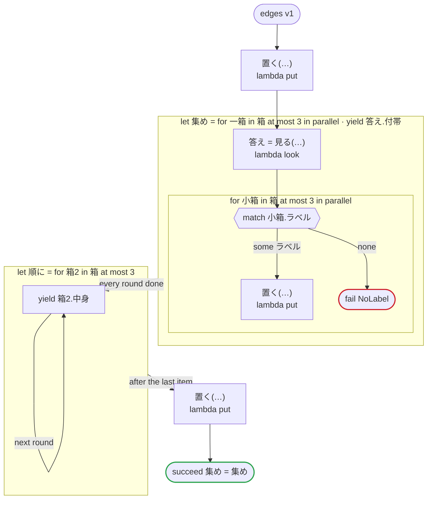

# edges v1

言語のエッジケース：配列の json をリストに入れる、yield した json を集める、並列の中の並列、理由の無い fail

`tests/flows/edges.flow`, drawn by `dandori doc`. Inputs: `箱: list[箱]`, `一つ: json`. Outputs: `集め: list[json]`.

## flow

A rectangle is a task, one with a line down each side a rule, a slanted one a task whose value comes from outside (an event, or the answer to a callback), a hexagon a `match`, a rounded box a wait, and a box around steps a loop. A dashed arrow is an error the call handles.

## Calls

| Line | Call | Calls | Retries | Timeout | When it fails |
|---:|---|---|---|---|---|
| 28 | `置く(…)` | `lambda put`, `idempotent` | — | — | `timeout`, `failure` → the workflow fails |
| 30 | `答え = 見る(…)` | `lambda look`, `idempotent` | — | — | `timeout`, `failure` → the round fails, and then the workflow |
| 33 | `置く(…)` | `lambda put`, `idempotent` | — | — | `timeout`, `failure` → the round fails, and then the workflow |
| 38 | `置く(…)` | `lambda put`, `idempotent` | — | — | `timeout`, `failure` → the workflow fails |

## Ends

Every way the workflow can end.

| Line | End |
|---:|---|
| 34 | `fail NoLabel` |
| 39 | `succeed 集め = 集め` |

