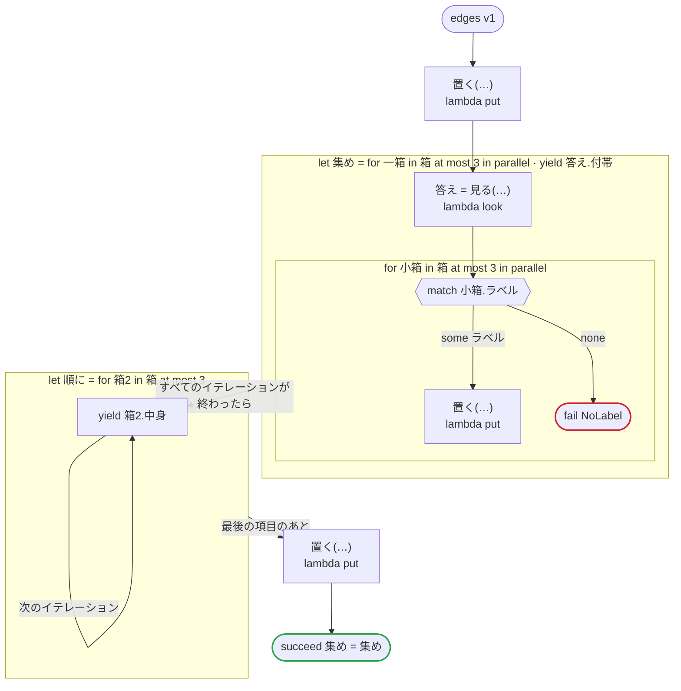

# edges v1

言語のエッジケース：配列の json をリストに入れる、yield した json を集める、並列の中の並列、理由の無い fail

`tests/flows/edges.flow` を `dandori doc` で描いたものです。入力は `箱: list[箱]`, `一つ: json`、出力は `集め: list[json]` です。

## flow

四角はタスク、両脇に線のある四角は規則、斜めの四角は外から値が届くタスク（イベントやコールバックの応答）、六角形は `match`、角の丸い四角は待ち、ステップを囲む枠はループです。破線の矢印は、呼び出しがその場で処理するエラーです。

## 呼び出し

| 行 | 呼び出し | 呼ぶもの | リトライ | タイムアウト | 失敗したとき |
|---:|---|---|---|---|---|
| 28 | `置く(…)` | `lambda put`, `idempotent` | — | — | `timeout`, `failure` → ワークフローが失敗する |
| 30 | `答え = 見る(…)` | `lambda look`, `idempotent` | — | — | `timeout`, `failure` → そのイテレーションが失敗し、ワークフローも失敗する |
| 33 | `置く(…)` | `lambda put`, `idempotent` | — | — | `timeout`, `failure` → そのイテレーションが失敗し、ワークフローも失敗する |
| 38 | `置く(…)` | `lambda put`, `idempotent` | — | — | `timeout`, `failure` → ワークフローが失敗する |

## 終わり方

ワークフローの終わり方のすべてです。

| 行 | 終わり方 |
|---:|---|
| 34 | `fail NoLabel` |
| 39 | `succeed 集め = 集め` |

