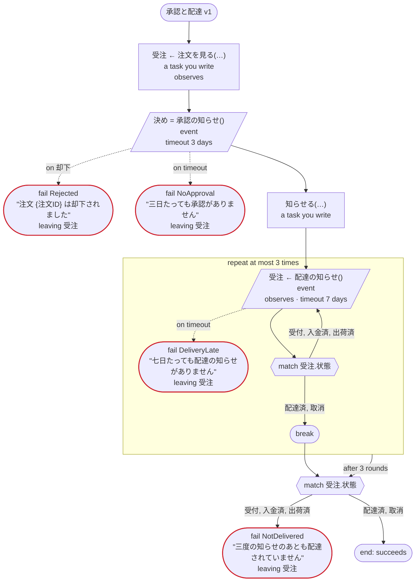

# 承認と配達 v1

出来事を待つ（Temporal）：注文の承認と配達の知らせを、ワークフローの ID と名前で送られてくる出来事として待つ。断りの出来事、期限切れ、ループの回ごとに待つ出来事、案件の状態を知らせる出来事も通る。ほかの出力先では E050

`tests/flows/events.flow`, drawn by `dandori doc`. Inputs: `注文ID: string`.

## flow

A rectangle is a task, one with a line down each side a rule, a slanted one a task whose value comes from outside (an event, or the answer to a callback), a hexagon a `match`, a rounded box a wait, and a box around steps a loop. A dashed arrow is an error the call handles.

## on failure

Runs when a call fails and nothing at the call handles the error: from the calls on lines 43, 44, 47 and 49. When it runs to its end, the workflow fails with that error.

## Calls

| Line | Call | Calls | Retries | Timeout | When it fails | Case after |
|---:|---|---|---|---|---|---|
| 43 | `受注 ← 注文を見る(…)` | a task you write, `observes`, `idempotent` | — | — | `timeout`, `failure` → `on failure` | `受注`: `受付`, `入金済`, `出荷済`, `配達済`, `取消` |
| 44 | `決め = 承認の知らせ()` | `event` | — | 3 days | `却下` → line 45 `timeout` → line 46 `failure` → `on failure` | — |
| 47 | `知らせる(…)` | a task you write, `key` | — | — | `timeout`, `failure` → `on failure` | — |
| 49 | `受注 ← 配達の知らせ()` | `event`, `observes` | — | 7 days | `timeout` → line 50 `failure` → `on failure` | `受注`: `受付`, `入金済`, `出荷済`, `配達済`, `取消` |

## Ends

Every way the workflow can end, and what each case can be then, the events on the other side included.

| Line | End | `受注` |
|---:|---|---|
| 45 | `fail Rejected` "注文 {注文ID} は却下されました" `leaving 受注` | handed over as it is: `受付`, `入金済`, `出荷済`, `配達済`, `取消` |
| 46 | `fail NoApproval` "三日たっても承認がありません" `leaving 受注` | handed over as it is: `受付`, `入金済`, `出荷済`, `配達済`, `取消` |
| 50 | `fail DeliveryLate` "七日たっても配達の知らせがありません" `leaving 受注` | handed over as it is: `受付`, `入金済`, `出荷済`, `配達済`, `取消` |
| 56 | `fail NotDelivered` "三度の知らせのあとも配達されていません" `leaving 受注` | handed over as it is: `受付`, `入金済`, `出荷済`, `配達済`, `取消` |
| 56 | the flow runs to its end, and the workflow succeeds | `配達済`, `取消` |
| 59 | `fail Stopped` "途中で止まりました" `leaving 受注` | handed over as it is: not started, or `受付`, `入金済`, `出荷済`, `配達済`, `取消` |

