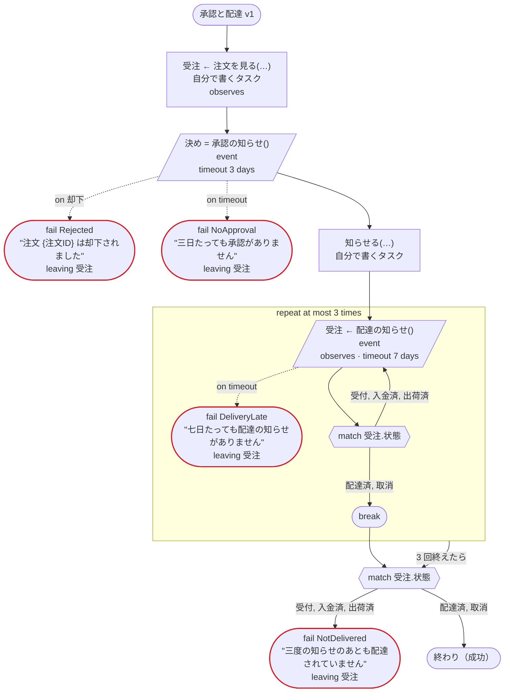
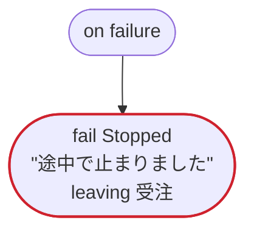

# 承認と配達 v1

イベントを待つ（Temporal）：注文の承認と配達の知らせを、ワークフローの ID と名前で送られてくるイベントとして待つ。拒否のイベント、タイムアウト、ループのイテレーションごとに待つイベント、案件の状態を知らせるイベントも通る。ほかのプラットフォームでは E050

`tests/flows/events.flow` を `dandori doc` で描いたものです。入力は `注文ID: string` です。

## flow

四角はタスク、両脇に線のある四角は規則、斜めの四角は外から値が届くタスク（イベントやコールバックの応答）、六角形は `match`、角の丸い四角は待ち、ステップを囲む枠はループです。破線の矢印は、呼び出しがその場で処理するエラーです。

## on failure

呼び出しが失敗し、そのエラーをその場で処理しないときに走ります（43・44・47・49 行目の呼び出しから）。最後まで走ると、ワークフローはそのエラーで失敗します。

## 呼び出し

| 行 | 呼び出し | 呼ぶもの | リトライ | タイムアウト | 失敗したとき | 呼び出しのあとの案件 |
|---:|---|---|---|---|---|---|
| 43 | `受注 ← 注文を見る(…)` | 自分で書くタスク, `observes`, `idempotent` | — | — | `timeout`, `failure` → `on failure` | `受注`: `受付`, `入金済`, `出荷済`, `配達済`, `取消` |
| 44 | `決め = 承認の知らせ()` | `event` | — | 3 日 | `却下` → 45 行目 `timeout` → 46 行目 `failure` → `on failure` | — |
| 47 | `知らせる(…)` | 自分で書くタスク, `key` | — | — | `timeout`, `failure` → `on failure` | — |
| 49 | `受注 ← 配達の知らせ()` | `event`, `observes` | — | 7 日 | `timeout` → 50 行目 `failure` → `on failure` | `受注`: `受付`, `入金済`, `出荷済`, `配達済`, `取消` |

## 終わり方

ワークフローの終わり方のすべてと、そのとき各案件がとりうる状態です。外部のサービスで起きるイベントも含めています。

| 行 | 終わり方 | `受注` |
|---:|---|---|
| 45 | `fail Rejected` "注文 {注文ID} は却下されました" `leaving 受注` | そのまま引き渡す: `受付`, `入金済`, `出荷済`, `配達済`, `取消` |
| 46 | `fail NoApproval` "三日たっても承認がありません" `leaving 受注` | そのまま引き渡す: `受付`, `入金済`, `出荷済`, `配達済`, `取消` |
| 50 | `fail DeliveryLate` "七日たっても配達の知らせがありません" `leaving 受注` | そのまま引き渡す: `受付`, `入金済`, `出荷済`, `配達済`, `取消` |
| 56 | `fail NotDelivered` "三度の知らせのあとも配達されていません" `leaving 受注` | そのまま引き渡す: `受付`, `入金済`, `出荷済`, `配達済`, `取消` |
| 56 | flow が最後まで走り、ワークフローは成功する | `配達済`, `取消` |
| 59 | `fail Stopped` "途中で止まりました" `leaving 受注` | そのまま引き渡す: 始まっていないか、`受付`, `入金済`, `出荷済`, `配達済`, `取消` |

