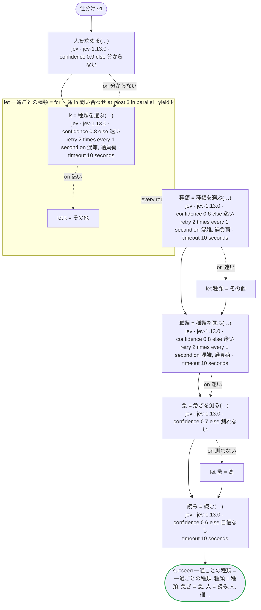
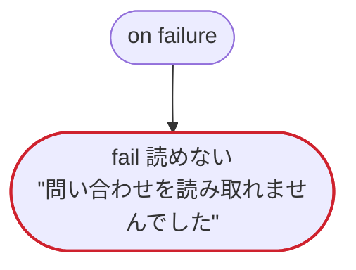

# 仕分け v1

Jev のエッジケース：一部の値にだけ意味を書いた choice、score、はいといいえの意味を書いた noul、一回のリクエストで四つに答えるレコード（choice・score・noul と、確信度の割合）、確信度が下限を切ったときのエラーを処理する呼び出しと、処理せずに on failure へ行く呼び出し、下限を切った答えのあとも前の値が残る変数、並列のイテレーションの中の Jev、結果を読まない呼び出し、ステータスで宣言したエラーのリトライ

`tests/flows/jev.flow`, drawn by `dandori doc`. Inputs: `問い合わせ: list[string]`, `本文: string`, `会員: bool`. Outputs: `一通ごとの種類: list[種類]`, `種類: 種類`, `急ぎ: 急ぎ`, `人: bool`, `確かさ: rate[step 0.01%]`.

## flow

A rectangle is a task, one with a line down each side a rule, a slanted one a task whose value comes from outside (an event, or the answer to a callback), a hexagon a `match`, a rounded box a wait, and a box around steps a loop. A dashed arrow is an error the call handles.

## on failure

Runs when a call fails and nothing at the call handles the error: from the calls on lines 73, 76, 79, 82, 84 and 86. When it runs to its end, the workflow fails with that error.

## Calls

| Line | Call | Calls | Retries | Timeout | When it fails |
|---:|---|---|---|---|---|
| 73 | `人を求める(…)` | `jev · jev-1.13.0 · confidence 0.9 else 分からない` | — | — | `分からない` → line 74 `timeout`, `failure` → `on failure` |
| 76 | `k = 種類を選ぶ(…)` | `jev · jev-1.13.0 · confidence 0.8 else 迷い` | 2 times every 1 second (混雑, 過負荷) | 10 seconds | `混雑`, `過負荷` → the round fails, then `on failure` `迷い` → line 77 `timeout`, `failure` → the round fails, then `on failure` |
| 79 | `種類 = 種類を選ぶ(…)` | `jev · jev-1.13.0 · confidence 0.8 else 迷い` | 2 times every 1 second (混雑, 過負荷) | 10 seconds | `混雑`, `過負荷` → `on failure` `迷い` → line 80 `timeout`, `failure` → `on failure` |
| 82 | `種類 = 種類を選ぶ(…)` | `jev · jev-1.13.0 · confidence 0.8 else 迷い` | 2 times every 1 second (混雑, 過負荷) | 10 seconds | `混雑`, `過負荷` → `on failure` `迷い` → line 83 `timeout`, `failure` → `on failure` |
| 84 | `急 = 急ぎを測る(…)` | `jev · jev-1.13.0 · confidence 0.7 else 測れない` | — | — | `測れない` → line 85 `timeout`, `failure` → `on failure` |
| 86 | `読み = 読む(…)` | `jev · jev-1.13.0 · confidence 0.6 else 自信なし` | — | 10 seconds | `自信なし`, `timeout`, `failure` → `on failure` |

## Ends

Every way the workflow can end.

| Line | End |
|---:|---|
| 87 | `succeed 一通ごとの種類 = 一通ごとの種類, 種類 = 種類, 急ぎ = 急, 人 = 読み.人, 確かさ = 読み.確かさ` |
| 90 | `fail 読めない` "問い合わせを読み取れませんでした" |

