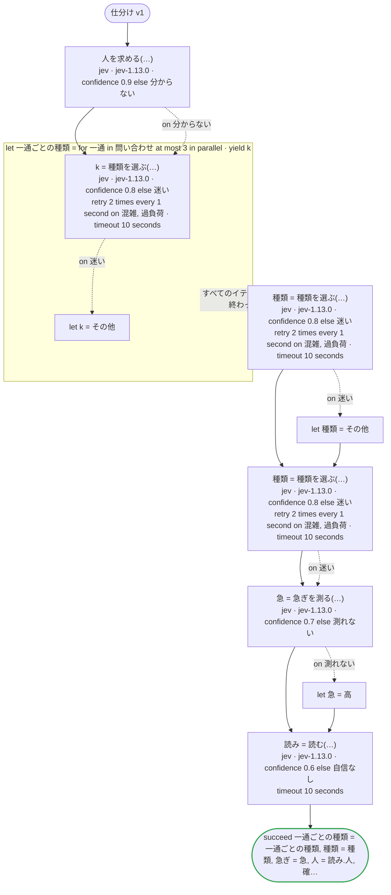
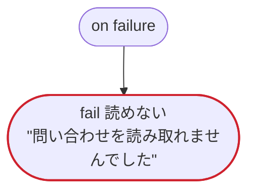

# 仕分け v1

Jev のエッジケース：一部の値にだけ意味を書いた choice、score、はいといいえの意味を書いた noul、一回のリクエストで四つに答えるレコード（choice・score・noul と、確信度の割合）、確信度が下限を切ったときのエラーを処理する呼び出しと、処理せずに on failure へ行く呼び出し、下限を切った答えのあとも前の値が残る変数、並列のイテレーションの中の Jev、結果を読まない呼び出し、ステータスで宣言したエラーのリトライ

`tests/flows/jev.flow` を `dandori doc` で描いたものです。入力は `問い合わせ: list[string]`, `本文: string`, `会員: bool`、出力は `一通ごとの種類: list[種類]`, `種類: 種類`, `急ぎ: 急ぎ`, `人: bool`, `確かさ: rate[step 0.01%]` です。

## flow

四角はタスク、両脇に線のある四角は規則、斜めの四角は外から値が届くタスク（イベントやコールバックの応答）、六角形は `match`、角の丸い四角は待ち、ステップを囲む枠はループです。破線の矢印は、呼び出しがその場で処理するエラーです。

## on failure

呼び出しが失敗し、そのエラーをその場で処理しないときに走ります（73・76・79・82・84・86 行目の呼び出しから）。最後まで走ると、ワークフローはそのエラーで失敗します。

## 呼び出し

| 行 | 呼び出し | 呼ぶもの | リトライ | タイムアウト | 失敗したとき |
|---:|---|---|---|---|---|
| 73 | `人を求める(…)` | `jev · jev-1.13.0 · confidence 0.9 else 分からない` | — | — | `分からない` → 74 行目 `timeout`, `failure` → `on failure` |
| 76 | `k = 種類を選ぶ(…)` | `jev · jev-1.13.0 · confidence 0.8 else 迷い` | 1 秒おきに 2 回（混雑, 過負荷） | 10 秒 | `混雑`, `過負荷` → そのイテレーションが失敗し、`on failure` へ `迷い` → 77 行目 `timeout`, `failure` → そのイテレーションが失敗し、`on failure` へ |
| 79 | `種類 = 種類を選ぶ(…)` | `jev · jev-1.13.0 · confidence 0.8 else 迷い` | 1 秒おきに 2 回（混雑, 過負荷） | 10 秒 | `混雑`, `過負荷` → `on failure` `迷い` → 80 行目 `timeout`, `failure` → `on failure` |
| 82 | `種類 = 種類を選ぶ(…)` | `jev · jev-1.13.0 · confidence 0.8 else 迷い` | 1 秒おきに 2 回（混雑, 過負荷） | 10 秒 | `混雑`, `過負荷` → `on failure` `迷い` → 83 行目 `timeout`, `failure` → `on failure` |
| 84 | `急 = 急ぎを測る(…)` | `jev · jev-1.13.0 · confidence 0.7 else 測れない` | — | — | `測れない` → 85 行目 `timeout`, `failure` → `on failure` |
| 86 | `読み = 読む(…)` | `jev · jev-1.13.0 · confidence 0.6 else 自信なし` | — | 10 秒 | `自信なし`, `timeout`, `failure` → `on failure` |

## 終わり方

ワークフローの終わり方のすべてです。

| 行 | 終わり方 |
|---:|---|
| 87 | `succeed 一通ごとの種類 = 一通ごとの種類, 種類 = 種類, 急ぎ = 急, 人 = 読み.人, 確かさ = 読み.確かさ` |
| 90 | `fail 読めない` "問い合わせを読み取れませんでした" |

