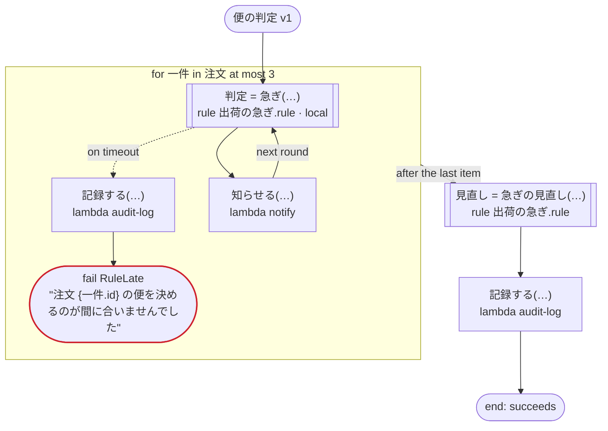

# 便の判定 v1

規則をローカルアクティビティで呼ぶ（Temporal）：注文ごとに規則で便を決めて知らせる。規則のタイムアウトを処理してタスクを呼ぶ呼び出しと、ふつうのアクティビティで呼ぶ規則も通る。ほかのプラットフォームでは、ふつうの規則の呼び出しと同じ

`tests/flows/local_rules.flow`, drawn by `dandori doc`. Inputs: `注文: list[注文]`, `まとめ: 注文`.

## flow

A rectangle is a task, one with a line down each side a rule, a slanted one a task whose value comes from outside (an event, or the answer to a callback), a hexagon a `match`, a rounded box a wait, and a box around steps a loop. A dashed arrow is an error the call handles.

## Calls

| Line | Call | Calls | Retries | Timeout | When it fails |
|---:|---|---|---|---|---|
| 32 | `判定 = 急ぎ(…)` | rule `出荷の急ぎ.rule`, a local activity on Temporal | 2 times, after 1 second and 2 (failure) | — | `timeout` → line 33 `failure` → the workflow fails |
| 34 | `記録する(…)` | `lambda audit-log`, `idempotent` | — | — | `timeout`, `failure` → the workflow fails |
| 36 | `知らせる(…)` | `lambda notify`, `idempotent` | — | — | `timeout`, `failure` → the workflow fails |
| 37 | `見直し = 急ぎの見直し(…)` | rule `出荷の急ぎ.rule` | 2 times, after 1 second and 2 (failure) | — | `timeout`, `failure` → the workflow fails |
| 38 | `記録する(…)` | `lambda audit-log`, `idempotent` | — | — | `timeout`, `failure` → the workflow fails |

## Ends

Every way the workflow can end.

| Line | End |
|---:|---|
| 35 | `fail RuleLate` "注文 {一件.id} の便を決めるのが間に合いませんでした" |
| 38 | the flow runs to its end, and the workflow succeeds |

