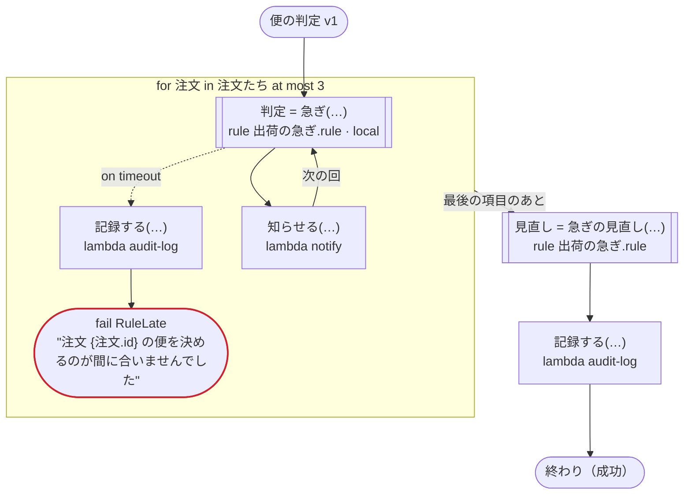

# 便の判定 v1

規則をローカルアクティビティで呼ぶ（Temporal）：注文ごとに規則で便を決めて知らせる。規則の期限切れを受けてタスクを呼ぶ呼び出しと、ふつうのアクティビティで呼ぶ規則も通る。ほかの出力先では、ふつうの規則の呼び出しと同じ

`tests/flows/local_rules.flow` を `dandori doc` で描いたものです。入力は `注文たち: list[注文]`, `まとめ: 注文` です。

## flow

四角はタスク、両脇に線のある四角は規則、斜めの四角は外から値が届くタスク（イベントやコールバックの応答）、六角形は `match`、角の丸い四角は待ち、ステップを囲む枠はループです。破線の矢印は、呼び出しがその場で処理するエラーです。

## 呼び出し

| 行 | 呼び出し | 呼ぶもの | リトライ | タイムアウト | 失敗したとき |
|---:|---|---|---|---|---|
| 32 | `判定 = 急ぎ(…)` | 規則 `出荷の急ぎ.rule`（Temporal ではローカルアクティビティ） | 2 回（1 秒後と 2 秒後、failure） | — | `timeout` → 33 行目 `failure` → ワークフローが失敗する |
| 34 | `記録する(…)` | `lambda audit-log`, `idempotent` | — | — | `timeout`, `failure` → ワークフローが失敗する |
| 36 | `知らせる(…)` | `lambda notify`, `idempotent` | — | — | `timeout`, `failure` → ワークフローが失敗する |
| 37 | `見直し = 急ぎの見直し(…)` | 規則 `出荷の急ぎ.rule` | 2 回（1 秒後と 2 秒後、failure） | — | `timeout`, `failure` → ワークフローが失敗する |
| 38 | `記録する(…)` | `lambda audit-log`, `idempotent` | — | — | `timeout`, `failure` → ワークフローが失敗する |

## 終わり方

ワークフローの終わり方のすべてです。

| 行 | 終わり方 |
|---:|---|
| 35 | `fail RuleLate` "注文 {注文.id} の便を決めるのが間に合いませんでした" |
| 38 | flow が最後まで走り、ワークフローは成功する |

